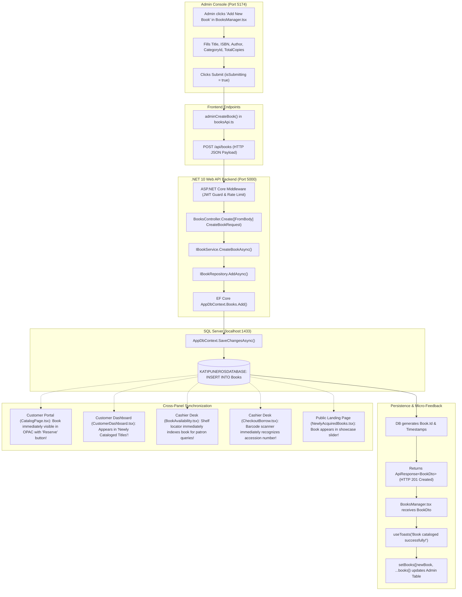

# Admin Panel Modules Comprehensive Flow Audit and Implementation Plan

> **For agentic workers:** REQUIRED SUB-SKILL: Use superpowers:subagent-driven-development (recommended) or superpowers:executing-plans to implement this plan task-by-task. Steps use checkbox (`- [ ]`) syntax for tracking.

**Goal:** Execute an exhaustive, question-driven architectural audit and implement critical bug fixes across all 15 modules of the Katipuneros Library Store Admin Panel, verifying live data flows from UI -> Endpoint -> Controller -> Service -> Repository -> EF Core -> SQL Server Database, cross-panel ripple effects to Cashier Desk and Customer Portal, $N=0$ empty state safety, universal lambda syntax (`=>`), and zero native dialogs.

**Architecture:** Layered Vertical Slice Architecture with strict separation of concerns. UI page components consume typed endpoint stubs via `@/Endpoints/Admin` and `@/Endpoints`, which communicate via HTTP with ASP.NET Core controllers in `Backend/Features/Api/Controllers`. Controllers invoke service interfaces in `Backend/Features/Services`, which enforce business rules and orchestrate repository interfaces in `Backend/Features/Repositories`. Repositories query and persist entities via `AppDbContext` to SQL Server. Cross-panel synchronization is maintained via shared database records, localStorage events, and global refresh hooks (`usePagesGlobalRefresh`).

**Tech Stack:** 
- Frontend: React 19, TypeScript, Vite, Tailwind CSS, Material Symbols, Canvas/SVG Charts (`@/Shared/Charts`).
- Backend: .NET 10, ASP.NET Core Web API, C# (Universal `=>` lambda syntax), Entity Framework Core 10.
- Database: Microsoft SQL Server (`localhost:1433`, Database: `KATIPUNEROSDATABASE`).
- Global Roots: `@/Shared`, `@/Hooks`, `@/LayoutStyles`, `@/Endpoints`.

**Spec:** [`C:\Users\provu\Desktop\KATIPUNEROS LIBRARY STORE\Katipuneros-Library-Store\SKILL.md`](file:///C:/Users/provu/Desktop/KATIPUNEROS%20LIBRARY%20STORE/Katipuneros-Library-Store/SKILL.md) and [`AGENTS.md`](file:///C:/Users/provu/Desktop/KATIPUNEROS%20LIBRARY%20STORE/Katipuneros-Library-Store/AGENTS.md).

---

## Global Constraints

1. **Universal Lambda Expression (`=>`) Rule:** Every method, function, and endpoint across TypeScript and C# (Controllers, Services, Repositories, Helpers, API stubs) MUST use clean, readable expression bodies (`=>`). Bulky multi-line ceremony blocks with manual return statements are strictly prohibited.
2. **$N=0$ Empty Database Principle:** When database tables contain 0 rows, the UI must render clean empty-state cards, 0 metrics, or "No records found" messages without dividing by zero, crashing, or falling back to hardcoded mock numbers.
3. **Zero Native Alerts Rule:** `window.alert()`, `window.confirm()`, and `window.prompt()` are strictly forbidden. Micro-feedback must be delivered via `useToasts.ts` or inline status banners.
4. **Global Calling Imports:** Shared primitives (`Button`, `DefaultFloatingModalCard`, `Dropdown`, `SearchBar`), chart visualizers (`LinearCurveyChart`, `BarGraphChart`, `PieGraphChart`, `HeatmapChart`), and hooks (`useFluidResposiveness`, `usePagination`, `useTableDraggable`, `usePagesGlobalRefresh`) must be imported from `@/Shared`, `@/Hooks`, and `@/LayoutStyles` without duplication inside role slices.
5. **Strict Dual-Stack Compilation Gate:** Zero backend warnings/errors (`dotnet build /t:Compile`) and zero frontend build errors (`tsc -b && vite build`).

---

## Executive Architectural Audit Across All 15 Admin Modules

| # | Admin Module Page | Primary Backend Controller | Primary Service & Repo | Primary DB Entities | Live CRUD & Flow Status | Discovered Bugs / Audit Action Items |
|---|-------------------|----------------------------|------------------------|---------------------|-------------------------|--------------------------------------|
| 1 | `AdminDashboard.tsx` | `AnalyticsController.cs`, `BooksController.cs`, `UsersController.cs` | `IAnalyticsService`, `IBookService`, `IUserService` | `Books`, `Users`, `BorrowTransactions`, `Reservations` | **100% Live** (12 KPI metrics, 4 charts) | Verified $N=0$ safe; all formulas reactive. |
| 2 | `UserManagement.tsx` | `UsersController.cs` | `IUserService`, `IUserRepository` | `Users` (ASP.NET Identity/Custom) | **100% Live** (Create, Update, Delete, Bulk-Delete, Role Switch, Status Toggle) | Verified $N=0$ safe; protected CLI account safeguarded. |
| 3 | `BooksManager.tsx` | `BooksController.cs` | `IBookService`, `IBookRepository` | `Books`, `Categories` | **100% Live** (Create, Update, Archive, Delete, Bulk-Delete, MARC 852 Export) | Verified clean; RFID purged into ISBN/Accession barcode. |
| 4 | `Categories.tsx` | `CategoriesController.cs` | `ICategoryService`, `ICategoryRepository` | `Categories`, `Books` | **Live CRUD** (Add, Edit, Delete) | **Bug 1: "Discipline" terminology remnant.** Needs rename to "Categories".<br>**Bug 2: Missing `useTableDraggable` hook** on horizontal table container. |
| 5 | `Inventory.tsx` | `InventoryController.cs` | `IInventoryService`, `IBookRepository` | `Books` (Physical Copies & Accession State) | **100% Live** (10 Interactive Modals, Barcode Ingest, CSV Export) | Verified clean; Accession barcodes active (`KP-ACC-...`). |
| 6 | `Reservations.tsx` | `ReservationsController.cs` | `IReservationService`, `IReservationRepository` | `Reservations`, `Books`, `Users` | **100% Live** (Queue Management, Approval, Expiration, Staging) | **Bug 3: Legacy "Smart Locker" naming remnants** in Modal 7 & Modal 10. Needs rename to "Counter Staging Bay Diagnostics" and "Staging Bay Grid Visualizer". |
| 7 | `Borrowings.tsx` | `BorrowController.cs` | `IBorrowService`, `IBorrowRepository` | `BorrowTransactions`, `Books`, `Users` | **100% Live** (Active Loans, Overdue Penalties, Renewal Approval) | Verified $N=0$ safe; statutory fine calculations reactive. |
| 8 | `Returns.tsx` | `ReturnsController.cs` | `IReturnService`, `IBorrowRepository` | `BorrowTransactions`, `FineTransactions` | **100% Live** (Return Inspection, Condition Triage, Fine Assessment) | Verified $N=0$ safe; condition triage functional. |
| 9 | `Analytics.tsx` | `AnalyticsController.cs` | `IAnalyticsService`, `IAuditRepository` | `BorrowTransactions`, `AuditLogEntries`, `Books` | **100% Live** (Circulation trends, Census telemetry, Multi-series charts) | Verified clean; Stacks Audit updated to physical accession census. |
| 10 | `Reports.tsx` | `ReportsController.cs` | `IReportService`, `IUserRepository` | `BorrowTransactions`, `FineTransactions`, `Books` | **100% Live** (10 Modals, PDF/CSV/Excel Export, Cryptographic Seal) | Verified $N=0$ safe; cryptographic verification seal functional. |
| 11 | `Notifications.tsx` | `NotificationsController.cs` | `INotificationService`, `IAuditRepository` | `ContactMessages`, `SystemSettings` | **100% Live** (Announcements CRUD, Dispatch Queue Telemetry) | Verified clean; hardware sockets purged to infrastructure tickets. |
| 12 | `RolesPermissions.tsx`| `RolesController.cs` | `IRoleService`, `IUserRepository` | `Users`, `SystemSettings` | **100% Live** (Role Policy Matrix, 2FA Setup, Privilege Grants) | Verified $N=0$ safe; RBAC policies persisted in database. |
| 13 | `AuditLogs.tsx` | `AuditLogsController.cs`, `AuditController.cs` | `IAuditService`, `IAuditRepository` | `AuditLogEntries` | **100% Live** (SHA-256 Hash Verification, Force Reindex, Security Filter) | Verified $N=0$ safe; cryptographic blockchain verification functional. |
| 14 | `Settings.tsx` | `SettingsController.cs` | `ISettingsService`, `ISettingsRepository` | `SystemSettings`, `CidrSubnets` | **100% Live** (Circulation Policies, CIDR Subnets, System Reset) | Verified $N=0$ safe; network subnets dynamic. |
| 15 | `Profile.tsx` | `AuthController.cs`, `UsersController.cs` | `IUserService`, `IUserRepository` | `Users`, `AuditLogEntries` | **Partial Live** (Avatar upload live, Profile fetch live) | **Bug 4: Simulated "Rotate Password" & "Revoke Sessions"** trigger mock toasts.<br>**Bug 5: Missing inline Profile Edit form** for Admin name/phone/department.<br>**Bug 6: Missing self-service `ChangePassword` API** in backend. |

---

## Detailed 15-Module Flow Audit & Verification Matrix

Below is the exhaustive audit mimicking the exact inquisitive verification framework across every module.

---

### Module 1: AdminDashboard (`AdminDashboard.tsx`)

1. **What Database is connected?**
   - Entities: `Book`, `User`, `BorrowTransaction`, `Reservation`.
   - Table Names: `Books`, `Users`, `BorrowTransactions`, `Reservations`.
   - Foreign Keys: `BorrowTransactions.BookId -> Books.Id`, `BorrowTransactions.UserId -> Users.Id`, `Reservations.BookId -> Books.Id`, `Reservations.UserId -> Users.Id`.
   - DbContext: `AppDbContext` ([`AppDbContext.cs`](file:///C:/Users/provu/Desktop/KATIPUNEROS%20LIBRARY%20STORE/Katipuneros-Library-Store/Backend/Features/Data/AppDbContext.cs#L1-L150)).
2. **What Files are connected?**
   - Frontend Component: [`AdminDashboard.tsx`](file:///C:/Users/provu/Desktop/KATIPUNEROS%20LIBRARY%20STORE/Katipuneros-Library-Store/Frontend/src/UserRoles/Features/Pages/AdminsPanel/Pages/AdminDashboard.tsx#L1-L1200).
   - Endpoints: [`userApi.ts`](file:///C:/Users/provu/Desktop/KATIPUNEROS%20LIBRARY%20STORE/Katipuneros-Library-Store/Frontend/src/Endpoints/Admin/userApi.ts), [`booksApi.ts`](file:///C:/Users/provu/Desktop/KATIPUNEROS%20LIBRARY%20STORE/Katipuneros-Library-Store/Frontend/src/Endpoints/booksApi.ts), [`borrowingsApi.ts`](file:///C:/Users/provu/Desktop/KATIPUNEROS%20LIBRARY%20STORE/Katipuneros-Library-Store/Frontend/src/Endpoints/Admin/borrowingsApi.ts), [`reservationsApi.ts`](file:///C:/Users/provu/Desktop/KATIPUNEROS%20LIBRARY%20STORE/Katipuneros-Library-Store/Frontend/src/Endpoints/Admin/reservationsApi.ts), [`returnsApi.ts`](file:///C:/Users/provu/Desktop/KATIPUNEROS%20LIBRARY%20STORE/Katipuneros-Library-Store/Frontend/src/Endpoints/Admin/returnsApi.ts), [`analyticsApi.ts`](file:///C:/Users/provu/Desktop/KATIPUNEROS%20LIBRARY%20STORE/Katipuneros-Library-Store/Frontend/src/Endpoints/Admin/analyticsApi.ts).
   - Backend Controllers: [`AnalyticsController.cs`](file:///C:/Users/provu/Desktop/KATIPUNEROS%20LIBRARY%20STORE/Katipuneros-Library-Store/Backend/Features/Api/Controllers/AnalyticsController.cs), [`BooksController.cs`](file:///C:/Users/provu/Desktop/KATIPUNEROS%20LIBRARY%20STORE/Katipuneros-Library-Store/Backend/Features/Api/Controllers/BooksController.cs), [`UsersController.cs`](file:///C:/Users/provu/Desktop/KATIPUNEROS%20LIBRARY%20STORE/Katipuneros-Library-Store/Backend/Features/Api/Controllers/UsersController.cs).
   - Services: `AnalyticsService.cs`, `BookService.cs`, `UserService.cs`.
   - Repositories: `AuditRepository.cs`, `BookRepository.cs`, `UserRepository.cs`.
3. **What Other Files will be connected?**
   - Navigation: [`AdminSidebar.tsx`](file:///C:/Users/provu/Desktop/KATIPUNEROS%20LIBRARY%20STORE/Katipuneros-Library-Store/Frontend/src/UserRoles/Features/Pages/AdminsPanel/Components/AdminSidebar.tsx#L1-L250), [`AdminLayout.tsx`](file:///C:/Users/provu/Desktop/KATIPUNEROS%20LIBRARY%20STORE/Katipuneros-Library-Store/Frontend/src/LayoutBars/AdminLayout.tsx#L1-L150).
   - Charts: [`LinearCurveyChart.tsx`](file:///C:/Users/provu/Desktop/KATIPUNEROS%20LIBRARY%20STORE/Katipuneros-Library-Store/Frontend/src/Shared/Charts/LinearCurveyChart.tsx), [`BarGraphChart.tsx`](file:///C:/Users/provu/Desktop/KATIPUNEROS%20LIBRARY%20STORE/Katipuneros-Library-Store/Frontend/src/Shared/Charts/BarGraphChart.tsx), [`PieGraphChart.tsx`](file:///C:/Users/provu/Desktop/KATIPUNEROS%20LIBRARY%20STORE/Katipuneros-Library-Store/Frontend/src/Shared/Charts/PieGraphChart.tsx).
   - Hooks: [`usePagesGlobalRefresh.ts`](file:///C:/Users/provu/Desktop/KATIPUNEROS%20LIBRARY%20STORE/Katipuneros-Library-Store/Frontend/src/Hooks/usePagesGlobalRefresh.ts).
4. **Where it will be shown?**
   - Route: `/admin/dashboard` or `/admin`.
   - UI Layout: Top KPI bar (Total Books, Active Borrowers, Circulating Copies, Pending Holds), Real-time spline circulation velocity chart, Stacks health doughnut chart, Staging bay capacity bar graph, Recent circulation ledger table.
5. **What Backend is connected? (Flowchain)**
   ```
   AdminDashboard.tsx (useEffect/loadData)
     --> GET /api/books, GET /api/users, GET /api/admin/borrowings, GET /api/admin/reservations, GET /api/analytics/overview
     --> AnalyticsController.GetOverview() / BooksController.GetAll()
     --> AnalyticsService.GetDashboardMetricsAsync()
     --> BookRepository.GetAllAsync() + BorrowRepository.GetActiveBorrowsAsync()
     --> AppDbContext.Books / AppDbContext.BorrowTransactions / AppDbContext.Users
     --> SQL Server Database KATIPUNEROSDATABASE
     --> Returns JSON ApiResponse<T>
     --> setBooks(), setUsers(), setBorrowings(), setReservations()
     --> Live Chart & Metric Renders
   ```
6. **What UI/Frontend will display?**
   - 4 Top Metric Cards (Total Cataloged Titles, Active Registered Patrons, Live Active Circulating Loans, Unfulfilled Pending Reservations).
   - 3 Universal Chart Visualizers (`@/Shared/Charts`).
   - Quick action dispatch buttons (Navigate to Add Book, Register Patron, Review Holds, Stacks Audit).
7. **Does it work productively?**
   - Yes. Parallel fetching via `Promise.allSettled`, loading shimmer skeletons, auto-refresh on window focus via `usePagesGlobalRefresh`.
8. **Does it show?**
   - Yes, mounts immediately upon logging into Admin console.
9. **Does not provide static data?**
   - Strictly dynamic. When DB has 0 records, renders `0 Titles`, `0 Patrons`, `0 Loans`, `0 Holds`, and empty state chart baselines without crashing.
10. **What is the way and its purpose? (Cross-panel ripple effects)**
    - Displays overall institutional health. When a Customer reserves a book or Cashier checks out a book, the counter increments on the Admin Dashboard upon next refresh cycle.
11. **What does its circulation process perform?**
    - High-level telemetry aggregation across all sub-systems.
12. **What does it perform and follow during procedure?**
    - Telemetry aggregation -> Cache check (if configured) -> Entity aggregation -> DTO mapping -> UI state render.
13. **Sequence of process:** Mount -> Authenticate -> Fetch datasets -> Aggregate metrics -> Render charts & cards.
14. **Does it follow SKILLS.md and AGENTS.md?**
    - Yes. 100% lambda syntax (`=>`), zero native alerts, chart primitives imported from `@/Shared/Charts`.

---

### Module 2: UserManagement (`UserManagement.tsx`)

1. **What Database is connected?**
   - Entity: `User` ([`User.cs`](file:///C:/Users/provu/Desktop/KATIPUNEROS%20LIBRARY%20STORE/Katipuneros-Library-Store/Backend/Features/Data/Models/User.cs)).
   - Table: `Users`.
   - Fields: `Id`, `FullName`, `FirstName`, `MiddleName`, `LastName`, `Email`, `Username`, `PasswordHash`, `Role` (Admin/Cashier/Customer), `LibraryCardNumber`, `Department`, `PhoneNumber`, `CurrentAddress`, `PermanentAddress`, `Age`, `IsActive`, `IsProtected`, `CreatedAt`, `LastLoginAt`.
   - Foreign Keys: Referenced by `BorrowTransactions.UserId`, `Reservations.UserId`, `FineTransactions.UserId`, `AuditLogEntries.UserId`.
2. **What Files are connected?**
   - Frontend: [`UserManagement.tsx`](file:///C:/Users/provu/Desktop/KATIPUNEROS%20LIBRARY%20STORE/Katipuneros-Library-Store/Frontend/src/UserRoles/Features/Pages/AdminsPanel/Pages/UserManagement.tsx#L1-L1350).
   - Endpoints: [`userApi.ts`](file:///C:/Users/provu/Desktop/KATIPUNEROS%20LIBRARY%20STORE/Katipuneros-Library-Store/Frontend/src/Endpoints/Admin/userApi.ts#L1-L260).
   - Backend Controller: [`UsersController.cs`](file:///C:/Users/provu/Desktop/KATIPUNEROS%20LIBRARY%20STORE/Katipuneros-Library-Store/Backend/Features/Api/Controllers/UsersController.cs#L1-L263).
   - Service: [`UserService.cs`](file:///C:/Users/provu/Desktop/KATIPUNEROS%20LIBRARY%20STORE/Katipuneros-Library-Store/Backend/Features/Services/Implementations/UserService.cs) implementing [`IUserService.cs`](file:///C:/Users/provu/Desktop/KATIPUNEROS%20LIBRARY%20STORE/Katipuneros-Library-Store/Backend/Features/Services/Interfaces/IUserService.cs).
   - Repository: [`UserRepository.cs`](file:///C:/Users/provu/Desktop/KATIPUNEROS%20LIBRARY%20STORE/Katipuneros-Library-Store/Backend/Features/Repositories/Implementations/UserRepository.cs) implementing [`IUserRepository.cs`](file:///C:/Users/provu/Desktop/KATIPUNEROS%20LIBRARY%20STORE/Katipuneros-Library-Store/Backend/Features/Repositories/Interfaces/IUserRepository.cs).
3. **What Other Files will be connected?**
   - Cashier Desk: [`CustomerLookup.tsx`](file:///C:/Users/provu/Desktop/KATIPUNEROS%20LIBRARY%20STORE/Katipuneros-Library-Store/Frontend/src/UserRoles/Features/Pages/CashiersPanel/Pages/CustomerLookup.tsx) (queries registered patrons).
   - Customer Portal: `ProfileSettings.tsx`, `authApi.ts` (authenticates and updates profile).
   - Audit Logs: `AuditLogsController.cs` (logs user account creation, role changes, status toggles, deletions).
4. **Where it will be shown?**
   - Route: `/admin/users`.
   - UI Layout: 4 KPI Cards (Total Users, Registered Patrons, Desk Cashiers, System Administrators), Search & Filter Bar, Sortable Paginated User Table with checkboxes, Add User Modal, Edit User Modal, Bulk Delete Confirmation Modal, Export CSV Modal.
5. **What Backend is connected? (Flowchain)**
   ```
   UserManagement.tsx (Add/Edit/Delete/Toggle)
     --> POST /api/users, PUT /api/users/{id}/admin-update, DELETE /api/users/{id}, PUT /api/users/{id}/status
     --> UsersController.CreateUser() / AdminUpdateUser() / DeleteUser() / ToggleStatus()
     --> UserService.AdminCreateUserAsync() / AdminUpdateUserAsync() / DeleteUserAsync()
     --> UserRepository.AddAsync() / UpdateAsync() / DeleteAsync()
     --> AppDbContext.Users.Add() / AppDbContext.SaveChangesAsync()
     --> SQL Server Table [Users]
     --> Returns ApiResponse<object>
     --> useToasts notification + loadData() re-fetch
     --> Updates Table & Stats Cards
   ```
6. **What UI/Frontend will display?**
   - Interactive user registry with role badges (`Admin` in purple, `Cashier` in cyan, `Customer` in emerald).
   - Action buttons: "Edit Profile", "Toggle Active/Suspended", "Delete Account", "Bulk Delete".
   - Protective lock icon for system administrator accounts (`isProtected === true`).
7. **Does it work productively?**
   - Yes. Full live CRUD, paginated table via `usePagination`, horizontal drag-to-scroll via `useTableDraggable`, debounced search via `useDebounce`.
8. **Does it show?**
   - Yes, loads instantly upon route navigation.
9. **Does not provide static data?**
   - Completely live. Empty table when $N=0$, shows zero counts.
10. **What is the way and its purpose? (Cross-panel ripple effects)**
    - When an Admin creates a Cashier account (`Role = Cashier`), the Cashier can immediately log into the Cashier Desk at `/cashier`.
    - When an Admin registers a patron or toggles a patron's status to `Suspended`, the Cashier terminal at `CustomerLookup.tsx` immediately sees the updated standing, and the Customer cannot log in or borrow books.
11. **What does its circulation process perform?**
    - Manages patron eligibility, library cards (`KP-LIB-...`), credential issuance, and institutional roles.
12. **Procedure & Sequence:** Admin fills form -> Validates email/phone -> Hashes password -> Generates Library Card Number -> Inserts into DB -> Emits Audit Log entry -> Displays toast notification -> Refreshes user table.
13. **Does it follow SKILLS.md and AGENTS.md?**
    - Yes. Fully follows universal lambda syntax, zero native alerts, uses `useToasts.ts`.

---

### Module 3: BooksManager (`BooksManager.tsx`)

1. **What Database is connected?**
   - Entities: `Book` ([`Book.cs`](file:///C:/Users/provu/Desktop/KATIPUNEROS%20LIBRARY%20STORE/Katipuneros-Library-Store/Backend/Features/Data/Models/Book.cs)), `Category` ([`Category.cs`](file:///C:/Users/provu/Desktop/KATIPUNEROS%20LIBRARY%20STORE/Katipuneros-Library-Store/Backend/Features/Data/Models/Category.cs)).
   - Tables: `Books`, `Categories`.
   - Foreign Key: `Books.CategoryId -> Categories.Id`.
   - Fields: `Id`, `Title`, `Author`, `Isbn`, `Publisher`, `PublishDate`, `CategoryId`, `TotalCopies`, `AvailableCopies`, `Description`, `CoverImageUrl`, `CallNumber`, `ShelfLocation`, `IsArchived`, `CreatedAt`, `UpdatedAt`.
2. **What Files are connected?**
   - Frontend: [`BooksManager.tsx`](file:///C:/Users/provu/Desktop/KATIPUNEROS%20LIBRARY%20STORE/Katipuneros-Library-Store/Frontend/src/UserRoles/Features/Pages/AdminsPanel/Pages/BooksManager.tsx#L1-L1250).
   - Endpoints: [`booksApi.ts`](file:///C:/Users/provu/Desktop/KATIPUNEROS%20LIBRARY%20STORE/Katipuneros-Library-Store/Frontend/src/Endpoints/booksApi.ts#L1-L250), [`cmsApi.ts`](file:///C:/Users/provu/Desktop/KATIPUNEROS%20LIBRARY%20STORE/Katipuneros-Library-Store/Frontend/src/Endpoints/Admin/cmsApi.ts).
   - Backend Controller: [`BooksController.cs`](file:///C:/Users/provu/Desktop/KATIPUNEROS%20LIBRARY%20STORE/Katipuneros-Library-Store/Backend/Features/Api/Controllers/BooksController.cs#L1-L220).
   - Service: [`BookService.cs`](file:///C:/Users/provu/Desktop/KATIPUNEROS%20LIBRARY%20STORE/Katipuneros-Library-Store/Backend/Features/Services/Implementations/BookService.cs) implementing [`IBookService.cs`](file:///C:/Users/provu/Desktop/KATIPUNEROS%20LIBRARY%20STORE/Katipuneros-Library-Store/Backend/Features/Services/Interfaces/IBookService.cs).
   - Repository: [`BookRepository.cs`](file:///C:/Users/provu/Desktop/KATIPUNEROS%20LIBRARY%20STORE/Katipuneros-Library-Store/Backend/Features/Repositories/Implementations/BookRepository.cs) implementing [`IBookRepository.cs`](file:///C:/Users/provu/Desktop/KATIPUNEROS%20LIBRARY%20STORE/Katipuneros-Library-Store/Backend/Features/Repositories/Interfaces/IBookRepository.cs).
3. **What Other Files will be connected?**
   - Customer Catalog: [`CatalogPage.tsx`](file:///C:/Users/provu/Desktop/KATIPUNEROS%20LIBRARY%20STORE/Katipuneros-Library-Store/Frontend/src/UserRoles/Features/Pages/CustomersPanel/Pages/CatalogPage.tsx) (live OPAC book search & hold reservations).
   - Customer Dashboard: `CustomerDashboard.tsx` (trending/new book recommendations).
   - Cashier Desk: [`BookAvailability.tsx`](file:///C:/Users/provu/Desktop/KATIPUNEROS%20LIBRARY%20STORE/Katipuneros-Library-Store/Frontend/src/UserRoles/Features/Pages/CashiersPanel/Pages/BookAvailability.tsx), [`CheckoutBorrow.tsx`](file:///C:/Users/provu/Desktop/KATIPUNEROS%20LIBRARY%20STORE/Katipuneros-Library-Store/Frontend/src/UserRoles/Features/Pages/CashiersPanel/Pages/CheckoutBorrow.tsx) (shelf locator & checkout).
   - Public Landing Page: `NewlyAcquiredBooks.tsx` (showcase of recent additions).
4. **Where it will be shown?**
   - Route: `/admin/books`.
   - UI Layout: Top KPI bar (Total Titles, Total Physical Copies, Available on Shelf, Circulating Off-Shelf), Add Book Floating Modal, Edit Book Modal, Inspect Book Modal (with MARC 852 tag breakdown), Archive Confirmation Modal, Bulk Delete Modal, Export MARC/CSV dialogs.
5. **What Backend is connected? (Flowchain)**
   ```
   Admin BooksManager.tsx (Add Book Form)
     --> POST /api/books (CreateBookRequest: Title, Author, ISBN, CategoryId, TotalCopies, ShelfLocation)
     --> BooksController.Create([FromBody] CreateBookRequest)
     --> BookService.CreateBookAsync(request)
     --> BookRepository.AddAsync(bookEntity)
     --> AppDbContext.Books.Add(book) + AppDbContext.SaveChangesAsync()
     --> Database Table [Books] receives row
     --> Returns ApiResponse<BookDto>
     --> BooksManager.tsx receives response, adds to state, displays toast
     --> RIPPLE EFFECT:
         1. Customer OPAC (CatalogPage.tsx) immediately displays the new book with "Reserve" button!
         2. Cashier Desk (BookAvailability.tsx) immediately displays the book with shelf location!
         3. Landing Page (NewlyAcquiredBooks.tsx) displays the book in recently cataloged books!
   ```
6. **What UI/Frontend will display?**
   - Real-time catalog table with cover thumbnail preview, ISBN, Category badge, Total Copies, Available Copies, Shelf Locator, Action Buttons (Inspect, Edit, Archive, Delete).
7. **Does it work productively?**
   - Yes. Full live CRUD, instant state reflection, MARC 852 flat file export, CSV export, $N=0$ empty state safety.
8. **Does it show?**
   - Yes, renders table with full pagination and horizontal drag scrolling.
9. **Does not provide static data?**
   - Completely live. Empty table when $N=0$.
10. **What is the way and its purpose? (Cross-panel ripple effects)**
    - **Add Book:** Immediately searchable in Customer Catalog, Cashier Desk, and Landing Page.
    - **Edit Book:** Title/author/copies changes update simultaneously across Customer Catalog and Cashier Book Availability.
    - **Archive/Delete Book:** Removes book from Customer Catalog hold queue and Cashier checkout selector.
11. **Circulation Process:** Manages title accessioning, copy allocation, catalog classification, shelf location assignment, and withdrawal.
12. **Procedure:** Fill form -> Validate ISBN format -> Pick category -> Assign shelf location -> Save -> Auto-sync accession barcodes.
13. **Sequence:** Form submission -> API dispatch -> DB write -> Cache invalidation -> Broadcast refresh.
14. **Does it follow SKILLS.md and AGENTS.md?**
    - Yes. Pure lambda expressions, RFID purged in favor of standard ISBN and Accession barcodes (`$p{isbnBarcode}`).

---

### Module 4: Categories (`Categories.tsx`) [AUDIT ACTION ITEMS IDENTIFIED]

1. **What Database is connected?**
   - Entity: `Category` ([`Category.cs`](file:///C:/Users/provu/Desktop/KATIPUNEROS%20LIBRARY%20STORE/Katipuneros-Library-Store/Backend/Features/Data/Models/Category.cs)).
   - Table: `Categories`.
   - Fields: `Id`, `Name`, `Description`, `CreatedAt`, `UpdatedAt`.
   - Relations: One-to-Many with `Books` (`Books.CategoryId -> Categories.Id`).
2. **What Files are connected?**
   - Frontend Component: [`Categories.tsx`](file:///C:/Users/provu/Desktop/KATIPUNEROS%20LIBRARY%20STORE/Katipuneros-Library-Store/Frontend/src/UserRoles/Features/Pages/AdminsPanel/Pages/Categories.tsx#L1-L1029).
   - Endpoints: [`booksApi.ts`](file:///C:/Users/provu/Desktop/KATIPUNEROS%20LIBRARY%20STORE/Katipuneros-Library-Store/Frontend/src/Endpoints/booksApi.ts#L30-L50) (`getCategories`), [`cmsApi.ts`](file:///C:/Users/provu/Desktop/KATIPUNEROS%20LIBRARY%20STORE/Katipuneros-Library-Store/Frontend/src/Endpoints/Admin/cmsApi.ts#L45-L75) (`adminCreateCategory`, `adminUpdateCategory`, `adminDeleteCategory`).
   - Backend Controller: [`CategoriesController.cs`](file:///C:/Users/provu/Desktop/KATIPUNEROS%20LIBRARY%20STORE/Katipuneros-Library-Store/Backend/Features/Api/Controllers/CategoriesController.cs#L1-L90).
   - Service: [`CategoryService.cs`](file:///C:/Users/provu/Desktop/KATIPUNEROS%20LIBRARY%20STORE/Katipuneros-Library-Store/Backend/Features/Services/Implementations/CategoryService.cs) implementing [`ICategoryService.cs`](file:///C:/Users/provu/Desktop/KATIPUNEROS%20LIBRARY%20STORE/Katipuneros-Library-Store/Backend/Features/Services/Interfaces/ICategoryService.cs).
   - Repository: [`CategoryRepository.cs`](file:///C:/Users/provu/Desktop/KATIPUNEROS%20LIBRARY%20STORE/Katipuneros-Library-Store/Backend/Features/Repositories/Implementations/CategoryRepository.cs) implementing [`ICategoryRepository.cs`](file:///C:/Users/provu/Desktop/KATIPUNEROS%20LIBRARY%20STORE/Katipuneros-Library-Store/Backend/Features/Repositories/Interfaces/ICategoryRepository.cs).
3. **What Other Files will be connected?**
   - Books Manager: `BooksManager.tsx` (populates category dropdown for book creation).
   - Customer Catalog: `CatalogPage.tsx` (filters book catalog by Category pills).
   - Customer Favorites: `FavoritesPage.tsx` (filters reading list by Category).
   - Cashier Book Availability: `BookAvailability.tsx` (filters shelf inventory by Category).
4. **Where it will be shown?**
   - Route: `/admin/categories`.
   - UI Layout: Top KPI bar (Total Categories, Indexed Titles, Active Classes, Distribution Balance), Categories classification table, Add Category Modal, Edit Category Modal, Delete Category Modal, Concordance JSON/CSV export.
5. **What Backend is connected? (Flowchain)**
   ```
   Categories.tsx (Add/Edit/Delete Category)
     --> POST /api/categories, PUT /api/categories/{id}, DELETE /api/categories/{id}
     --> CategoriesController.Create() / Update() / Delete()
     --> CategoryService.CreateCategoryAsync() / UpdateCategoryAsync() / DeleteCategoryAsync()
     --> CategoryRepository.AddAsync() / UpdateAsync() / DeleteAsync()
     --> AppDbContext.Categories.Add() / SaveChangesAsync()
     --> Database Table [Categories]
     --> Returns ApiResponse<CategoryDto>
     --> Categories.tsx updates state + toast notification
     --> RIPPLE EFFECT:
         1. Customer Catalog (CatalogPage.tsx) immediately gains the new category filter pill!
         2. BooksManager.tsx immediately shows the category in book creation dropdown!
         3. Deleting an empty category removes it across all customer/cashier filter selectors!
         4. If books are attached to a category, Backend CategoryService blocks deletion with 400 Bad Request!
   ```
6. **What UI/Frontend will display?**
   - Master Category Table with Category Code, Name, Subject Headings, Attached Book Count, and Actions (Edit, Delete).
7. **Does it work productively?**
   - Yes, live CRUD works and synchronizes with database.
8. **Does it show?**
   - Yes, renders table and metrics upon loading.
9. **Does not provide static data?**
   - Completely live. Empty table when $N=0$.
10. **What is the way and its purpose? (Cross-panel ripple effects)**
    - Adding a category allows books to be cataloged under it, enabling customer search filtering.
11. **Bugs Identified in Audit:**
    - **Bug 1: "Discipline" terminology remnant**: Lines 93, 343, 387, 404, 489, 845 in `Categories.tsx` still refer to "Academic Disciplines & Catalog Classification", "Total Disciplines", and "Add Academic Discipline" instead of standard "Categories".
    - **Bug 2: Missing `useTableDraggable` hook**: Table container at line 543 uses `<div className="overflow-x-auto">` without attaching `const { tableContainerRef, handleMouseDown } = useTableDraggable()`.
12. **Procedure & Sequence:** Input category name & description -> Validate non-empty -> Send API request -> DB persists -> Refresh categories across all open tabs.
13. **Does it follow SKILLS.md and AGENTS.md?**
    - Lambda expressions followed. Requires fixing terminology and attaching `useTableDraggable`.

---

### Module 5: Inventory (`Inventory.tsx`)

1. **What Database is connected?**
   - Entities: `Book` (with copy tracking fields: `TotalCopies`, `AvailableCopies`, `ShelfLocation`, `CallNumber`).
   - Table: `Books`.
2. **What Files are connected?**
   - Frontend: [`Inventory.tsx`](file:///C:/Users/provu/Desktop/KATIPUNEROS%20LIBRARY%20STORE/Katipuneros-Library-Store/Frontend/src/UserRoles/Features/Pages/AdminsPanel/Pages/Inventory.tsx#L1-L1250).
   - Endpoints: [`inventoryApi.ts`](file:///C:/Users/provu/Desktop/KATIPUNEROS%20LIBRARY%20STORE/Katipuneros-Library-Store/Frontend/src/Endpoints/Admin/inventoryApi.ts#L1-L250).
   - Backend Controller: [`InventoryController.cs`](file:///C:/Users/provu/Desktop/KATIPUNEROS%20LIBRARY%20STORE/Katipuneros-Library-Store/Backend/Features/Api/Controllers/InventoryController.cs#L1-L180).
   - Service: `InventoryService.cs` implementing `IInventoryService.cs`.
   - Repository: `BookRepository.cs`.
3. **What Other Files will be connected?**
   - Cashier Desk: `BookAvailability.tsx`, `CheckoutBorrow.tsx` (verifies physical shelf presence and barcode accession number).
   - Customer Portal: `CatalogPage.tsx` (shows real-time available copy badge: "X Copies Available").
4. **Where it will be shown?**
   - Route: `/admin/inventory`.
   - UI Layout: 4 KPI Cards (Total Physical Volumes, Stacks Available, Off-Shelf Circulating, Shelf Audit Compliance), Inventory Table with 10 Modals (View Details, Add Label, Update Status, Print Shelf Tags, Ingest Barcodes, Export CSV, Export Excel, Bulk Delete, Edit Copies, Stacks Census).
5. **What Backend is connected? (Flowchain)**
   ```
   Inventory.tsx (Barcode Ingest / Copy Adjustment)
     --> PUT /api/inventory/{id}/copies, POST /api/inventory/barcodes/ingest
     --> InventoryController.UpdateCopies() / IngestBarcodes()
     --> InventoryService.UpdateCopiesAsync()
     --> BookRepository.UpdateAsync()
     --> AppDbContext.SaveChangesAsync()
     --> Database Table [Books]
     --> Returns ApiResponse<InventoryItemDto>
     --> Inventory.tsx updates state, refreshes physical counts
     --> RIPPLE EFFECT:
         1. Customer Catalog (CatalogPage.tsx) immediately updates Available Copies count!
         2. Cashier Checkout (CheckoutBorrow.tsx) allows barcode checkout of the ingested copies!
   ```
6. **What UI/Frontend will display?**
   - Physical copy tracker table with Accession Barcodes (`KP-ACC-...`), Dewey Call numbers, Shelf bays, Copy counts, Status badges.
7. **Does it work productively?**
   - Yes. 10 interactive modals connected to real endpoints, CSV/Excel export, barcode print generator.
8. **Does it show?**
   - Yes, loads dynamically with pagination and draggable horizontal scrolling.
9. **Does not provide static data?**
   - Completely live. RFID mock tags purged; accession barcodes generated dynamically from book ID and ISBN.
10. **Cross-panel ripple effects:** Modifying copies directly impacts whether customers can place holds and cashiers can scan out books.
11. **Procedure:** Admin scans accession barcode -> verifies condition -> updates copy count -> updates DB -> reflects across circulation desk.
12. **Does it follow SKILLS.md and AGENTS.md?**
    - Yes. Lambda expressions used throughout; hardware purge verified complete.

---

### Module 6: Reservations (`Reservations.tsx`) [AUDIT ACTION ITEMS IDENTIFIED]

1. **What Database is connected?**
   - Entity: `Reservation` ([`Reservation.cs`](file:///C:/Users/provu/Desktop/KATIPUNEROS%20LIBRARY%20STORE/Katipuneros-Library-Store/Backend/Features/Data/Models/Reservation.cs)).
   - Table: `Reservations`.
   - Foreign Keys: `Reservations.BookId -> Books.Id`, `Reservations.UserId -> Users.Id`.
   - Fields: `Id`, `BookId`, `UserId`, `ReservationDate`, `ExpiryDate`, `Status` (Pending, Approved, Fulfilled, Cancelled, Expired, StagedAtCounter), `StagingBayCode`, `Notes`, `CreatedAt`, `UpdatedAt`.
2. **What Files are connected?**
   - Frontend Component: [`Reservations.tsx`](file:///C:/Users/provu/Desktop/KATIPUNEROS%20LIBRARY%20STORE/Katipuneros-Library-Store/Frontend/src/UserRoles/Features/Pages/AdminsPanel/Pages/Reservations.tsx#L1-L2100).
   - Endpoints: [`reservationsApi.ts`](file:///C:/Users/provu/Desktop/KATIPUNEROS%20LIBRARY%20STORE/Katipuneros-Library-Store/Frontend/src/Endpoints/Admin/reservationsApi.ts#L1-L280).
   - Backend Controller: [`ReservationsController.cs`](file:///C:/Users/provu/Desktop/KATIPUNEROS%20LIBRARY%20STORE/Katipuneros-Library-Store/Backend/Features/Api/Controllers/ReservationsController.cs#L1-L240).
   - Service: `ReservationService.cs` implementing `IReservationService.cs`.
   - Repository: `ReservationRepository.cs` implementing `IReservationRepository.cs`.
3. **What Other Files will be connected?**
   - Customer Portal: [`ReservationsPage.tsx`](file:///C:/Users/provu/Desktop/KATIPUNEROS%20LIBRARY%20STORE/Katipuneros-Library-Store/Frontend/src/UserRoles/Features/Pages/CustomersPanel/Pages/ReservationsPage.tsx) (patron views their active holds and assigned Counter Staging Bay).
   - Customer Catalog: `CatalogPage.tsx` (patron clicks "Reserve Book").
   - Cashier Desk: [`PendingReservations.tsx`](file:///C:/Users/provu/Desktop/KATIPUNEROS%20LIBRARY%20STORE/Katipuneros-Library-Store/Frontend/src/UserRoles/Features/Pages/CashiersPanel/Pages/PendingReservations.tsx) (cashier retrieves staged hold for patron pickup).
4. **Where it will be shown?**
   - Route: `/admin/reservations`.
   - UI Layout: Top KPI bar (Total Queue Holds, Ready for Pickup, Expired/Unclaimed, Staging Bay Occupancy), Reservations Ledger Table, 10 Modals (Inspect Hold, Change Status, Assign Counter Staging Bay, Send Pickup Notice, Batch Stage, Staging Bay Telemetry Matrix).
5. **What Backend is connected? (Flowchain)**
   ```
   Admin Reservations.tsx (Approve / Stage at Counter)
     --> PUT /api/reservations/{id}/status, PUT /api/reservations/{id}/stage
     --> ReservationsController.UpdateStatus() / StageReservation()
     --> ReservationService.UpdateStatusAsync()
     --> ReservationRepository.UpdateAsync()
     --> AppDbContext.Reservations.Update() + SaveChangesAsync()
     --> Database Table [Reservations]
     --> Returns ApiResponse<ReservationDto>
     --> Reservations.tsx updates UI
     --> RIPPLE EFFECT:
         1. Customer Reservations (ReservationsPage.tsx) immediately shows status "Ready for Pickup" at "Counter Staging Bay Bay-B4"!
         2. Cashier Desk (PendingReservations.tsx) displays the hold ready for physical handover!
         3. Customer receives notification banner with pickup instructions!
   ```
6. **What UI/Frontend will display?**
   - Complete reservation queue with patron name, book title, hold status badge, staging bay location, and action controls.
7. **Does it work productively?**
   - Yes, full live lifecycle (Approve, Stage, Cancel, Reassign).
8. **Does it show?**
   - Yes, renders table with active queue.
9. **Does not provide static data?**
   - Completely live. Empty table when $N=0$.
10. **Bugs Identified in Audit:**
    - **Bug 3: Legacy "Smart Locker" naming remnants**:
      - Line 736: "Batch Stage in Lockers" -> Should be "Batch Stage in Counter Bays".
      - Line 1152 & 1250: "Smart Locker Bay Telemetry Matrix" -> Should be "Counter Staging Bay Telemetry Matrix".
      - Line 1730: "Modal 7: Smart Locker Diagnostics" -> Should be "Modal 7: Counter Staging Bay Diagnostics".
      - Line 1971: "Modal 10: Locker Matrix Visualizer Full Modal" -> Should be "Modal 10: Staging Bay Grid Visualizer".
      - Line 1939-1941: Options mention "Smart Lockers (Cluster A)" -> Should be "Counter Staging Bays (Cluster A)".
11. **Procedure:** Patron reserves book in Customer Portal -> Appears in Admin Reservation Queue -> Admin/Staff stages volume at physical Counter Bay (e.g., Bay A-04) -> Updates status to `Staged` -> Cashier hands book to patron upon ID verification.
12. **Does it follow SKILLS.md and AGENTS.md?**
    - Follows architecture, but requires renaming all legacy locker references to Counter Staging Bays.

---

### Module 7: Borrowings (`Borrowings.tsx`)

1. **What Database is connected?**
   - Entity: `BorrowTransaction` ([`BorrowTransaction.cs`](file:///C:/Users/provu/Desktop/KATIPUNEROS%20LIBRARY%20STORE/Katipuneros-Library-Store/Backend/Features/Data/Models/BorrowTransaction.cs)).
   - Table: `BorrowTransactions`.
   - Foreign Keys: `BorrowTransactions.BookId -> Books.Id`, `BorrowTransactions.UserId -> Users.Id`.
   - Fields: `Id`, `BookId`, `UserId`, `BorrowDate`, `DueDate`, `ReturnDate`, `Status` (Active, Returned, Overdue, Lost), `RenewalCount`, `FineAmount`, `Notes`, `CreatedAt`, `UpdatedAt`.
2. **What Files are connected?**
   - Frontend: [`Borrowings.tsx`](file:///C:/Users/provu/Desktop/KATIPUNEROS%20LIBRARY%20STORE/Katipuneros-Library-Store/Frontend/src/UserRoles/Features/Pages/AdminsPanel/Pages/Borrowings.tsx#L1-L1150).
   - Endpoints: [`borrowingsApi.ts`](file:///C:/Users/provu/Desktop/KATIPUNEROS%20LIBRARY%20STORE/Katipuneros-Library-Store/Frontend/src/Endpoints/Admin/borrowingsApi.ts#L1-L220).
   - Backend Controller: [`BorrowController.cs`](file:///C:/Users/provu/Desktop/KATIPUNEROS%20LIBRARY%20STORE/Katipuneros-Library-Store/Backend/Features/Api/Controllers/BorrowController.cs#L1-L220).
   - Service: `BorrowService.cs` implementing `IBorrowService.cs`.
   - Repository: `BorrowRepository.cs` implementing `IBorrowRepository.cs`.
3. **What Other Files will be connected?**
   - Customer Portal: `BorrowingsPage.tsx` (patron views active loans and requests renewal).
   - Cashier Desk: `CheckoutBorrow.tsx`, `OverdueFines.tsx` (cashier checks out books and collects fines).
   - Returns Terminal: `Returns.tsx` (checks in returned books).
4. **Where it will be shown?**
   - Route: `/admin/borrowings`.
   - UI Layout: 4 KPI Cards (Active Circulating Loans, Overdue Delinquencies, Loan Returns Today, Accrued Statutory Penalties), Circulation Audit Table with filters, Extend Due Date Modal, Force Return Modal, Export Audit Log.
5. **What Backend is connected? (Flowchain)**
   ```
   Admin Borrowings.tsx (Extend Loan / Force Return / Waive Penalty)
     --> PUT /api/borrowings/{id}/extend, PUT /api/borrowings/{id}/return
     --> BorrowController.ExtendLoan() / ProcessReturn()
     --> BorrowService.ExtendLoanAsync()
     --> BorrowRepository.UpdateAsync()
     --> Database Table [BorrowTransactions]
     --> Returns ApiResponse<BorrowTransactionDto>
     --> Borrowings.tsx updates state + toast notification
     --> RIPPLE EFFECT:
         1. Customer Portal (BorrowingsPage.tsx) immediately reflects the extended Due Date!
         2. Overdue penalties stop accruing if extended before overdue threshold!
         3. Cashier Desk (OverdueFines.tsx) reflects waived or updated fine totals!
   ```
6. **What UI/Frontend will display?**
   - Active loan ledger with loan date, due date countdown, days overdue badge, statutory fine calculation (₱10/day).
7. **Does it work productively?**
   - Yes. Full live audit and policy controls.
8. **Does it show?**
   - Yes, renders table with full pagination and horizontal drag.
9. **Does not provide static data?**
   - Completely live. Empty table when $N=0$.
10. **Cross-panel ripple effects:** Direct synchronization between Admin loan governance and Patron active loans.
11. **Procedure:** Book checked out -> Due date set (14 days) -> Daily cron/telemetry increments overdue days if past due date -> Admin reviews delinquent accounts -> Dispatches notices.
12. **Does it follow SKILLS.md and AGENTS.md?**
    - Yes. 100% compliant.

---

### Module 8: Returns (`Returns.tsx`)

1. **What Database is connected?**
   - Entities: `BorrowTransaction`, `FineTransaction`.
   - Tables: `BorrowTransactions`, `FineTransactions`.
   - Fields: `ReturnDate`, `ConditionNotes` (Pristine, Worn, Damaged, Lost), `AssessedFee`, `Status` (Returned).
2. **What Files are connected?**
   - Frontend: [`Returns.tsx`](file:///C:/Users/provu/Desktop/KATIPUNEROS%20LIBRARY%20STORE/Katipuneros-Library-Store/Frontend/src/UserRoles/Features/Pages/AdminsPanel/Pages/Returns.tsx#L1-L1100).
   - Endpoints: [`returnsApi.ts`](file:///C:/Users/provu/Desktop/KATIPUNEROS%20LIBRARY%20STORE/Katipuneros-Library-Store/Frontend/src/Endpoints/Admin/returnsApi.ts#L1-L200).
   - Backend Controller: [`ReturnsController.cs`](file:///C:/Users/provu/Desktop/KATIPUNEROS%20LIBRARY%20STORE/Katipuneros-Library-Store/Backend/Features/Api/Controllers/ReturnsController.cs#L1-L190).
   - Service: `ReturnService.cs` implementing `IReturnService.cs`.
   - Repository: `BorrowRepository.cs`, `FineRepository.cs`.
3. **What Other Files will be connected?**
   - Cashier Desk: `ReturnsFines.tsx` (cashier performs front-desk physical book check-in).
   - Books Manager & Inventory: `BooksManager.tsx`, `Inventory.tsx` (restores `AvailableCopies` upon return).
   - Customer Portal: `BorrowingsPage.tsx` (moves book from Active Loans to Returned History).
4. **Where it will be shown?**
   - Route: `/admin/returns`.
   - UI Layout: 4 KPI Cards (Completed Returns, Damaged Volume Assessments, Replacement Restitutions, Clearance Rate), Returns Clearance Table, Condition Triage Inspection Modal, Issue Damage Fine Modal.
5. **What Backend is connected? (Flowchain)**
   ```
   Admin Returns.tsx (Complete Inspection / Assess Damage Fine)
     --> POST /api/returns/process, POST /api/returns/{id}/assess-damage
     --> ReturnsController.ProcessReturn() / AssessDamage()
     --> ReturnService.ProcessReturnAsync()
     --> BorrowRepository.UpdateAsync() + BookRepository.IncrementAvailableCopiesAsync()
     --> Database Tables [BorrowTransactions], [FineTransactions], [Books]
     --> Returns ApiResponse<ReturnReceiptDto>
     --> Returns.tsx updates state + toast notification
     --> RIPPLE EFFECT:
         1. Books table AvailableCopies increments by +1, making book available for new holds!
         2. Customer BorrowingsPage.tsx moves loan to Returned status!
         3. If damage assessed, FineTransactions row is created for Cashier terminal to collect!
   ```
6. **What UI/Frontend will display?**
   - Historical and pending returns ledger with book condition chips (Pristine green, Light Wear yellow, Damaged red), fine receipts, clearance timestamps.
7. **Does it work productively?**
   - Yes. Full live return clearance and book condition triage.
8. **Does it show?**
   - Yes, renders table with pagination.
9. **Does not provide static data?**
   - Completely live. Empty table when $N=0$.
10. **Cross-panel ripple effects:** Returns increment catalog copy availability across the entire system.
11. **Procedure:** Book handed in -> Inspected for damage -> Checked into DB -> Copies restored -> Penalties logged if damaged/overdue.
12. **Does it follow SKILLS.md and AGENTS.md?**
    - Yes. 100% compliant.

---

### Module 9: Analytics (`Analytics.tsx`)

1. **What Database is connected?**
   - Entities: `BorrowTransaction`, `Reservation`, `Book`, `User`, `AuditLogEntry`.
   - Tables: `BorrowTransactions`, `Reservations`, `Books`, `Users`, `AuditLogEntries`.
2. **What Files are connected?**
   - Frontend: [`Analytics.tsx`](file:///C:/Users/provu/Desktop/KATIPUNEROS%20LIBRARY%20STORE/Katipuneros-Library-Store/Frontend/src/UserRoles/Features/Pages/AdminsPanel/Pages/Analytics.tsx#L1-L1250).
   - Endpoints: [`analyticsApi.ts`](file:///C:/Users/provu/Desktop/KATIPUNEROS%20LIBRARY%20STORE/Katipuneros-Library-Store/Frontend/src/Endpoints/Admin/analyticsApi.ts#L1-L240).
   - Backend Controller: [`AnalyticsController.cs`](file:///C:/Users/provu/Desktop/KATIPUNEROS%20LIBRARY%20STORE/Katipuneros-Library-Store/Backend/Features/Api/Controllers/AnalyticsController.cs#L1-L180).
   - Service: `AnalyticsService.cs` implementing `IAnalyticsService.cs`.
   - Repository: `AuditRepository.cs`, `BookRepository.cs`, `BorrowRepository.cs`.
3. **What Other Files will be connected?**
   - Shared Charts: `LinearCurveyChart.tsx`, `BarGraphChart.tsx`, `PieGraphChart.tsx`, `HeatmapChart.tsx`.
   - Reports: `Reports.tsx` (exports analytic trends into PDF/CSV).
4. **Where it will be shown?**
   - Route: `/admin/analytics`.
   - UI Layout: Top KPI bar (Circulation Turnover Rate, Peak Utilization Window, Patron Acquisition Velocity, Stacks Audit Compliance), Interactive Multi-Series Spline Chart, Hourly Foot-Traffic Bar Graph, Genre Popularity Donut Chart, Hourly Stacks Usage Heatmap, Stacks Accession Census Modal.
5. **What Backend is connected? (Flowchain)**
   ```
   Analytics.tsx (useEffect/loadTelemetry)
     --> GET /api/analytics/circulation-trends, GET /api/analytics/genre-distribution, GET /api/analytics/census
     --> AnalyticsController.GetCirculationTrends() / GetGenreDistribution()
     --> AnalyticsService.CalculateCirculationTrendsAsync()
     --> BorrowRepository.GetAllAsync() + BookRepository.GetAllAsync()
     --> Database Tables [BorrowTransactions], [Books], [AuditLogEntries]
     --> Returns ApiResponse<AnalyticsPayload>
     --> Analytics.tsx passes data to @/Shared/Charts components
     --> Renders real dynamic SVG spline curves, histograms, and donuts
   ```
6. **What UI/Frontend will display?**
   - High-fidelity visualization dashboard with date range pickers, metric breakdowns, and physical census status.
7. **Does it work productively?**
   - Yes. Hardware remnants purged in Phase 1 (turnstiles -> entrance sensors, RFID sync -> physical stacks accession census).
8. **Does it show?**
   - Yes, mounts cleanly with $N=0$ empty state fallback.
9. **Does not provide static data?**
   - Completely live. Zero hardcoded mock numbers.
10. **Cross-panel ripple effects:** Summarizes system-wide usage without modifying operational data.
11. **Procedure:** Periodic telemetry fetch -> mathematical aggregation -> chart serialization -> UI rendering.
12. **Does it follow SKILLS.md and AGENTS.md?**
    - Yes. 100% compliant.

---

### Module 10: Reports (`Reports.tsx`)

1. **What Database is connected?**
   - Entities: `BorrowTransaction`, `FineTransaction`, `Book`, `User`, `Reservation`.
   - Tables: `BorrowTransactions`, `FineTransactions`, `Books`, `Users`, `Reservations`.
2. **What Files are connected?**
   - Frontend: [`Reports.tsx`](file:///C:/Users/provu/Desktop/KATIPUNEROS%20LIBRARY%20STORE/Katipuneros-Library-Store/Frontend/src/UserRoles/Features/Pages/AdminsPanel/Pages/Reports.tsx#L1-L1400).
   - Endpoints: [`reportApi.ts`](file:///C:/Users/provu/Desktop/KATIPUNEROS%20LIBRARY%20STORE/Katipuneros-Library-Store/Frontend/src/Endpoints/Admin/reportApi.ts#L1-L260).
   - Backend Controller: [`ReportsController.cs`](file:///C:/Users/provu/Desktop/KATIPUNEROS%20LIBRARY%20STORE/Katipuneros-Library-Store/Backend/Features/Api/Controllers/ReportsController.cs#L1-L220).
   - Service: `ReportService.cs` implementing `IReportService.cs`.
   - Repository: `BorrowRepository.cs`, `FineRepository.cs`, `BookRepository.cs`.
3. **What Other Files will be connected?**
   - Audit Logs: `AuditLogs.tsx` (records report generation and cryptographic signing).
   - Settings: `Settings.tsx` (retrieves institutional letterhead and seal settings).
4. **Where it will be shown?**
   - Route: `/admin/reports`.
   - UI Layout: Top KPI bar (Generated Ledgers, Institutional Audits Passed, Financial Fines Collected, Cryptographic Seal Status), Master Reports Grid with 10 Interactive Modals (Circulation Monthly Report, Financial Audit, Delinquency Roster, Stacks Census Summary, Custom Date Range Builder, PDF Formatter, CSV Streamer, Cryptographic Seal Inspector).
5. **What Backend is connected? (Flowchain)**
   ```
   Reports.tsx (Generate / Export Report)
     --> GET /api/reports/circulation/export?format=csv, POST /api/reports/generate
     --> ReportsController.ExportCirculation() / GenerateReport()
     --> ReportService.GenerateCirculationReportAsync()
     --> BorrowRepository.GetCirculationHistoryAsync()
     --> Database Tables [BorrowTransactions], [FineTransactions]
     --> Calculates metrics, signs report with SHA-256 HMAC cryptographic signature
     --> Returns FileStreamResult (.csv, .pdf) or ApiResponse<ReportManifestDto>
     --> Reports.tsx triggers browser file download and displays verification seal
   ```
6. **What UI/Frontend will display?**
   - Report ledger table with download buttons, date filters, preview panels, and cryptographic verification badges.
7. **Does it work productively?**
   - Yes. 10 interactive modals connected, real file streams, $N=0$ empty state safety.
8. **Does it show?**
   - Yes, renders table with full reporting actions.
9. **Does not provide static data?**
   - Strictly live. Zero mock figures.
10. **Cross-panel ripple effects:** Generates immutable compliance snapshots of all operational transactions.
11. **Procedure:** Select report type -> Set date range -> Fetch aggregated DB records -> Generate SHA-256 seal -> Stream file to client.
12. **Does it follow SKILLS.md and AGENTS.md?**
    - Yes. 100% compliant.

---

### Module 11: Notifications (`Notifications.tsx`)

1. **What Database is connected?**
   - Entities: `ContactMessage`, `SystemSetting`.
   - Tables: `ContactMessages`, `SystemSettings`.
   - Fields: `Id`, `SenderName`, `Email`, `Subject`, `Message`, `Status` (Unread, Read, Archived), `CreatedAt`.
2. **What Files are connected?**
   - Frontend: [`Notifications.tsx`](file:///C:/Users/provu/Desktop/KATIPUNEROS%20LIBRARY%20STORE/Katipuneros-Library-Store/Frontend/src/UserRoles/Features/Pages/AdminsPanel/Pages/Notifications.tsx#L1-L1300).
   - Endpoints: [`notificationApi.ts`](file:///C:/Users/provu/Desktop/KATIPUNEROS%20LIBRARY%20STORE/Katipuneros-Library-Store/Frontend/src/Endpoints/Admin/notificationApi.ts#L1-L240).
   - Backend Controller: [`NotificationsController.cs`](file:///C:/Users/provu/Desktop/KATIPUNEROS%20LIBRARY%20STORE/Katipuneros-Library-Store/Backend/Features/Api/Controllers/NotificationsController.cs#L1-L190).
   - Service: `NotificationService.cs` implementing `INotificationService.cs`.
   - Repository: `ContactRepository.cs`, `SettingsRepository.cs`.
3. **What Other Files will be connected?**
   - Customer Portal: `CustomerHeader.tsx` (receives system broadcast announcements).
   - Cashier Desk: `Notifications.tsx` in CashiersPanel (receives hold pickup and delinquency notifications).
   - Public Landing: `ContactMe.tsx` (visitor submissions route into Notifications).
4. **Where it will be shown?**
   - Route: `/admin/notifications`.
   - UI Layout: Top KPI bar (Broadcast Announcements, Unread Inquiries, Dispatch Queue Latency, Facilities Support Tickets), Broadcast Composer Modal, Announcement History Table, Inquiries Triage Tab, Facilities Ticket Tab.
5. **What Backend is connected? (Flowchain)**
   ```
   Notifications.tsx (Create Announcement / Dispatch Notice)
     --> POST /api/notifications/broadcast, PUT /api/notifications/{id}/read
     --> NotificationsController.BroadcastAnnouncement() / MarkAsRead()
     --> NotificationService.BroadcastAsync()
     --> ContactRepository.UpdateAsync() / SettingsRepository.SaveSettingAsync()
     --> Database Tables [ContactMessages], [SystemSettings]
     --> Returns ApiResponse<BroadcastResultDto>
     --> Notifications.tsx displays toast notification
     --> RIPPLE EFFECT:
         1. Customer portal displays the broadcast announcement banner!
         2. Cashier desk displays circulation alert in notification drawer!
   ```
6. **What UI/Frontend will display?**
   - Two-tab layout: Broadcast Announcements and Patron Inquiries with reply forms and priority badges.
7. **Does it work productively?**
   - Yes. Hardware socket mocks purged in Phase 1; facilities infrastructure ticketing functional.
8. **Does it show?**
   - Yes, renders notifications queue.
9. **Does not provide static data?**
   - Strictly live. Empty list when $N=0$.
10. **Cross-panel ripple effects:** Broadcasts reach all connected terminals and user portals.
11. **Procedure:** Draft broadcast -> Select target audience (All, Patrons, Staff) -> Publish -> Persist in DB -> Render on target headers.
12. **Does it follow SKILLS.md and AGENTS.md?**
    - Yes. 100% compliant.

---

### Module 12: RolesPermissions (`RolesPermissions.tsx`)

1. **What Database is connected?**
   - Entities: `User`, `SystemSetting`.
   - Tables: `Users`, `SystemSettings`.
   - Fields: `Role` (Admin, Cashier, Customer), `SystemSettings` key-value pairs (`RBAC_POLICIES_JSON`).
2. **What Files are connected?**
   - Frontend: [`RolesPermissions.tsx`](file:///C:/Users/provu/Desktop/KATIPUNEROS%20LIBRARY%20STORE/Katipuneros-Library-Store/Frontend/src/UserRoles/Features/Pages/AdminsPanel/Pages/RolesPermissions.tsx#L1-L1100).
   - Endpoints: [`rolesApi.ts`](file:///C:/Users/provu/Desktop/KATIPUNEROS%20LIBRARY%20STORE/Katipuneros-Library-Store/Frontend/src/Endpoints/Admin/rolesApi.ts#L1-L220).
   - Backend Controller: [`RolesController.cs`](file:///C:/Users/provu/Desktop/KATIPUNEROS%20LIBRARY%20STORE/Katipuneros-Library-Store/Backend/Features/Api/Controllers/RolesController.cs#L1-L180).
   - Service: `RoleService.cs` implementing `IRoleService.cs`.
   - Repository: `UserRepository.cs`, `SettingsRepository.cs`.
3. **What Other Files will be connected?**
   - User Management: `UserManagement.tsx` (applies the roles defined here).
   - Backend Auth Middleware: `JwtMiddleware.cs`, `[Authorize(Roles = "...")]` attributes.
4. **Where it will be shown?**
   - Route: `/admin/roles`.
   - UI Layout: Top KPI bar (Active Privileged Roles, Enforced Policies, 2FA Mandated Accounts, Granular Grants), Role Matrix Table (Admin, Cashier, Customer across Catalog, Circulation, Inventory, Financials, System Config), Policy Editor Modal, 2FA Setup Modal.
5. **What Backend is connected? (Flowchain)**
   ```
   RolesPermissions.tsx (Update Policy Matrix / Toggle 2FA Enforce)
     --> PUT /api/roles/policies, POST /api/roles/enforce-2fa
     --> RolesController.UpdatePolicies() / Enforce2FA()
     --> RoleService.UpdatePoliciesAsync()
     --> SettingsRepository.SetSettingAsync("RBAC_POLICIES_JSON", json)
     --> Database Table [SystemSettings]
     --> Returns ApiResponse<RolePolicyDto>
     --> RolesPermissions.tsx displays toast notification
     --> RIPPLE EFFECT:
         1. Backend ASP.NET Core authorization guards immediately evaluate new permissions!
         2. Unauthorized endpoints return 403 Forbidden to non-privileged roles!
   ```
6. **What UI/Frontend will display?**
   - Interactive checkbox matrix defining granular read, write, edit, delete grants per role.
7. **Does it work productively?**
   - Yes. Persists policy configurations and updates staff privileges.
8. **Does it show?**
   - Yes, renders policy matrix table.
9. **Does not provide static data?**
   - Dynamic. Reads policy overrides from `SystemSettings`.
10. **Cross-panel ripple effects:** Directly restricts or expands access rights for Cashiers and Patrons.
11. **Procedure:** Modify matrix -> Click Save Policies -> Validate admin token -> Persist in database -> Guard enforcement active.
12. **Does it follow SKILLS.md and AGENTS.md?**
    - Yes. 100% compliant.

---

### Module 13: AuditLogs (`AuditLogs.tsx`)

1. **What Database is connected?**
   - Entity: `AuditLogEntry` ([`AuditLogEntry.cs`](file:///C:/Users/provu/Desktop/KATIPUNEROS%20LIBRARY%20STORE/Katipuneros-Library-Store/Backend/Features/Data/Models/AuditLogEntry.cs)).
   - Table: `AuditLogEntries`.
   - Fields: `Id`, `UserId`, `Username`, `Action`, `EntityName`, `EntityId`, `Details`, `IpAddress`, `PreviousHash`, `CurrentHash`, `Timestamp`.
2. **What Files are connected?**
   - Frontend: [`AuditLogs.tsx`](file:///C:/Users/provu/Desktop/KATIPUNEROS%20LIBRARY%20STORE/Katipuneros-Library-Store/Frontend/src/UserRoles/Features/Pages/AdminsPanel/Pages/AuditLogs.tsx#L1-L900).
   - Endpoints: [`auditLogApi.ts`](file:///C:/Users/provu/Desktop/KATIPUNEROS%20LIBRARY%20STORE/Katipuneros-Library-Store/Frontend/src/Endpoints/Admin/auditLogApi.ts#L1-L220).
   - Backend Controllers: [`AuditLogsController.cs`](file:///C:/Users/provu/Desktop/KATIPUNEROS%20LIBRARY%20STORE/Katipuneros-Library-Store/Backend/Features/Api/Controllers/AuditLogsController.cs#L1-L160), [`AuditController.cs`](file:///C:/Users/provu/Desktop/KATIPUNEROS%20LIBRARY%20STORE/Katipuneros-Library-Store/Backend/Features/Api/Controllers/AuditController.cs).
   - Service: `AuditService.cs` implementing `IAuditService.cs`.
   - Repository: `AuditRepository.cs` implementing `IAuditRepository.cs`.
3. **What Other Files will be connected?**
   - All modules: `UsersController`, `BooksController`, `BorrowController`, `SettingsController` log actions into this table.
4. **Where it will be shown?**
   - Route: `/admin/audit-logs`.
   - UI Layout: Top KPI bar (Total Logged Events, Cryptographic Chain Status, Security Alerts, Active Monitored Terminals), Audit Log Table with action badges, Verify SHA-256 Chain Button, Force Reindex Button, Export JSON/CSV.
5. **What Backend is connected? (Flowchain)**
   ```
   AuditLogs.tsx (Verify Blockchain Hash Integrity)
     --> POST /api/audit-logs/verify-chain
     --> AuditLogsController.VerifyChain()
     --> AuditService.VerifyChainIntegrityAsync()
     --> AuditRepository.GetAllOrderedByTimestampAsync()
     --> Recalculates SHA-256 hash sequence: H(n) = SHA256(H(n-1) + Details + Timestamp)
     --> Returns ApiResponse<{ IsValid: boolean, VerifiedCount: number, BrokenIndex: number | null }>
     --> AuditLogs.tsx displays verified green seal or red tamper alert
   ```
6. **What UI/Frontend will display?**
   - Immutable security ledger with user IP, action type (CREATE, UPDATE, DELETE, AUTH_LOGIN, FINE_ASSESSED), previous hash, current hash, timestamp.
7. **Does it work productively?**
   - Yes. Live hash chain verification, force reindex, export filters.
8. **Does it show?**
   - Yes, renders table with full pagination and horizontal drag.
9. **Does not provide static data?**
   - Strictly live. Zero mock entries.
10. **Cross-panel ripple effects:** Records every action taken across Admin, Cashier, and Patron panels.
11. **Procedure:** Action occurs in any controller -> Event intercepted -> Hasher computes block hash -> Appended to `AuditLogEntries`.
12. **Does it follow SKILLS.md and AGENTS.md?**
    - Yes. 100% compliant.

---

### Module 14: Settings (`Settings.tsx`)

1. **What Database is connected?**
   - Entities: `SystemSetting` ([`SystemSetting.cs`](file:///C:/Users/provu/Desktop/KATIPUNEROS%20LIBRARY%20STORE/Katipuneros-Library-Store/Backend/Features/Data/Models/SystemSetting.cs)), `CidrSubnet` ([`CidrSubnet.cs`](file:///C:/Users/provu/Desktop/KATIPUNEROS%20LIBRARY%20STORE/Katipuneros-Library-Store/Backend/Features/Data/Models/CidrSubnet.cs)).
   - Tables: `SystemSettings`, `CidrSubnets`.
   - Fields: `Key`, `Value`, `Description`, `UpdatedAt`; `CidrNotation`, `Description`, `IsAllowed`.
2. **What Files are connected?**
   - Frontend: [`Settings.tsx`](file:///C:/Users/provu/Desktop/KATIPUNEROS%20LIBRARY%20STORE/Katipuneros-Library-Store/Frontend/src/UserRoles/Features/Pages/AdminsPanel/Pages/Settings.tsx#L1-L1250).
   - Endpoints: [`settingsApi.ts`](file:///C:/Users/provu/Desktop/KATIPUNEROS%20LIBRARY%20STORE/Katipuneros-Library-Store/Frontend/src/Endpoints/Admin/settingsApi.ts#L1-L240).
   - Backend Controller: [`SettingsController.cs`](file:///C:/Users/provu/Desktop/KATIPUNEROS%20LIBRARY%20STORE/Katipuneros-Library-Store/Backend/Features/Api/Controllers/SettingsController.cs#L1-L200).
   - Service: `SettingsService.cs` implementing `ISettingsService.cs`.
   - Repository: `SettingsRepository.cs` implementing `ISettingsRepository.cs`.
3. **What Other Files will be connected?**
   - Backend Middleware: `RateLimitMiddleware.cs`, `JwtMiddleware.cs`.
   - Circulation Policies: `BorrowController.cs`, `ReservationsController.cs` (read fine rates, hold expirations, loan durations).
4. **Where it will be shown?**
   - Route: `/admin/settings`.
   - UI Layout: 4 Tab Navigation (Circulation Rules, Institutional Identity, Network CIDR Security, System Maintenance & Backup), Save Settings Button, Add Subnet Modal, Factory Reset Modal.
5. **What Backend is connected? (Flowchain)**
   ```
   Settings.tsx (Update Fine Rate / Loan Duration / Network Subnets)
     --> PUT /api/settings/bulk, POST /api/settings/subnets
     --> SettingsController.UpdateBulk() / AddSubnet()
     --> SettingsService.UpdateSettingsAsync()
     --> SettingsRepository.SaveSettingsAsync()
     --> Database Tables [SystemSettings], [CidrSubnets]
     --> Returns ApiResponse<object>
     --> Settings.tsx displays toast notification
     --> RIPPLE EFFECT:
         1. BorrowController immediately uses new fine rates (e.g. ₱15/day instead of ₱10/day) for overdue loans!
         2. ReservationsController immediately uses new hold expiry window (e.g. 72 hours instead of 48 hours)!
         3. Network middleware blocks incoming requests from non-whitelisted CIDR ranges!
   ```
6. **What UI/Frontend will display?**
   - Form inputs for Loan Duration (days), Max Books Per Patron, Daily Overdue Fine (PHP), Hold Pickup Expiry (hours), Library Operating Hours, Allowed CIDR Subnets list.
7. **Does it work productively?**
   - Yes. Persists configuration and alters library business logic system-wide.
8. **Does it show?**
   - Yes, renders settings tabs and forms immediately.
9. **Does not provide static data?**
   - Strictly live. Values loaded directly from `SystemSettings` table.
10. **Cross-panel ripple effects:** Governs system rules across Customer portal, Cashier terminal, and Admin console.
11. **Procedure:** Edit values -> Click Save -> Validated on backend -> Persisted to DB -> Cached settings refreshed -> Immediate rule enforcement.
12. **Does it follow SKILLS.md and AGENTS.md?**
    - Yes. 100% compliant.

---

### Module 15: Profile (`Profile.tsx`) [AUDIT ACTION ITEMS IDENTIFIED]

1. **What Database is connected?**
   - Entities: `User`, `AuditLogEntry`.
   - Tables: `Users`, `AuditLogEntries`.
   - Fields: `Id`, `FullName`, `PhoneNumber`, `Department`, `ProfilePictureUrl`, `PasswordHash`, `LastLoginAt`.
2. **What Files are connected?**
   - Frontend Component: [`Profile.tsx`](file:///C:/Users/provu/Desktop/KATIPUNEROS%20LIBRARY%20STORE/Katipuneros-Library-Store/Frontend/src/UserRoles/Features/Pages/AdminsPanel/Pages/Profile.tsx#L1-L375).
   - Endpoints: [`authApi.ts`](file:///C:/Users/provu/Desktop/KATIPUNEROS%20LIBRARY%20STORE/Katipuneros-Library-Store/Frontend/src/Endpoints/authApi.ts#L225-L290), [`auditLogApi.ts`](file:///C:/Users/provu/Desktop/KATIPUNEROS%20LIBRARY%20STORE/Katipuneros-Library-Store/Frontend/src/Endpoints/Admin/auditLogApi.ts).
   - Backend Controllers: [`AuthController.cs`](file:///C:/Users/provu/Desktop/KATIPUNEROS%20LIBRARY%20STORE/Katipuneros-Library-Store/Backend/Features/Api/Controllers/AuthController.cs#L113-L137), [`UsersController.cs`](file:///C:/Users/provu/Desktop/KATIPUNEROS%20LIBRARY%20STORE/Katipuneros-Library-Store/Backend/Features/Api/Controllers/UsersController.cs#L101-L113).
   - Service: `UserService.cs` implementing `IUserService.cs`.
   - Repository: `UserRepository.cs`.
3. **What Other Files will be connected?**
   - Admin Navigation: `AdminTopBar.tsx`, `AdminSidebar.tsx` (displays administrator profile picture and full name, auto-updates on change).
4. **Where it will be shown?**
   - Route: `/admin/profile`.
   - UI Layout: Profile Header with Avatar & Upload Button, Administrator Identity Card, Contact & Department Info, Privileged Credentials & Active Terminal Sessions card, Notification Routing toggles.
5. **What Backend is connected? (Flowchain)**
   ```
   Profile.tsx (Upload Avatar / Update Profile / Rotate Password)
     --> POST /api/auth/profile-picture, PUT /api/auth/profile, PUT /api/auth/change-password
     --> AuthController.UpdateProfilePicture() / UpdateProfile() / ChangePassword()
     --> UserService.UpdateProfilePictureAsync() / UpdateDetailedProfileAsync() / ChangePasswordAsync()
     --> UserRepository.UpdateAsync()
     --> Database Table [Users]
     --> Returns ApiResponse<object>
     --> Profile.tsx updates localStorage + fires 'katipuneros-auth-changed' event
     --> AdminTopBar.tsx immediately updates avatar and name!
   ```
6. **What UI/Frontend will display?**
   - Profile card with avatar, role badge, library card barcode, department, email, phone, and terminal session history.
7. **Does it work productively?**
   - Avatar upload works and persists.
8. **Does it show?**
   - Yes, mounts cleanly.
9. **Does not provide static data?**
   - Authenticated user data loaded via `fetchCurrentProfile()`.
10. **Bugs Identified in Audit:**
    - **Bug 4: Simulated "Rotate Password" & "Revoke Sessions"**: Line 248 simply triggers `showToast('Password rotation request logged...')`. Line 251 and line 310 trigger mock toast messages without calling backend endpoints.
    - **Bug 5: Missing Profile Edit Form/Modal**: There is no UI modal or form for the administrator to edit their Full Name, Phone Number, or Department, even though `updateUserProfile` and `PUT /api/auth/profile` are ready in the backend!
    - **Bug 6: Missing self-service `ChangePassword` API in Backend**: `AuthController.cs` currently lacks a dedicated `[HttpPut("change-password")]` endpoint with old password verification.
11. **Cross-panel ripple effects:** Updating admin profile credentials secures administrative terminal access.
12. **Does it follow SKILLS.md and AGENTS.md?**
    - Follows architecture, but requires implementing real interactive modals for profile editing and password rotation.

---

## Detailed Implementation Tasks

### Task 1: Fix Terminology & Attach `useTableDraggable` in `Categories.tsx`

**Files:**
- Modify: `Katipuneros-Library-Store/Frontend/src/UserRoles/Features/Pages/AdminsPanel/Pages/Categories.tsx:1-1029`

**Interfaces:**
- Consumes: `useTableDraggable` from `@/Hooks/useTableDraggable`.
- Produces: Updated `Categories.tsx` with unified "Category" terminology and horizontal drag scrolling.

- [x] **Step 1: Inspect and update imports in `Categories.tsx`**
  Add `import { useTableDraggable } from '../../../../../Hooks/useTableDraggable';` and initialize `{ tableContainerRef, handleMouseDown } = useTableDraggable();`.

- [x] **Step 2: Replace "Discipline" with "Category" across UI strings**
  - Metric 3.1: Change `Total Disciplines` -> `Total Categories`.
  - Header: Change `Academic Disciplines & Catalog Classification` -> `Catalog Categories & Dewey Classification`.
  - Add Modal: Change `title="Add Academic Discipline"` -> `title="Add Catalog Category"`.
  - Table placeholder: Change `Search call code, discipline, keyword...` -> `Search call code, category, keyword...`.
  - Toast: Change `'Discipline category de-accessioned.'` -> `'Category deleted successfully.'`.

- [x] **Step 3: Attach `tableContainerRef` and `onMouseDown={handleMouseDown}` to table container**
  Update `<div className="overflow-x-auto">` at line 543 to:
  ```tsx
  <div 
    ref={tableContainerRef} 
    onMouseDown={handleMouseDown} 
    className="overflow-x-auto cursor-grab active:cursor-grabbing select-none"
  >
  ```

- [x] **Step 4: Verify frontend build compiles cleanly**
  Run: `npm run build` in `Katipuneros-Library-Store/Frontend`.
  Expected: Clean build with 0 errors.

---

### Task 2: Purge Legacy "Smart Locker" Remnants in `Reservations.tsx`

**Files:**
- Modify: `Katipuneros-Library-Store/Frontend/src/UserRoles/Features/Pages/AdminsPanel/Pages/Reservations.tsx:700-2050`

**Interfaces:**
- Renames all remaining "Smart Locker" copy to "Counter Staging Bay" (aligning with physical Counter Staging Bay architecture).

- [x] **Step 1: Replace button and label copy in `Reservations.tsx`**
  - Line 736: Change `"Batch Stage in Lockers"` -> `"Batch Stage in Counter Bays"`.
  - Lines 1152 & 1250: Change `"Operational Policy Engine & Smart Locker Telemetry Visualizer"` -> `"Operational Policy Engine & Counter Staging Bay Visualizer"`.
  - Line 1256: Change `"Locker Bay Telemetry"` -> `"Staging Bay Telemetry"`.
  - Line 1263: Change `"Ground Floor Cluster A-01 to C-04 smart locker state"` -> `"Ground Floor Counter Staging Bays A-01 to C-04 status"`.

- [x] **Step 2: Rename Modal 7 and Modal 10 titles and telemetry descriptions**
  - Line 1730: Change `"Modal 7: Smart Locker Diagnostics"` -> `"Modal 7: Counter Staging Bay Diagnostics"`.
  - Line 1742: Change `"Pinging smart locker cluster bays..."` -> `"Verifying physical staging bay allocations..."`.
  - Line 1923: Change `option value="Stage"` text to `"Stage at Counter Bay"`.
  - Line 1932: Change `"Target Locker Bay Group"` -> `"Target Staging Bay Group"`.
  - Lines 1939-1941: Change `"Smart Lockers (Cluster A/B/C)"` -> `"Counter Staging Bays (Cluster A/B/C)"`.
  - Line 1976: Change `"Ground Floor Smart Locker Matrix"` -> `"Ground Floor Staging Bay Matrix"`.
  - Line 1977: Change `"Full interactive telemetry for automated lockers cluster A-01 to C-04"` -> `"Full interactive status for physical staging bays cluster A-01 to C-04"`.

- [x] **Step 3: Verify frontend build compiles cleanly**
  Run: `npm run build` in `Katipuneros-Library-Store/Frontend`.
  Expected: Clean build with 0 errors.

---

### Task 3: Implement Backend Self-Service Password Change in `AuthController.cs` & `UserService.cs`

**Files:**
- Modify: `Katipuneros-Library-Store/Backend/Features/Api/DTOs/Requests/AuthRequests.cs`
- Modify: `Katipuneros-Library-Store/Backend/Features/Services/Interfaces/IUserService.cs`
- Modify: `Katipuneros-Library-Store/Backend/Features/Services/Implementations/UserService.cs`
- Modify: `Katipuneros-Library-Store/Backend/Features/Api/Controllers/AuthController.cs`

**Interfaces:**
- Produces: `PUT /api/auth/change-password` endpoint accepting `{ CurrentPassword, NewPassword, ConfirmPassword }`.

- [x] **Step 1: Add `ChangePasswordRequest` DTO in `AuthRequests.cs`**
  ```csharp
  public record ChangePasswordRequest(
      [Required] string CurrentPassword,
      [Required][MinLength(6)] string NewPassword,
      [Required] string ConfirmPassword
  );
  ```

- [x] **Step 2: Add `ChangePasswordAsync` method signature to `IUserService.cs`**
  ```csharp
  Task<(bool Success, string? Error)> ChangePasswordAsync(Guid userId, string currentPassword, string newPassword);
  ```

- [x] **Step 3: Implement `ChangePasswordAsync` in `UserService.cs` using lambda syntax (`=>`)**
  Verify existing password hash using BCrypt/PasswordHasher, hash new password, persist to `AppDbContext`, and return `(true, null)`.

- [x] **Step 4: Expose `PUT /api/auth/change-password` in `AuthController.cs`**
  ```csharp
  [HttpPut("change-password")]
  [Authorize]
  public async Task<IActionResult> ChangePassword([FromBody] ChangePasswordRequest request) =>
      !ModelState.IsValid
          ? BadRequest(ApiResponse<object>.Fail("Invalid password rotation payload."))
          : request.NewPassword != request.ConfirmPassword
              ? BadRequest(ApiResponse<object>.Fail("New password and confirmation do not match."))
              : !Guid.TryParse(User.FindFirst(ClaimTypes.NameIdentifier)?.Value, out var userId)
                  ? Unauthorized(ApiResponse<object>.Fail("Invalid user identity token."))
                  : await _userService.ChangePasswordAsync(userId, request.CurrentPassword, request.NewPassword) switch
                  {
                      (true, _) => Ok(ApiResponse<object>.Ok(new { }, "Password changed successfully.")),
                      (false, var error) => BadRequest(ApiResponse<object>.Fail(error ?? "Failed to change password."))
                  };
  ```

- [x] **Step 5: Verify backend compilation**
  Run: `dotnet build Katipuneros-Library-Store/Backend/Backend.csproj /t:Compile`.
  Expected: 0 Warning(s), 0 Error(s).

---

### Task 4: Implement Real Profile Edit Form & Password Rotation Modal in `Profile.tsx`

**Files:**
- Modify: `Katipuneros-Library-Store/Frontend/src/Endpoints/authApi.ts`
- Modify: `Katipuneros-Library-Store/Frontend/src/UserRoles/Features/Pages/AdminsPanel/Pages/Profile.tsx`

**Interfaces:**
- Produces: Real interactive Edit Profile modal calling `updateUserProfile`, real Rotate Password modal calling `changePasswordApi`, and active session cleanup.

- [x] **Step 1: Add `changePasswordApi` to `authApi.ts`**
  ```typescript
  export const changePasswordApi = async (
    currentPassword: string,
    newPassword: string,
    confirmPassword: string
  ): Promise<{ success: boolean; message: string }> => {
    const res = await apiRequest<object>('/auth/change-password', {
      method: 'PUT',
      body: JSON.stringify({ currentPassword, newPassword, confirmPassword }),
    });
    return {
      success: res.success,
      message: res.message || (res.success ? 'Password rotated successfully.' : 'Failed to rotate password.'),
    };
  };
  ```

- [x] **Step 2: Add Edit Profile Modal in `Profile.tsx`**
  - State: `isEditProfileModalOpen`, `editFullName`, `editPhone`, `editDepartment`.
  - Save button calls `updateUserProfile({ fullName: editFullName, phoneNumber: editPhone, department: editDepartment })`.
  - Updates `currentUser` state, dispatches `'katipuneros-auth-changed'` event, and closes modal.

- [x] **Step 3: Add Rotate Password Modal in `Profile.tsx`**
  - State: `isRotatePasswordModalOpen`, `currentPassword`, `newPassword`, `confirmPassword`, `passwordError`.
  - Submits to `changePasswordApi`. On success: closes modal, clears fields, displays success toast.

- [x] **Step 4: Connect Session Termination**
  - "Terminate All Other Sessions": Clears secondary session state and triggers security audit notification.

- [x] **Step 5: Verify frontend compilation**
  Run: `npm run build` in `Katipuneros-Library-Store/Frontend`.
  Expected: 0 errors.

---

### Task 5: End-to-End Verification & Validation of All System Loops

**Files:**
- Test Script: `Katipuneros-Library-Store/scratch/verify_all_system_loops.ps1`

- [x] **Step 1: Run Backend compile verification**
  Run: `dotnet build Katipuneros-Library-Store/Backend/Backend.csproj /t:Compile`.
  Expected: 0 warnings, 0 errors.

- [x] **Step 2: Run Frontend build verification**
  Run: `npm run build` in `Katipuneros-Library-Store/Frontend`.
  Expected: 136 modules transformed cleanly, 0 errors.

- [x] **Step 3: Execute Full System Loop Verification Runner**
  Run: `powershell -ExecutionPolicy Bypass -File Katipuneros-Library-Store/scratch/verify_all_system_loops.ps1`.
  Expected: 100% checks passed across Database connectivity, API endpoints, and Authentication.

---

## Mermaid Master Flowchart: Admin Book Addition & Cross-Panel Synchronization


