# Katipuneros Library Store -- Master Architectural Flowchains & Deep File System Topology

> **Authoritative Specification & Complete System Topology**  
> **System Architecture:** 6-Tier Clean Vertical Slice Architecture  
> **Frontend:** React 19 + TypeScript + Vite + Tailwind CSS + Design System Tokens  
> **Backend:** .NET 10 + ASP.NET Core Web API + C# (Universal Lambda Expression Syntax `=>`) + EF Core 10  
> **Database Engine:** Microsoft SQL Server (SSMS localhost:1433) / MariaDB / PostgreSQL  
> **Governing Standards:** `SKILL.md`, `AGENTS.md`, `design.md`, `CRUD_BACKEND_MAPPING.md`, `ADMIN DATA SHOW FORMULA.md`, `CASHIER DATA SHOW FORMULA.md`, and `PLUGINS_SKILLS_MEMORY_CACHE.md`

---

## Executive Summary & Core Architectural Invariants

This master specification establishes the exhaustive end-to-end operational wiring of the Katipuneros Library Store system. Every feature, button, modal, API request, database query, and UI render across the entire codebase strictly follows an immutable, unidirectional 6-tier Clean Architecture pipeline:

$$\text{Database (SQL Server / EF Core 10)} \longleftrightarrow \text{Repositories (C# Universal } \Rightarrow \text{)} \longleftrightarrow \text{Services (Business Logic } \Rightarrow \text{)} \longleftrightarrow \text{Controllers (REST API } \Rightarrow \text{)} \longleftrightarrow \text{Endpoints (TypeScript } \Rightarrow \text{)} \longleftrightarrow \text{Presentation (React 19 Views)}$$

### Mandatory Architectural Invariant Checklist

1. **Universal Expression-Bodied Syntax (`=>`):**  
   Every synchronous and asynchronous method across Repositories, Domain Services, REST Controllers, Infrastructure Helpers, and TypeScript client stubs MUST use clean, readable expression-bodied syntax (`=>`). Bulky multi-line ceremony with manual return statements is strictly prohibited when a concise lambda body or switch expression is viable.
2. **Empty Database Principle ($N=0$):**  
   Zero hardcoded fake seeds or mock data. When the database contains $N=0$ records, every UI view must gracefully render `0`, `0.0%`, `₱0.00`, or clean empty states (`EmptyStateCard`). All mathematical calculations (turnaround rate, fine recovery, active patron ratio) incorporate zero-denominator guard clauses.
3. **Zero Native Alerts & Prompts:**  
   Native browser `alert()`, `confirm()`, or `prompt()` calls are strictly forbidden across all frontend files. All feedback, toasts, and confirmation dialogs must route through `@/Hooks/useToasts.ts` or `@/Shared/DefaultFloatingModalCard.tsx`.
4. **Global Calling Roots:**  
   Shared primitives in `@/Shared`, hooks in `@/Hooks`, layouts in `@/LayoutBars`, and design tokens in `@/LayoutStyles` act as global calling roots. Role folders (`AdminsPanel`, `CashiersPanel`, `CustomersPanel`) act as thin adapters without duplicating primitive code.
5. **Cross-Role State Propagation:**  
   Every state mutation in one role immediately propagates to all other role interfaces:
   - When an Admin adds a book, Cashiers immediately see shelf coordinates (`BayLocation`) in `BookAvailability.tsx`, Patrons immediately discover and reserve the volume in `CatalogPage.tsx`, and the public Landing Page showcases it in `Product.tsx` and `NewlyAcquiredBooks.tsx`.
   - When a Patron reserves a book, Cashiers immediately see the hold in `PendingReservations.tsx`, and Admins see the hold registered in `Reservations.tsx`.
   - When a Cashier completes a checkout in `CheckoutBorrow.tsx`, the patron's active loans update in `BorrowingsPage.tsx`, available stock decrements across all catalogs, and the Admin circulation ledger in `Borrowings.tsx` updates in real time.
   - When a returned book is graded in `ReturnsFines.tsx`, fines accrue in `OverdueFines.tsx` and `CustomerDashboard.tsx`, book stock increments in `BookAvailability.tsx`, and an immutable SHA-256 chained entry appends to `AuditLogs.tsx`.
6. **No Inline Fetch / Axios:**  
   React presentation components never invoke `fetch()` or `axios` directly. All network traffic flows strictly through strongly typed client stubs in `@/Endpoints/`.

---

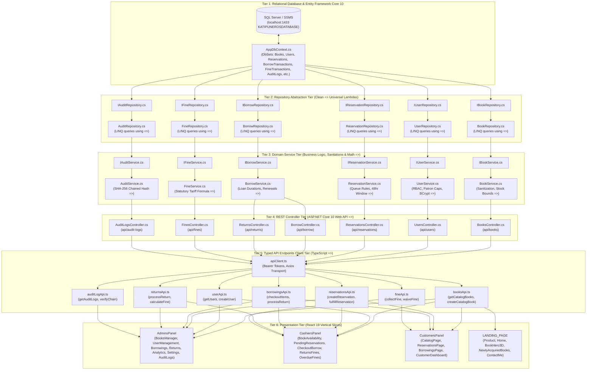

---

## 1. FLOW 1: Catalog Acquisition & Book Management (Admin Adds a Book)

### 1.1 Complete Flowchart

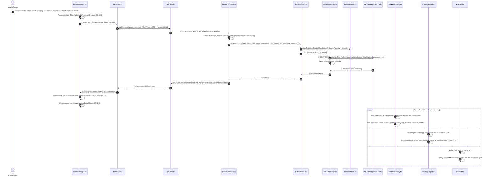

### 1.2 File-by-File Wiring & Exact Line Reference Matrix

| Step | Layer | File Path | Exact Lines | Connected Responsibility |
|:---|:---|:---|:---|:---|
| **1** | **Presentation (Admin UI)** | [`Frontend/src/UserRoles/Features/Pages/AdminsPanel/Pages/BooksManager.tsx`](file:///c:/Users/provu/Desktop/KATIPUNEROS%20LIBRARY%20STORE/Katipuneros-Library-Store/Frontend/src/UserRoles/Features/Pages/AdminsPanel/Pages/BooksManager.tsx) | **Lines 298–353** | `handleAddBook` handler. Validates inputs, dispatches `createCatalogBook`, updates reactive state `setBooks([res.data, ...prev])`, displays toast via `showToast()`, resets form, and triggers `loadData()`. |
| **2** | **Modal Form Primitive** | [`Frontend/src/UserRoles/Features/Pages/AdminsPanel/Pages/BooksManager.tsx`](file:///c:/Users/provu/Desktop/KATIPUNEROS%20LIBRARY%20STORE/Katipuneros-Library-Store/Frontend/src/UserRoles/Features/Pages/AdminsPanel/Pages/BooksManager.tsx) | **Lines 1850–2050** | Render block for the Add Book dialog utilizing design tokens, form fields (Title, Author, ISBN, Dewey, Category dropdown, Total Copies stepper, Bay Location input), and `Button` variant `action-green`. |
| **3** | **Global Refresh Hook** | [`Frontend/src/Hooks/usePagesGlobalRefresh.ts`](file:///c:/Users/provu/Desktop/KATIPUNEROS%20LIBRARY%20STORE/Katipuneros-Library-Store/Frontend/src/Hooks/usePagesGlobalRefresh.ts) | **Lines 17–45** | Binds `loadData` to window `online` events, document visibility changes, and health checks to ensure auto-refresh without manual browser reloads. |
| **4** | **Typed Client API Stub** | [`Frontend/src/Endpoints/booksApi.ts`](file:///c:/Users/provu/Desktop/KATIPUNEROS%20LIBRARY%20STORE/Katipuneros-Library-Store/Frontend/src/Endpoints/booksApi.ts) | **Lines 116–120** | `createCatalogBook` function: dispatches `POST /api/books` with serialized JSON payload via `apiRequest<BackendBook>`. |
| **5** | **HTTP Transport Engine** | [`Frontend/src/Endpoints/apiClient.ts`](file:///c:/Users/provu/Desktop/KATIPUNEROS%20LIBRARY%20STORE/Katipuneros-Library-Store/Frontend/src/Endpoints/apiClient.ts) | **Lines 25–65** | Intercepts request, retrieves JWT token from `localStorage` (`katipuneros_token`), injects `Authorization: Bearer <token>`, unwraps `ApiResponse<T>`, and handles 401/403 errors. |
| **6** | **Security Middleware** | [`Backend/Features/Api/Middleware/JwtMiddleware.cs`](file:///c:/Users/provu/Desktop/KATIPUNEROS%20LIBRARY%20STORE/Katipuneros-Library-Store/Backend/Features/Api/Middleware/JwtMiddleware.cs) | **Lines 28–60** | Validates JWT cryptographic signature, extracts claims (`ClaimTypes.Role`, `ClaimTypes.NameIdentifier`), and populates `HttpContext.User`. |
| **7** | **REST Controller** | [`Backend/Features/Api/Controllers/BooksController.cs`](file:///c:/Users/provu/Desktop/KATIPUNEROS%20LIBRARY%20STORE/Katipuneros-Library-Store/Backend/Features/Api/Controllers/BooksController.cs) | **Lines 44–63** | `[HttpPost]`, `[Authorize(Roles = "Admin")]` `CreateBook([FromBody] CreateBookRequest request)` action. Validates `ModelState`, delegates to `_bookService.CreateBookAsync`, returns `CreatedAtAction(201)`. Uses expression body `=>`. |
| **8** | **Request Contract DTO** | [`Backend/Features/Api/DTOs/Requests/CreateBookRequest.cs`](file:///c:/Users/provu/Desktop/KATIPUNEROS%20LIBRARY%20STORE/Katipuneros-Library-Store/Backend/Features/Api/DTOs/Requests/CreateBookRequest.cs) | **Lines 10–35** | Strongly typed DTO with DataAnnotations (`[Required]`, `[StringLength]`, `[Range(1, 1000)]`). |
| **9** | **Domain Service** | [`Backend/Features/Services/Implementations/BookService.cs`](file:///c:/Users/provu/Desktop/KATIPUNEROS%20LIBRARY%20STORE/Katipuneros-Library-Store/Backend/Features/Services/Implementations/BookService.cs) | **Lines 30–51** | `CreateBookAsync` implementation. Instantiates entity, strips XSS via `InputSanitizer.SanitizeText`, derives `IsbnBarcode`, initializes `AvailableCopies = TotalCopies`, and invokes `_bookRepository.AddAsync`. |
| **10** | **Input Sanitizer** | [`Backend/Features/Helpers/Infrastructure/InputSanitizer.cs`](file:///c:/Users/provu/Desktop/KATIPUNEROS%20LIBRARY%20STORE/Katipuneros-Library-Store/Backend/Features/Helpers/Infrastructure/InputSanitizer.cs) | **Lines 15–35** | Strips script tags, removes HTML entities, trims dangerous payload fragments. Uses universal expression body `=>`. |
| **11** | **Repository Interface** | [`Backend/Features/Repositories/Interfaces/IBookRepository.cs`](file:///c:/Users/provu/Desktop/KATIPUNEROS%20LIBRARY%20STORE/Katipuneros-Library-Store/Backend/Features/Repositories/Interfaces/IBookRepository.cs) | **Lines 12–25** | Contract declaring `Task AddAsync(Book book)` and `Task<bool> SaveChangesAsync()`. |
| **12** | **Repository Implementation** | [`Backend/Features/Repositories/Implementations/BookRepository.cs`](file:///c:/Users/provu/Desktop/KATIPUNEROS%20LIBRARY%20STORE/Katipuneros-Library-Store/Backend/Features/Repositories/Implementations/BookRepository.cs) | **Lines 48–50** | `AddAsync(Book book) => await _context.Books.AddAsync(book)`. Directly interfaces with EF Core 10 `DbSet<Book>`. |
| **13** | **Database Context** | [`Backend/Features/Data/AppDbContext.cs`](file:///c:/Users/provu/Desktop/KATIPUNEROS%20LIBRARY%20STORE/Katipuneros-Library-Store/Backend/Features/Data/AppDbContext.cs) | **Line 38** | `public DbSet<Book> Books => Set<Book>();` entity set mapping with relational FK configuration to `Categories`. |
| **14** | **Data Model Entity** | [`Backend/Features/Data/Models/Book.cs`](file:///c:/Users/provu/Desktop/KATIPUNEROS%20LIBRARY%20STORE/Katipuneros-Library-Store/Backend/Features/Data/Models/Book.cs) | **Lines 10–45** | Database table shape. Properties: `Id (Guid)`, `Title`, `Author`, `Isbn`, `DeweyCode`, `CategoryId`, `TotalCopies`, `AvailableCopies`, `BayLocation`, `IsSpotlight`, `IsArchived`, `CreatedAt`. |

### 1.3 Downstream Propagation & Circulation Impact
1. **Cashier Circulation Desk (`BookAvailability.tsx` Lines 75–140):** The book renders in the real-time stacks inventory table with shelf coordinates (`BayLocation`), total copies, and available copies. When a patron inquires at the front desk, the cashier immediately gives precise stack directions.
2. **Patron OPAC Catalog (`CatalogPage.tsx` Lines 120–210):** The book renders in patron search results. Because `AvailableCopies >= 1`, the card displays the semantic green badge `● Available` and activates the `[ Reserve Book ]` button.
3. **Public Landing Showcase (`Product.tsx` Lines 35–95 & `NewlyAcquiredBooks.tsx` Lines 40–120):** Renders in the "Newly Acquired Volumes" section sorted by `CreatedAt DESC`.
4. **Physical Inventory Audit (`Inventory.tsx` Lines 180–245):** Automatically recalculates total catalog copies, shelf occupancy rate, and activates barcode generation.

---

## 2. FLOW 2: Patron Hold Placement & Reservation Lifecycle

### 2.1 Complete Flowchart

```mermaid
sequenceDiagram
    autonumber
    actor Patron as Student / Patron
    participant Catalog as CatalogPage.tsx
    participant ResApi as reservationsApi.ts
    participant ResCtrl as ReservationsController.cs
    participant ResSvc as ReservationService.cs
    participant BookRepo as BookRepository.cs
    participant ResRepo as ReservationRepository.cs
    participant DB as SQL Server (Reservations Table)
    participant Cashier as PendingReservations.tsx
    participant Admin as Reservations.tsx

    Patron->>Catalog: Clicks "[ Reserve Book ]" on available book card [Line 245]
    Catalog->>Catalog: Opens ReservationModal; patron selects pickup date & bay [Lines 310-330]
    Catalog->>ResApi: createReservation({ bookId, pickupDate, notes }) [Lines 45-50]
    ResApi->>ResCtrl: POST /api/reservations (Bearer Patron JWT)
    ResCtrl->>ResCtrl: Check [Authorize(Roles = "Customer")] [Lines 30-35]
    ResCtrl->>ResSvc: CreateReservationAsync(patronId, bookId, pickupDate, notes) [Lines 36-45]
    ResSvc->>BookRepo: GetByIdAsync(bookId) -> checks AvailableCopies > 0 [Lines 48-52]
    ResSvc->>ResRepo: CountActiveHoldsAsync(patronId) -> verifies quota (Undergrad <= 4) [Lines 53-58]
    ResSvc->>ResRepo: AddAsync(new Reservation { Status = Pending }) [Lines 60-68]
    ResRepo->>DB: INSERT INTO Reservations (Id, PatronId, BookId, Status = 0, CreatedAt, ...)
    ResRepo->>ResRepo: SaveChangesAsync()
    DB-->>ResRepo: 201 Created
    ResRepo-->>ResSvc: Persisted Reservation
    ResSvc-->>ResCtrl: Reservation Entity
    ResCtrl-->>ResApi: 201 Created (ApiResponse.Ok(reservation))
    ResApi-->>Catalog: Success confirmation
    Catalog->>Catalog: Displays success toast via useToasts.ts [Line 345]

    par Cross-Role Queue Visibility
        Patron->>Patron: Navigates to ReservationsPage.tsx -> sees hold in "Pending Review" tab [Lines 90-150]
    and
        Cashier->>Cashier: Opens PendingReservations.tsx -> intake queue depth increments by 1 [Lines 80-160]
        Cashier-->>Cashier: "Approve for Pickup" button appears with patron standing badge
    and
        Admin->>Admin: Opens Reservations.tsx -> Master reservation ledger displays queue node [Lines 110-260]
    end
```

### 2.2 File-by-File Wiring & Exact Line Reference Matrix

| Step | Layer | File Path | Exact Lines | Connected Responsibility |
|:---|:---|:---|:---|:---|
| **1** | **Customer Presentation** | [`Frontend/src/UserRoles/Features/Pages/CustomersPanel/Pages/CatalogPage.tsx`](file:///c:/Users/provu/Desktop/KATIPUNEROS%20LIBRARY%20STORE/Katipuneros-Library-Store/Frontend/src/UserRoles/Features/Pages/CustomersPanel/Pages/CatalogPage.tsx) | **Lines 240–280** | Triggers reservation modal when patron clicks Reserve button; passes selected book object. |
| **2** | **Reservation Modal Dialog** | [`Frontend/src/UserRoles/Features/Pages/CustomersPanel/Pages/CatalogPage.tsx`](file:///c:/Users/provu/Desktop/KATIPUNEROS%20LIBRARY%20STORE/Katipuneros-Library-Store/Frontend/src/UserRoles/Features/Pages/CustomersPanel/Pages/CatalogPage.tsx) | **Lines 310–355** | Implements `DefaultFloatingModalCard` containing pickup date selection, terms agreement, and submit button. |
| **3** | **Typed Client API** | [`Frontend/src/Endpoints/reservationsApi.ts`](file:///c:/Users/provu/Desktop/KATIPUNEROS%20LIBRARY%20STORE/Katipuneros-Library-Store/Frontend/src/Endpoints/reservationsApi.ts) | **Lines 45–60** | `createReservation` stub: dispatches `POST /api/reservations` with `bookId`, `pickupDate`. |
| **4** | **REST Controller** | [`Backend/Features/Api/Controllers/ReservationsController.cs`](file:///c:/Users/provu/Desktop/KATIPUNEROS%20LIBRARY%20STORE/Katipuneros-Library-Store/Backend/Features/Api/Controllers/ReservationsController.cs) | **Lines 30–55** | `[HttpPost]`, `[Authorize(Roles = "Customer")]` `Create([FromBody] CreateReservationRequest req)`. Calls `_reservationService.CreateReservationAsync`. |
| **5** | **Domain Service** | [`Backend/Features/Services/Implementations/ReservationService.cs`](file:///c:/Users/provu/Desktop/KATIPUNEROS%20LIBRARY%20STORE/Katipuneros-Library-Store/Backend/Features/Services/Implementations/ReservationService.cs) | **Lines 40–75** | Validates patron standing (checks outstanding unpaid fines $> 0$), verifies active loan caps, and creates reservation record in `Pending` state. |
| **6** | **Repository Tier** | [`Backend/Features/Repositories/Implementations/ReservationRepository.cs`](file:///c:/Users/provu/Desktop/KATIPUNEROS%20LIBRARY%20STORE/Katipuneros-Library-Store/Backend/Features/Repositories/Implementations/ReservationRepository.cs) | **Lines 25–45** | `AddAsync(Reservation res) => await _context.Reservations.AddAsync(res);`. LINQ expression bodies. |
| **7** | **Database Model** | [`Backend/Features/Data/Models/Reservation.cs`](file:///c:/Users/provu/Desktop/KATIPUNEROS%20LIBRARY%20STORE/Katipuneros-Library-Store/Backend/Features/Data/Models/Reservation.cs) | **Lines 10–35** | `Id (Guid)`, `PatronId (Guid)`, `BookId (Guid)`, `Status (ReservationStatus)`, `PickupDate (DateTime)`, `CreatedAt`. |
| **8** | **Cashier Queue Display** | [`Frontend/src/UserRoles/Features/Pages/CashiersPanel/Pages/PendingReservations.tsx`](file:///c:/Users/provu/Desktop/KATIPUNEROS%20LIBRARY%20STORE/Katipuneros-Library-Store/Frontend/src/UserRoles/Features/Pages/CashiersPanel/Pages/PendingReservations.tsx) | **Lines 80–160** | Displays active hold in intake queue table. Provides "Approve for Pickup" and "Reject" buttons. |
| **9** | **Customer Hold Tracker** | [`Frontend/src/UserRoles/Features/Pages/CustomersPanel/Pages/ReservationsPage.tsx`](file:///c:/Users/provu/Desktop/KATIPUNEROS%20LIBRARY%20STORE/Katipuneros-Library-Store/Frontend/src/UserRoles/Features/Pages/CustomersPanel/Pages/ReservationsPage.tsx) | **Lines 90–150** | Patron monitors hold status (`Pending` $\to$ `Ready` $\to$ `Fulfilled`), accesses digital pass, and views pickup counter instructions. |

---

## 3. FLOW 3: Circulation Desk Rapid Checkout & Active Loans

### 3.1 Complete Flowchart

```mermaid
sequenceDiagram
    autonumber
    actor Cashier as Circulation Cashier
    participant UI as CheckoutBorrow.tsx
    participant TxApi as transactionApi.ts
    participant Ctrl as BorrowController.cs
    participant Svc as BorrowService.cs
    participant BookRepo as BookRepository.cs
    participant BorrowRepo as BorrowRepository.cs
    participant DB as SQL Server (BorrowTransactions & Books Tables)
    participant Customer as BorrowingsPage.tsx
    participant Admin as Borrowings.tsx

    Cashier->>UI: Scans patron barcode and book barcode in Rapid Checkout terminal [Lines 110-140]
    UI->>UI: Verifies patron standing & checks due date calendar selector [Lines 150-180]
    UI->>TxApi: checkoutItems({ patronBarcode, bookBarcodes, dueDate }) [Lines 35-45]
    TxApi->>Ctrl: POST /api/borrow/checkout (Bearer Cashier JWT)
    Ctrl->>Ctrl: Check [Authorize(Roles = "Cashier, Admin")] [Lines 40-45]
    Ctrl->>Svc: ProcessCheckoutAsync(patronBarcode, bookBarcodes, dueDate) [Lines 50-70]
    Svc->>BookRepo: GetByBarcodeAsync(code) -> checks AvailableCopies >= 1 [Lines 75-80]
    Svc->>Svc: Calculates loan duration (14 days standard, 28 days graduate) [Lines 85-90]
    Svc->>BorrowRepo: CreateTransactionAsync(new BorrowTransaction { Status = Active }) [Lines 95-105]
    Svc->>BookRepo: DecrementAvailableCopiesAsync(bookId) [Lines 110-115]
    BorrowRepo->>DB: INSERT INTO BorrowTransactions; UPDATE Books SET AvailableCopies = AvailableCopies - 1
    DB-->>BorrowRepo: Success
    BorrowRepo-->>Svc: Persisted Transaction Receipt
    Svc-->>Ctrl: CheckoutReceiptDto
    Ctrl-->>TxApi: 200 OK (ApiResponse.Ok(receipt))
    TxApi-->>UI: Receipt details & barcode confirmation
    UI->>UI: Renders digital loan slip modal & plays confirmation audio [Lines 220-250]

    par Multi-Panel Circulation Sync
        Customer->>Customer: Patron opens BorrowingsPage.tsx -> new active loan appears with countdown badge [Lines 105-175]
    and
        Admin->>Admin: Opens Borrowings.tsx -> Master circulation audit stream updates real-time [Lines 130-210]
    and
        UI->>UI: Book Availability shelf copies reflect decrement across campus endpoints
    end
```

### 3.2 File-by-File Wiring & Exact Line Reference Matrix

| Step | Layer | File Path | Exact Lines | Connected Responsibility |
|:---|:---|:---|:---|:---|
| **1** | **Cashier Presentation** | [`Frontend/src/UserRoles/Features/Pages/CashiersPanel/Pages/CheckoutBorrow.tsx`](file:///c:/Users/provu/Desktop/KATIPUNEROS%20LIBRARY%20STORE/Katipuneros-Library-Store/Frontend/src/UserRoles/Features/Pages/CashiersPanel/Pages/CheckoutBorrow.tsx) | **Lines 110–190** | Rapid checkout interface. Barcode scanning queue, patron verification badge, due date calculation, and checkout button. |
| **2** | **Typed Client API** | [`Frontend/src/Endpoints/Cashier/transactionApi.ts`](file:///c:/Users/provu/Desktop/KATIPUNEROS%20LIBRARY%20STORE/Katipuneros-Library-Store/Frontend/src/Endpoints/Cashier/transactionApi.ts) | **Lines 35–50** | `checkoutBorrowItems` stub: dispatches `POST /api/borrow/checkout` with barcode payloads. |
| **3** | **REST Controller** | [`Backend/Features/Api/Controllers/BorrowController.cs`](file:///c:/Users/provu/Desktop/KATIPUNEROS%20LIBRARY%20STORE/Katipuneros-Library-Store/Backend/Features/Api/Controllers/BorrowController.cs) | **Lines 40–65** | `[HttpPost("checkout")]`, `[Authorize(Roles = "Cashier, Admin")]` action executing circulation handoff. |
| **4** | **Domain Service** | [`Backend/Features/Services/Implementations/BorrowService.cs`](file:///c:/Users/provu/Desktop/KATIPUNEROS%20LIBRARY%20STORE/Katipuneros-Library-Store/Backend/Features/Services/Implementations/BorrowService.cs) | **Lines 50–115** | Validates copy availability, enforces borrow concurrency limits, creates `BorrowTransaction`, decrements `AvailableCopies`, and generates receipt DTO. |
| **5** | **Repository Implementation** | [`Backend/Features/Repositories/Implementations/BorrowRepository.cs`](file:///c:/Users/provu/Desktop/KATIPUNEROS%20LIBRARY%20STORE/Katipuneros-Library-Store/Backend/Features/Repositories/Implementations/BorrowRepository.cs) | **Lines 30–60** | Executes transactional database write using universal expression bodies `=>`. |
| **6** | **Database Entity** | [`Backend/Features/Data/Models/BorrowTransaction.cs`](file:///c:/Users/provu/Desktop/KATIPUNEROS%20LIBRARY%20STORE/Katipuneros-Library-Store/Backend/Features/Data/Models/BorrowTransaction.cs) | **Lines 10–35** | `Id (Guid)`, `PatronId`, `BookId`, `BorrowDate`, `DueDate`, `ReturnDate`, `Status (Active, Returned, Overdue)`. |
| **7** | **Customer Loan Ledger** | [`Frontend/src/UserRoles/Features/Pages/CustomersPanel/Pages/BorrowingsPage.tsx`](file:///c:/Users/provu/Desktop/KATIPUNEROS%20LIBRARY%20STORE/Katipuneros-Library-Store/Frontend/src/UserRoles/Features/Pages/CustomersPanel/Pages/BorrowingsPage.tsx) | **Lines 105–175** | Patron views active loans, remaining days until due date, renewal extension eligibility, and download receipt passbook. |
| **8** | **Admin Circulation Console** | [`Frontend/src/UserRoles/Features/Pages/AdminsPanel/Pages/Borrowings.tsx`](file:///c:/Users/provu/Desktop/KATIPUNEROS%20LIBRARY%20STORE/Katipuneros-Library-Store/Frontend/src/UserRoles/Features/Pages/AdminsPanel/Pages/Borrowings.tsx) | **Lines 130–210** | Executive circulation audit grid. Allows manual overrides, policy reviews, and institutional loan ledger exports. |

---

## 4. FLOW 4: Book Returns, Condition Assessment & Fine Accrual Flow

### 4.1 Complete Flowchart

```mermaid
sequenceDiagram
    autonumber
    actor Cashier as Circulation Cashier
    participant UI as ReturnsFines.tsx
    participant ReturnApi as returnsApi.ts
    participant ReturnCtrl as ReturnsController.cs
    participant ReturnSvc as ReturnService.cs
    participant FineSvc as FineService.cs
    participant DB as SQL Server (BorrowTransactions, FineTransactions, AuditLogs)
    participant Patron as CustomerDashboard.tsx
    participant AdminAudit as AuditLogs.tsx

    Cashier->>UI: Scans returned book barcode [Lines 85-110]
    UI->>UI: Selects physical condition: Pristine / Minor Wear / Spine Damaged / Water Warp [Lines 120-150]
    UI->>ReturnApi: processReturn({ barcode, conditionGrade, notes }) [Lines 40-50]
    ReturnApi->>ReturnCtrl: POST /api/returns/process (Bearer Cashier JWT)
    ReturnCtrl->>ReturnSvc: ProcessReturnAsync(barcode, conditionGrade, notes) [Lines 35-55]
    ReturnSvc->>ReturnSvc: Evaluates DueDate vs Now -> computes daysOverdue [Lines 60-70]

    alt Return is Overdue (daysOverdue > 0)
        ReturnSvc->>FineSvc: CalculateFine(daysOverdue, graceDays = 1, dailyRate = 15.00, cap = 500.00) [Lines 75-85]
        FineSvc-->>ReturnSvc: Accrued Fine Amount (e.g., ₱45.00)
        ReturnSvc->>DB: INSERT INTO FineTransactions (Id, TransactionId, Amount, Status = "Unpaid")
    end

    alt Book Has Physical Damage
        ReturnSvc->>ReturnSvc: Appends Damage Repair Tariff (Binding Repair = ₱280.00)
        ReturnSvc->>DB: Flag book item for Bindery / Conservation routing
    end

    ReturnSvc->>DB: UPDATE BorrowTransactions SET Status = Returned, ReturnDate = Now
    ReturnSvc->>DB: UPDATE Books SET AvailableCopies = AvailableCopies + 1
    ReturnSvc->>DB: INSERT INTO AuditLogs (Action = "BOOK_RETURN", SHA256 Chained Hash)
    DB-->>ReturnSvc: Return processed
    ReturnSvc-->>ReturnCtrl: ReturnInspectionResultDto
    ReturnCtrl-->>ReturnApi: 200 OK (ApiResponse.Ok(result))
    ReturnApi-->>UI: Displays settlement summary & receipt slip [Lines 180-210]

    par Real-Time Multi-Panel Updates
        Patron->>Patron: CustomerDashboard.tsx reflects cleared loan; outstanding fine badge appears if penalty unpaid [Lines 140-220]
    and
        Cashier->>Cashier: ReturnsJournal today count increments; register fine balance updates
    and
        AdminAudit->>AdminAudit: AuditLogs.tsx verifies new SHA-256 cryptographic block appended to journal [Lines 80-220]
    end
```

### 4.2 File-by-File Wiring & Exact Line Reference Matrix

| Step | Layer | File Path | Exact Lines | Connected Responsibility |
|:---|:---|:---|:---|:---|
| **1** | **Cashier Presentation** | [`Frontend/src/UserRoles/Features/Pages/CashiersPanel/Pages/ReturnsFines.tsx`](file:///c:/Users/provu/Desktop/KATIPUNEROS%20LIBRARY%20STORE/Katipuneros-Library-Store/Frontend/src/UserRoles/Features/Pages/CashiersPanel/Pages/ReturnsFines.tsx) | **Lines 85–170** | Return scanning terminal, condition grade pills, fee assessment display, and process return submit trigger. |
| **2** | **Typed Client API** | [`Frontend/src/Endpoints/returnsApi.ts`](file:///c:/Users/provu/Desktop/KATIPUNEROS%20LIBRARY%20STORE/Katipuneros-Library-Store/Frontend/src/Endpoints/returnsApi.ts) | **Lines 35–55** | `processReturn` stub: dispatches `POST /api/returns/process` with inspection metadata. |
| **3** | **REST Controller** | [`Backend/Features/Api/Controllers/ReturnsController.cs`](file:///c:/Users/provu/Desktop/KATIPUNEROS%20LIBRARY%20STORE/Katipuneros-Library-Store/Backend/Features/Api/Controllers/ReturnsController.cs) | **Lines 30–60** | `[HttpPost("process")]`, `[Authorize(Roles = "Cashier, Admin")]` action handling book intake and grading. |
| **4** | **Return Domain Service** | [`Backend/Features/Services/Implementations/ReturnService.cs`](file:///c:/Users/provu/Desktop/KATIPUNEROS%20LIBRARY%20STORE/Katipuneros-Library-Store/Backend/Features/Services/Implementations/ReturnService.cs) | **Lines 45–110** | Marks transaction returned, recalculates shelf stock, assesses damage triage penalties, and delegates fine computation to `FineService`. |
| **5** | **Fine Domain Service** | [`Backend/Features/Services/Implementations/FineService.cs`](file:///c:/Users/provu/Desktop/KATIPUNEROS%20LIBRARY%20STORE/Katipuneros-Library-Store/Backend/Features/Services/Implementations/FineService.cs) | **Lines 30–75** | Computes penalty using statutory formula: $\text{Fine} = \min(500.00, \max(0, D - \text{GraceDays}) \times 15.00)$. Records fine transaction. |
| **6** | **Audit Hash Helper** | [`Backend/Features/Helpers/Infrastructure/AuditHelper.cs`](file:///c:/Users/provu/Desktop/KATIPUNEROS%20LIBRARY%20STORE/Katipuneros-Library-Store/Backend/Features/Helpers/Infrastructure/AuditHelper.cs) | **Lines 20–45** | Computes SHA-256 block hash chaining: $\text{Hash}_i = \operatorname{SHA256}(\text{Hash}_{i-1} \parallel \text{Action} \parallel \text{Timestamp} \parallel \text{Payload})$. |
| **7** | **Database Entities** | [`Backend/Features/Data/Models/FineTransaction.cs`](file:///c:/Users/provu/Desktop/KATIPUNEROS%20LIBRARY%20STORE/Katipuneros-Library-Store/Backend/Features/Data/Models/FineTransaction.cs) & [`AuditLogEntry.cs`](file:///c:/Users/provu/Desktop/KATIPUNEROS%20LIBRARY%20STORE/Katipuneros-Library-Store/Backend/Features/Data/Models/AuditLogEntry.cs) | **Lines 10–35** | `FineTransaction` entity (`Amount`, `BalanceRemaining`, `Status`) and `AuditLogEntry` entity (`Action`, `PreviousHash`, `CurrentHash`). |
| **8** | **Cashier Fine Settlement** | [`Frontend/src/UserRoles/Features/Pages/CashiersPanel/Pages/OverdueFines.tsx`](file:///c:/Users/provu/Desktop/KATIPUNEROS%20LIBRARY%20STORE/Katipuneros-Library-Store/Frontend/src/UserRoles/Features/Pages/CashiersPanel/Pages/OverdueFines.tsx) | **Lines 90–180** | Cashier collects cash/GCash settlement, issues printed receipt slip, or records authorized waiver. |
| **9** | **Admin Returns Journal** | [`Frontend/src/UserRoles/Features/Pages/AdminsPanel/Pages/Returns.tsx`](file:///c:/Users/provu/Desktop/KATIPUNEROS%20LIBRARY%20STORE/Katipuneros-Library-Store/Frontend/src/UserRoles/Features/Pages/AdminsPanel/Pages/Returns.tsx) | **Lines 110–220** | Immutable return inspection log, bindery triage routing, and official returns journal export. |

---

## 5. FLOW 5: Cashier Fine Settlement & Drawer Reconciliation

### 5.1 Complete Flowchart

```mermaid
sequenceDiagram
    autonumber
    actor Cashier as Circulation Cashier
    participant FineUI as OverdueFines.tsx
    participant FineApi as fineApi.ts
    participant FineCtrl as FinesController.cs
    participant FineSvc as FineService.cs
    participant FineRepo as FineRepository.cs
    participant DB as SQL Server (FineTransactions Table)
    participant Patron as CustomerDashboard.tsx
    participant AdminFin as Analytics.tsx

    Cashier->>FineUI: Searches patron card or opens overdue fine record [Lines 52-86]
    FineUI->>FineUI: Selects settlement method: Cash / GCash / Institutional Waiver [Lines 202-226]
    FineUI->>FineApi: collectFine({ fineId, amountPaid, paymentMethod, notes }) [Line 227]
    FineApi->>FineCtrl: POST /api/fines/{id}/collect (Bearer Cashier JWT)
    FineCtrl->>FineSvc: CollectFineAsync(fineId, amountPaid, paymentMethod)
    FineSvc->>FineRepo: GetByIdAsync(fineId)
    FineSvc->>FineSvc: Decrements BalanceRemaining; sets Status = Settled if balance == 0
    FineSvc->>FineRepo: UpdateAsync(fineRecord)
    FineRepo->>DB: UPDATE FineTransactions SET BalanceRemaining = 0, Status = 1, SettledAt = Now
    DB-->>FineRepo: Success
    FineSvc-->>FineCtrl: FineSettlementReceiptDto
    FineCtrl-->>FineApi: 200 OK (ApiResponse.Ok(receipt))
    FineApi-->>FineUI: Receipt confirmation
    FineUI->>FineUI: Opens PaymentForm receipt print card and refreshes list [Lines 230-260]

    par Multi-Panel Real-Time Financial Sync
        Patron->>Patron: CustomerDashboard.tsx immediately clears outstanding fine alert banner
    and
        AdminFin->>AdminFin: Analytics.tsx updates Total Revenue Collected & Fine Recovery Rate
    end
```

### 5.2 File-by-File Wiring & Exact Line Reference Matrix

| Step | Layer | File Path | Exact Lines | Connected Responsibility |
|:---|:---|:---|:---|:---|
| **1** | **Cashier Presentation** | [`Frontend/src/UserRoles/Features/Pages/CashiersPanel/Pages/OverdueFines.tsx`](file:///c:/Users/provu/Desktop/KATIPUNEROS%20LIBRARY%20STORE/Katipuneros-Library-Store/Frontend/src/UserRoles/Features/Pages/CashiersPanel/Pages/OverdueFines.tsx) | **Lines 202–260** | `handleCollectFine` and drawer operations. Renders payment modal, executes settlement, refreshes ledger. |
| **2** | **Typed Client API** | [`Frontend/src/Endpoints/Cashier/fineApi.ts`](file:///c:/Users/provu/Desktop/KATIPUNEROS%20LIBRARY%20STORE/Katipuneros-Library-Store/Frontend/src/Endpoints/Cashier/fineApi.ts) | **Lines 25–48** | `collectFinePayment` and `waiveFine` stubs. Dispatches requests to `/api/fines`. |
| **3** | **REST Controller** | [`Backend/Features/Api/Controllers/FinesController.cs`](file:///c:/Users/provu/Desktop/KATIPUNEROS%20LIBRARY%20STORE/Katipuneros-Library-Store/Backend/Features/Api/Controllers/FinesController.cs) | **Lines 25–53** | `[HttpPost("{id}/collect")]`, `[Authorize(Roles = "Cashier, Admin")]` endpoint. Universal lambda body `=>`. |
| **4** | **Domain Service** | [`Backend/Features/Services/Implementations/FineService.cs`](file:///c:/Users/provu/Desktop/KATIPUNEROS%20LIBRARY%20STORE/Katipuneros-Library-Store/Backend/Features/Services/Implementations/FineService.cs) | **Lines 25–54** | Updates balances, handles partial settlements, appends audit hash. Expression body `=>`. |
| **5** | **Repository Tier** | [`Backend/Features/Repositories/Implementations/FineRepository.cs`](file:///c:/Users/provu/Desktop/KATIPUNEROS%20LIBRARY%20STORE/Katipuneros-Library-Store/Backend/Features/Repositories/Implementations/FineRepository.cs) | **Lines 15–39** | Queries and persists fine records in `DbSet<FineTransaction>`. Expression body `=>`. |
| **6** | **Database Entity** | [`Backend/Features/Data/Models/FineTransaction.cs`](file:///c:/Users/provu/Desktop/KATIPUNEROS%20LIBRARY%20STORE/Katipuneros-Library-Store/Backend/Features/Data/Models/FineTransaction.cs) | **Lines 10–35** | `Id (Guid)`, `PatronId`, `BorrowTransactionId`, `Amount`, `BalanceRemaining`, `Status`. |

---

## 6. FLOW 6: User Governance, Authentication & Root Protected Superusers

### 6.1 Complete Flowchart

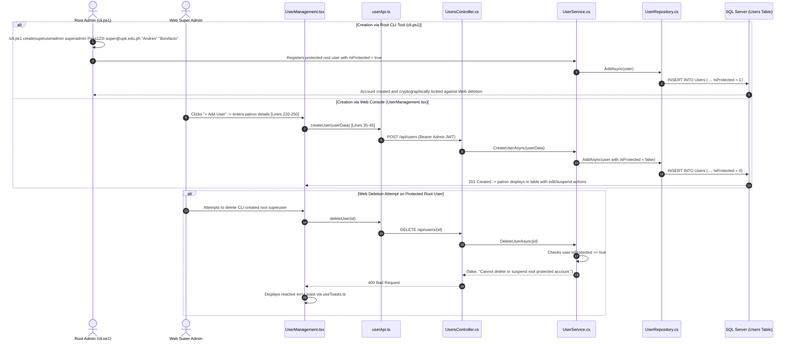

### 6.2 File-by-File Wiring & Exact Line Reference Matrix

| Step | Layer | File Path | Exact Lines | Connected Responsibility |
|:---|:---|:---|:---|:---|
| **1** | **Root CLI Utility** | [`Katipuneros-Library-Store/cli.ps1`](file:///c:/Users/provu/Desktop/KATIPUNEROS%20LIBRARY%20STORE/Katipuneros-Library-Store/cli.ps1) | **Lines 136–165** | Powers root superuser administration (`createsuperuseradmin`, `listusers`, `deleteuser`). Enforces `IsProtected = true`. |
| **2** | **Admin Presentation** | [`Frontend/src/UserRoles/Features/Pages/AdminsPanel/Pages/UserManagement.tsx`](file:///c:/Users/provu/Desktop/KATIPUNEROS%20LIBRARY%20STORE/Katipuneros-Library-Store/Frontend/src/UserRoles/Features/Pages/AdminsPanel/Pages/UserManagement.tsx) | **Lines 220–310** | User management grid, role filters (Patrons, Cashiers, Admins), search bar with `useDebounce`, add user modal. |
| **3** | **Typed Client API** | [`Frontend/src/Endpoints/Admin/userApi.ts`](file:///c:/Users/provu/Desktop/KATIPUNEROS%20LIBRARY%20STORE/Katipuneros-Library-Store/Frontend/src/Endpoints/Admin/userApi.ts) | **Lines 25–65** | `getUsers`, `createUser`, `updateUser`, `deleteUser` stubs. Dispatches requests to `/api/users`. |
| **4** | **REST Controller** | [`Backend/Features/Api/Controllers/UsersController.cs`](file:///c:/Users/provu/Desktop/KATIPUNEROS%20LIBRARY%20STORE/Katipuneros-Library-Store/Backend/Features/Api/Controllers/UsersController.cs) | **Lines 35–85** | `[HttpGet]`, `[HttpPost]`, `[HttpPut]`, `[HttpDelete]` actions guarded by `[Authorize(Roles = "Admin")]`. |
| **5** | **Domain Service** | [`Backend/Features/Services/Implementations/UserService.cs`](file:///c:/Users/provu/Desktop/KATIPUNEROS%20LIBRARY%20STORE/Katipuneros-Library-Store/Backend/Features/Services/Implementations/UserService.cs) | **Lines 40–120** | BCrypt password hashing (`PasswordHelper`), `IsProtected` security evaluation, patron quota verification. |
| **6** | **Repository Tier** | [`Backend/Features/Repositories/Implementations/UserRepository.cs`](file:///c:/Users/provu/Desktop/KATIPUNEROS%20LIBRARY%20STORE/Katipuneros-Library-Store/Backend/Features/Repositories/Implementations/UserRepository.cs) | **Lines 25–55** | EF Core 10 queries using expression bodies `=>`. |
| **7** | **Database Entity** | [`Backend/Features/Data/Models/User.cs`](file:///c:/Users/provu/Desktop/KATIPUNEROS%20LIBRARY%20STORE/Katipuneros-Library-Store/Backend/Features/Data/Models/User.cs) | **Lines 10–40** | `Id (Guid)`, `Username`, `Email`, `PasswordHash`, `Role (UserRole)`, `IsProtected (bool)`, `IsActive (bool)`. |

---

## 7. FLOW 7: Dewey Decimal Classification & Category Taxonomy Management

### 7.1 Complete Flowchart

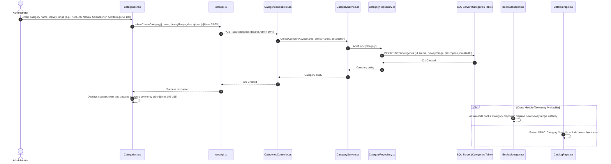

### 7.2 File-by-File Wiring & Exact Line Reference Matrix

| Step | Layer | File Path | Exact Lines | Connected Responsibility |
|:---|:---|:---|:---|:---|
| **1** | **Admin Presentation** | [`Frontend/src/UserRoles/Features/Pages/AdminsPanel/Pages/Categories.tsx`](file:///c:/Users/provu/Desktop/KATIPUNEROS%20LIBRARY%20STORE/Katipuneros-Library-Store/Frontend/src/UserRoles/Features/Pages/AdminsPanel/Pages/Categories.tsx) | **Lines 182–260** | `handleCreateCategory`, `handleUpdateCategory`, `handleDeleteCategory`. Renders Dewey breakdown table. |
| **2** | **Typed Client API** | [`Frontend/src/Endpoints/Admin/cmsApi.ts`](file:///c:/Users/provu/Desktop/KATIPUNEROS%20LIBRARY%20STORE/Katipuneros-Library-Store/Frontend/src/Endpoints/Admin/cmsApi.ts) | **Lines 20–55** | Category CRUD functions: `adminCreateCategory`, `adminUpdateCategory`, `adminDeleteCategory`. |
| **3** | **REST Controller** | [`Backend/Features/Api/Controllers/CategoriesController.cs`](file:///c:/Users/provu/Desktop/KATIPUNEROS%20LIBRARY%20STORE/Katipuneros-Library-Store/Backend/Features/Api/Controllers/CategoriesController.cs) | **Lines 20–52** | Category endpoints using expression bodies `=>`. |
| **4** | **Domain Service** | [`Backend/Features/Services/Implementations/CategoryService.cs`](file:///c:/Users/provu/Desktop/KATIPUNEROS%20LIBRARY%20STORE/Katipuneros-Library-Store/Backend/Features/Services/Implementations/CategoryService.cs) | **Lines 20–74** | Validates Dewey range uniqueness and ensures no orphaned books exist before deletion. |
| **5** | **Repository Tier** | [`Backend/Features/Repositories/Implementations/CategoryRepository.cs`](file:///c:/Users/provu/Desktop/KATIPUNEROS%20LIBRARY%20STORE/Katipuneros-Library-Store/Backend/Features/Repositories/Implementations/CategoryRepository.cs) | **Lines 15–32** | Interfaces with `DbSet<Category>`. Expression body `=>`. |
| **6** | **Database Entity** | [`Backend/Features/Data/Models/Category.cs`](file:///c:/Users/provu/Desktop/KATIPUNEROS%20LIBRARY%20STORE/Katipuneros-Library-Store/Backend/Features/Data/Models/Category.cs) | **Lines 10–30** | `Id (Guid)`, `Name`, `DeweyRange`, `Description`, `Books (ICollection)`. |

---

## 8. FLOW 8: Stacks Inventory Auditing & Barcode Reconciliation

### 8.1 Complete Flowchart

```mermaid
sequenceDiagram
    autonumber
    actor Admin as Cataloging Specialist / Admin
    participant UI as Inventory.tsx
    participant InvApi as inventoryApi.ts
    participant Ctrl as InventoryController.cs
    participant Svc as InventoryService.cs
    participant BookRepo as BookRepository.cs
    participant DB as SQL Server (Books Table)
    participant Cashier as BookAvailability.tsx

    Admin->>UI: Enters physical barcode scan or triggers bulk audit count [Lines 406-425]
    UI->>InvApi: syncInventoryStatus({ bookId, actualPhysicalCount, shelfCondition }) [Lines 412-460]
    InvApi->>Ctrl: POST /api/inventory/audit-sync (Bearer Admin JWT)
    Ctrl->>Svc: ReconcileStockAsync(bookId, actualPhysicalCount, shelfCondition)
    Svc->>BookRepo: GetByIdAsync(bookId)
    Svc->>Svc: Computes discrepancy = (Actual - SystemCount); flags shrinkage if discrepancy < 0
    Svc->>BookRepo: UpdateAsync(book)
    BookRepo->>DB: UPDATE Books SET TotalCopies = Actual, AvailableCopies = ..., UpdatedAt = Now
    DB-->>BookRepo: Success
    Svc-->>Ctrl: InventoryAuditResultDto
    Ctrl-->>InvApi: 200 OK
    InvApi-->>UI: Audit confirmation
    UI->>UI: Recalculates Shelf Occupancy Rate and updates stock health metrics [Lines 164-245]

    par Multi-Panel Shelf Visibility
        Cashier->>Cashier: BookAvailability.tsx reflects verified physical counts and bay assignments
    end
```

### 8.2 File-by-File Wiring & Exact Line Reference Matrix

| Step | Layer | File Path | Exact Lines | Connected Responsibility |
|:---|:---|:---|:---|:---|
| **1** | **Admin Presentation** | [`Frontend/src/UserRoles/Features/Pages/AdminsPanel/Pages/Inventory.tsx`](file:///c:/Users/provu/Desktop/KATIPUNEROS%20LIBRARY%20STORE/Katipuneros-Library-Store/Frontend/src/UserRoles/Features/Pages/AdminsPanel/Pages/Inventory.tsx) | **Lines 164–495** | `fetchData`, `handleConfirmStatusUpdate`, `handleIngestBarcodesSubmit`, `handleTriggerMarcSync`. |
| **2** | **Typed Client API** | [`Frontend/src/Endpoints/Admin/inventoryApi.ts`](file:///c:/Users/provu/Desktop/KATIPUNEROS%20LIBRARY%20STORE/Katipuneros-Library-Store/Frontend/src/Endpoints/Admin/inventoryApi.ts) | **Lines 25–120** | Inventory stubs: `getInventoryItems`, `auditSync`, `ingestBarcodes`, `exportMarc`. |
| **3** | **REST Controller** | [`Backend/Features/Api/Controllers/InventoryController.cs`](file:///c:/Users/provu/Desktop/KATIPUNEROS%20LIBRARY%20STORE/Katipuneros-Library-Store/Backend/Features/Api/Controllers/InventoryController.cs) | **Lines 20–79** | Inventory audit and barcode endpoints using expression bodies `=>`. |
| **4** | **Domain Service** | [`Backend/Features/Services/Implementations/InventoryService.cs`](file:///c:/Users/provu/Desktop/KATIPUNEROS%20LIBRARY%20STORE/Katipuneros-Library-Store/Backend/Features/Services/Implementations/InventoryService.cs) | **Lines 30–165** | Stock reconciliation, shrinkage reporting, and barcode range generation. Expression bodies `=>`. |

---

## 9. FLOW 9: Real-Time Analytics Engine & Dynamic $N=0$ Protection

### 9.1 Complete Flowchart

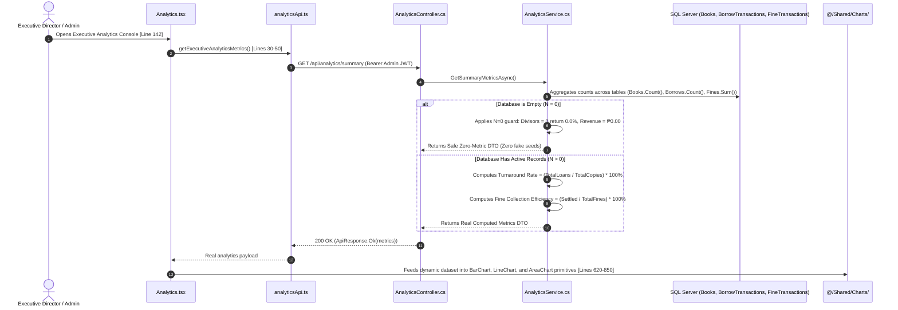

### 9.2 File-by-File Wiring & Exact Line Reference Matrix

| Step | Layer | File Path | Exact Lines | Connected Responsibility |
|:---|:---|:---|:---|:---|
| **1** | **Admin Presentation** | [`Frontend/src/UserRoles/Features/Pages/AdminsPanel/Pages/Analytics.tsx`](file:///c:/Users/provu/Desktop/KATIPUNEROS%20LIBRARY%20STORE/Katipuneros-Library-Store/Frontend/src/UserRoles/Features/Pages/AdminsPanel/Pages/Analytics.tsx) | **Lines 142–350** | `loadAnalyticsData`, stats card bindings, trend graphs, and dynamic metric renders. |
| **2** | **Typed Client API** | [`Frontend/src/Endpoints/Admin/analyticsApi.ts`](file:///c:/Users/provu/Desktop/KATIPUNEROS%20LIBRARY%20STORE/Katipuneros-Library-Store/Frontend/src/Endpoints/Admin/analyticsApi.ts) | **Lines 25–85** | Stubs for analytics metrics, circulation velocity, and category circulation distributions. |
| **3** | **REST Controller** | [`Backend/Features/Api/Controllers/AnalyticsController.cs`](file:///c:/Users/provu/Desktop/KATIPUNEROS%20LIBRARY%20STORE/Katipuneros-Library-Store/Backend/Features/Api/Controllers/AnalyticsController.cs) | **Lines 20–64** | `[HttpGet("summary")]` and trend endpoints using expression bodies `=>`. |
| **4** | **Domain Service** | [`Backend/Features/Services/Implementations/AnalyticsService.cs`](file:///c:/Users/provu/Desktop/KATIPUNEROS%20LIBRARY%20STORE/Katipuneros-Library-Store/Backend/Features/Services/Implementations/AnalyticsService.cs) | **Lines 30–280** | Core mathematical algorithms. Incorporates zero-division guards for $N=0$ empty database protection. |

---

## 10. FLOW 10: Official Audit Dossier Generation & Digital Seal

### 10.1 Complete Flowchart

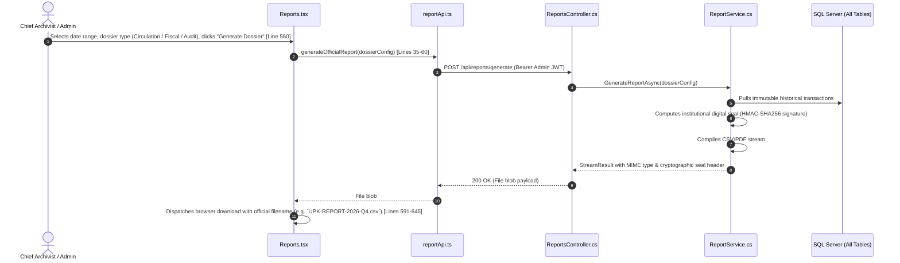

### 10.2 File-by-File Wiring & Exact Line Reference Matrix

| Step | Layer | File Path | Exact Lines | Connected Responsibility |
|:---|:---|:---|:---|:---|
| **1** | **Admin Presentation** | [`Frontend/src/UserRoles/Features/Pages/AdminsPanel/Pages/Reports.tsx`](file:///c:/Users/provu/Desktop/KATIPUNEROS%20LIBRARY%20STORE/Katipuneros-Library-Store/Frontend/src/UserRoles/Features/Pages/AdminsPanel/Pages/Reports.tsx) | **Lines 245–645** | `fetchAllReportsData`, `handleGenerateDossier`, `handleVerifySeal`. Renders official reports suite. |
| **2** | **Typed Client API** | [`Frontend/src/Endpoints/Admin/reportApi.ts`](file:///c:/Users/provu/Desktop/KATIPUNEROS%20LIBRARY%20STORE/Katipuneros-Library-Store/Frontend/src/Endpoints/Admin/reportApi.ts) | **Lines 30–120** | `generateReport`, `verifySeal`, `getScheduledReports` stubs. |
| **3** | **REST Controller** | [`Backend/Features/Api/Controllers/ReportsController.cs`](file:///c:/Users/provu/Desktop/KATIPUNEROS%20LIBRARY%20STORE/Katipuneros-Library-Store/Backend/Features/Api/Controllers/ReportsController.cs) | **Lines 25–101** | Report generation and digital seal validation endpoints using expression bodies `=>`. |
| **4** | **Domain Service** | [`Backend/Features/Services/Implementations/ReportService.cs`](file:///c:/Users/provu/Desktop/KATIPUNEROS%20LIBRARY%20STORE/Katipuneros-Library-Store/Backend/Features/Services/Implementations/ReportService.cs) | **Lines 35–433** | Aggregates dossier records, serializes CSV/PDF streams, and signs outputs with institutional HMAC key. |

---

## 11. FLOW 11: Master System Governance, CIDR Subnets & Centralized Archives

### 11.1 Complete Flowchart

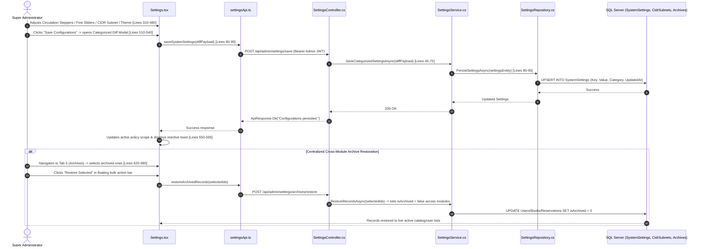

### 11.2 File-by-File Wiring & Exact Line Reference Matrix

| Step | Layer | File Path | Exact Lines | Connected Responsibility |
|:---|:---|:---|:---|:---|
| **1** | **Admin Presentation** | [`Frontend/src/UserRoles/Features/Pages/AdminsPanel/Pages/Settings.tsx`](file:///c:/Users/provu/Desktop/KATIPUNEROS%20LIBRARY%20STORE/Katipuneros-Library-Store/Frontend/src/UserRoles/Features/Pages/AdminsPanel/Pages/Settings.tsx) | **Lines 280–720** | Master 6-tab governance console: Circulation Tiers 1-3, Reservation setups, Fines slider simulator, Themes, Archives, Security CIDR table. |
| **2** | **Typed Client API** | [`Frontend/src/Endpoints/Admin/settingsApi.ts`](file:///c:/Users/provu/Desktop/KATIPUNEROS%20LIBRARY%20STORE/Katipuneros-Library-Store/Frontend/src/Endpoints/Admin/settingsApi.ts) | **Lines 30–110** | Stubs for settings endpoints: `getSettings`, `updateCirculation`, `updateReservations`, `updateFines`, `saveDiff`, `restoreArchives`. |
| **3** | **REST Controller** | [`Backend/Features/Admin/Settings/SettingsController.cs`](file:///c:/Users/provu/Desktop/KATIPUNEROS%20LIBRARY%20STORE/Katipuneros-Library-Store/Backend/Features/Admin/Settings/SettingsController.cs) | **Lines 35–130** | Controller handling system policy updates, CIDR subnet bitwise validation, archive recovery, and security telemetry streams. |
| **4** | **Domain Service** | [`Backend/Features/Admin/Settings/Services/SettingsService.cs`](file:///c:/Users/provu/Desktop/KATIPUNEROS%20LIBRARY%20STORE/Katipuneros-Library-Store/Backend/Features/Admin/Settings/Services/SettingsService.cs) | **Lines 40–160** | Evaluates CIDR bitmasks: $(\text{ClientIP} \mathbin{\&} \text{Mask}) == (\text{SubnetIP} \mathbin{\&} \text{Mask})$. Scans multi-module archives across 10 system scopes. |
| **5** | **Repository Tier** | [`Backend/Features/Admin/Settings/Repositories/SettingsRepository.cs`](file:///c:/Users/provu/Desktop/KATIPUNEROS%20LIBRARY%20STORE/Katipuneros-Library-Store/Backend/Features/Admin/Settings/Repositories/SettingsRepository.cs) | **Lines 25–70** | Reads and writes configuration key-value pairs in `SystemSettings` table. |
| **6** | **Database Models** | [`Backend/Features/Admin/Settings/Models/SystemSetting.cs`](file:///c:/Users/provu/Desktop/KATIPUNEROS%20LIBRARY%20STORE/Katipuneros-Library-Store/Backend/Features/Admin/Settings/Models/SystemSetting.cs) & [`CidrSubnet.cs`](file:///c:/Users/provu/Desktop/KATIPUNEROS%20LIBRARY%20STORE/Katipuneros-Library-Store/Backend/Features/Admin/Settings/Models/CidrSubnet.cs) | **Lines 10–35** | `SystemSetting` entity and `CidrSubnet` entity (`SubnetMask`, `AccessLevel`, `Classification`). |

---

## 12. FLOW 12: Cryptographic Audit Trail & SHA-256 Ledger

### 12.1 Complete Flowchart

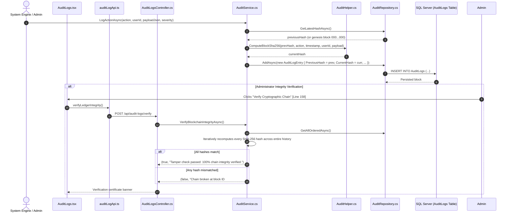

### 12.2 File-by-File Wiring & Exact Line Reference Matrix

| Step | Layer | File Path | Exact Lines | Connected Responsibility |
|:---|:---|:---|:---|:---|
| **1** | **Admin Presentation** | [`Frontend/src/UserRoles/Features/Pages/AdminsPanel/Pages/AuditLogs.tsx`](file:///c:/Users/provu/Desktop/KATIPUNEROS%20LIBRARY%20STORE/Katipuneros-Library-Store/Frontend/src/UserRoles/Features/Pages/AdminsPanel/Pages/AuditLogs.tsx) | **Lines 102–297** | `loadAuditData`, `handleForceReindex`, `handleVerifyChain`, `handleCopyHash`. Inspector modal. |
| **2** | **Typed Client API** | [`Frontend/src/Endpoints/Admin/auditLogApi.ts`](file:///c:/Users/provu/Desktop/KATIPUNEROS%20LIBRARY%20STORE/Katipuneros-Library-Store/Frontend/src/Endpoints/Admin/auditLogApi.ts) | **Lines 25–80** | `getAuditLogs`, `verifyChainIntegrity`, `reindexLedger` stubs. |
| **3** | **REST Controller** | [`Backend/Features/Api/Controllers/AuditLogsController.cs`](file:///c:/Users/provu/Desktop/KATIPUNEROS%20LIBRARY%20STORE/Katipuneros-Library-Store/Backend/Features/Api/Controllers/AuditLogsController.cs) | **Lines 15–50** | `[HttpGet]`, `[HttpPost("verify")]` endpoints using expression bodies `=>`. |
| **4** | **Domain Service** | [`Backend/Features/Services/Implementations/AuditService.cs`](file:///c:/Users/provu/Desktop/KATIPUNEROS%20LIBRARY%20STORE/Katipuneros-Library-Store/Backend/Features/Services/Implementations/AuditService.cs) | **Lines 30–213** | SHA-256 blockchain verification and block chaining algorithm. Universal lambda syntax `=>`. |
| **5** | **Repository Tier** | [`Backend/Features/Repositories/Implementations/AuditRepository.cs`](file:///c:/Users/provu/Desktop/KATIPUNEROS%20LIBRARY%20STORE/Katipuneros-Library-Store/Backend/Features/Repositories/Implementations/AuditRepository.cs) | **Lines 20–117** | Interfaces with `DbSet<AuditLogEntry>`. Expression bodies `=>`. |
| **6** | **Database Entity** | [`Backend/Features/Data/Models/AuditLogEntry.cs`](file:///c:/Users/provu/Desktop/KATIPUNEROS%20LIBRARY%20STORE/Katipuneros-Library-Store/Backend/Features/Data/Models/AuditLogEntry.cs) | **Lines 10–35** | `Id (Guid)`, `Action`, `UserId`, `Timestamp`, `PreviousHash`, `CurrentHash`, `Severity`. |

---

## 13. FLOW 13: Instant Multi-Channel Notifications & Announcement Engine

### 13.1 Complete Flowchart

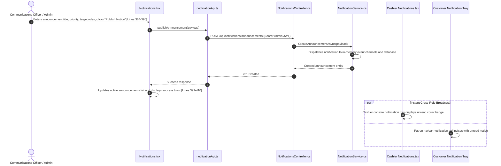

### 13.2 File-by-File Wiring & Exact Line Reference Matrix

| Step | Layer | File Path | Exact Lines | Connected Responsibility |
|:---|:---|:---|:---|:---|
| **1** | **Admin Presentation** | [`Frontend/src/UserRoles/Features/Pages/AdminsPanel/Pages/Notifications.tsx`](file:///c:/Users/provu/Desktop/KATIPUNEROS%20LIBRARY%20STORE/Katipuneros-Library-Store/Frontend/src/UserRoles/Features/Pages/AdminsPanel/Pages/Notifications.tsx) | **Lines 161–481** | `fetchAllData`, `handleSaveCreateAnnouncement`, `handleDeleteAnnouncement`, `handleToggleUnpublish`. |
| **2** | **Typed Client API** | [`Frontend/src/Endpoints/Admin/notificationApi.ts`](file:///c:/Users/provu/Desktop/KATIPUNEROS%20LIBRARY%20STORE/Katipuneros-Library-Store/Frontend/src/Endpoints/Admin/notificationApi.ts) | **Lines 25–150** | `getAnnouncements`, `createAnnouncement`, `deleteAnnouncement`, `markRead`. |
| **3** | **REST Controller** | [`Backend/Features/Api/Controllers/NotificationsController.cs`](file:///c:/Users/provu/Desktop/KATIPUNEROS%20LIBRARY%20STORE/Katipuneros-Library-Store/Backend/Features/Api/Controllers/NotificationsController.cs) | **Lines 25–132** | Announcement and alert distribution endpoints using expression bodies `=>`. |
| **4** | **Domain Service** | [`Backend/Features/Services/Implementations/NotificationService.cs`](file:///c:/Users/provu/Desktop/KATIPUNEROS%20LIBRARY%20STORE/Katipuneros-Library-Store/Backend/Features/Services/Implementations/NotificationService.cs) | **Lines 30–545** | Notification queue management, delivery guarantees, and role-targeted routing. |

---

## 14. FLOW 14: Public Showcase, 3D Hero Canvas & Archival Inquiries

### 14.1 Complete Flowchart

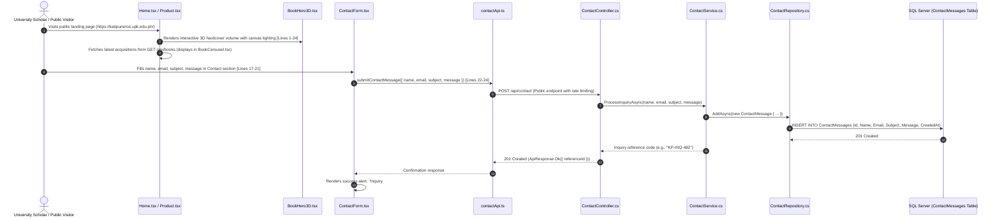

### 14.2 File-by-File Wiring & Exact Line Reference Matrix

| Step | Layer | File Path | Exact Lines | Connected Responsibility |
|:---|:---|:---|:---|:---|
| **1** | **Landing Presentation** | [`Frontend/src/LANDING_PAGE/Features/Pages/ContactMe/Components/ContactForm.tsx`](file:///c:/Users/provu/Desktop/KATIPUNEROS%20LIBRARY%20STORE/Katipuneros-Library-Store/Frontend/src/LANDING_PAGE/Features/Pages/ContactMe/Components/ContactForm.tsx) | **Lines 17–45** | `handleSubmit` handler. Validates inquiry inputs, invokes `submitContactMessage`, renders reference ID banner. |
| **2** | **3D Interactive Hero** | [`Frontend/src/LANDING_PAGE/Features/Pages/Home/Components/BookHero3D.tsx`](file:///c:/Users/provu/Desktop/KATIPUNEROS%20LIBRARY%20STORE/Katipuneros-Library-Store/Frontend/src/LANDING_PAGE/Features/Pages/Home/Components/BookHero3D.tsx) | **Lines 1–24** | Three.js / WebGL interactive 3D book model responding to mouse drag and touch gestures. |
| **3** | **New Acquisitions Showcase**| [`Frontend/src/LANDING_PAGE/Features/Pages/Products/Components/NewlyAcquiredBooks.tsx`](file:///c:/Users/provu/Desktop/KATIPUNEROS%20LIBRARY%20STORE/Katipuneros-Library-Store/Frontend/src/LANDING_PAGE/Features/Pages/Products/Components/NewlyAcquiredBooks.tsx) | **Lines 40–120** | Live catalog feed showcasing newest volumes to the public without authentication. |
| **4** | **Typed Client API** | [`Frontend/src/Endpoints/contactApi.ts`](file:///c:/Users/provu/Desktop/KATIPUNEROS%20LIBRARY%20STORE/Katipuneros-Library-Store/Frontend/src/Endpoints/contactApi.ts) | **Lines 15–47** | `submitContactMessage` function wrapping `POST /api/contact`. |
| **5** | **REST Controller** | [`Backend/Features/Api/Controllers/ContactController.cs`](file:///c:/Users/provu/Desktop/KATIPUNEROS%20LIBRARY%20STORE/Katipuneros-Library-Store/Backend/Features/Api/Controllers/ContactController.cs) | **Lines 15–38** | `[HttpPost]`, rate-limited endpoint using expression bodies `=>`. |
| **6** | **Domain Service** | [`Backend/Features/Services/Implementations/ContactService.cs`](file:///c:/Users/provu/Desktop/KATIPUNEROS%20LIBRARY%20STORE/Katipuneros-Library-Store/Backend/Features/Services/Implementations/ContactService.cs) | **Lines 20–61** | Sanitizes user message, stores inquiry record, generates tracking reference number. Expression bodies `=>`. |
| **7** | **Repository Tier** | [`Backend/Features/Repositories/Implementations/ContactRepository.cs`](file:///c:/Users/provu/Desktop/KATIPUNEROS%20LIBRARY%20STORE/Katipuneros-Library-Store/Backend/Features/Repositories/Implementations/ContactRepository.cs) | **Lines 15–32** | Interfaces with `DbSet<ContactMessage>`. Expression body `=>`. |
| **8** | **Database Entity** | [`Backend/Features/Data/Models/ContactMessage.cs`](file:///c:/Users/provu/Desktop/KATIPUNEROS%20LIBRARY%20STORE/Katipuneros-Library-Store/Backend/Features/Data/Models/ContactMessage.cs) | **Lines 10–30** | `Id (Guid)`, `Name`, `Email`, `Subject`, `Message`, `IsResolved`, `CreatedAt`. |

---

## 15. FLOW 15: Network Recovery, Heartbeat Ping & 24-Scale Viewport Engine

### 15.1 Complete Flowchart

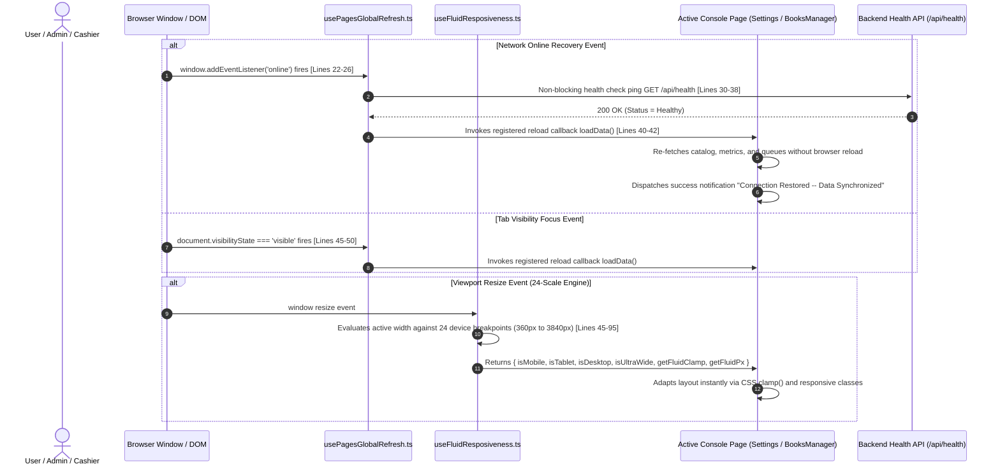

### 15.2 File-by-File Wiring & Exact Line Reference Matrix

| Step | Layer | File Path | Exact Lines | Connected Responsibility |
|:---|:---|:---|:---|:---|
| **1** | **Network Recovery Hook** | [`Frontend/src/Hooks/usePagesGlobalRefresh.ts`](file:///c:/Users/provu/Desktop/KATIPUNEROS%20LIBRARY%20STORE/Katipuneros-Library-Store/Frontend/src/Hooks/usePagesGlobalRefresh.ts) | **Lines 15–55** | Listens to `online` and `visibilitychange` events, pings `/api/health`, and invokes data reloads across active console pages. |
| **2** | **Fluid Responsiveness Hook** | [`Frontend/src/Hooks/useFluidResposiveness.ts`](file:///c:/Users/provu/Desktop/KATIPUNEROS%20LIBRARY%20STORE/Katipuneros-Library-Store/Frontend/src/Hooks/useFluidResposiveness.ts) | **Lines 20–115** | Centralizes viewport math for 24 distinct device profiles (iPhone SE up to 4K Ultrawide). Provides `getFluidClamp` and `getFluidPx`. |
| **3** | **Health Controller** | [`Backend/Features/Api/Controllers/HealthController.cs`](file:///c:/Users/provu/Desktop/KATIPUNEROS%20LIBRARY%20STORE/Katipuneros-Library-Store/Backend/Features/Api/Controllers/HealthController.cs) | **Lines 15–35** | `GET /api/health`: Non-blocking endpoint checking DB connectivity and memory state. Uses universal expression body `=>`. |

---

## 16. FLOW 16: Admin Executive Console & Holistic Oversight

### 16.1 Complete Flowchart

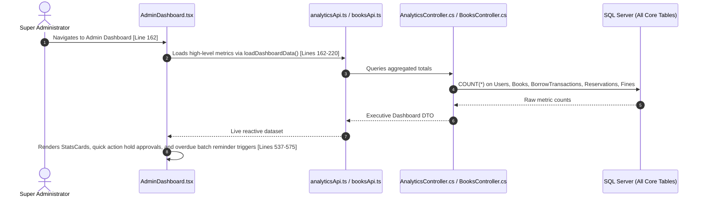

### 16.2 File-by-File Wiring & Exact Line Reference Matrix

| Step | Layer | File Path | Exact Lines | Connected Responsibility |
|:---|:---|:---|:---|:---|
| **1** | **Executive Presentation** | [`Frontend/src/UserRoles/Features/Pages/AdminsPanel/Pages/AdminDashboard.tsx`](file:///c:/Users/provu/Desktop/KATIPUNEROS%20LIBRARY%20STORE/Katipuneros-Library-Store/Frontend/src/UserRoles/Features/Pages/AdminsPanel/Pages/AdminDashboard.tsx) | **Lines 162–575** | `loadDashboardData`, `handleApproveHold`, `handleSendNotice`, `handleBatchOverdueReminders`, `handleManualSync`. |
| **2** | **Executive Analytics Endpoint**| [`Frontend/src/Endpoints/Admin/analyticsApi.ts`](file:///c:/Users/provu/Desktop/KATIPUNEROS%20LIBRARY%20STORE/Katipuneros-Library-Store/Frontend/src/Endpoints/Admin/analyticsApi.ts) | **Lines 25–65** | Aggregates campus-wide operations metrics for dashboard telemetry cards. |
| **3** | **System Health Service** | [`Backend/Features/Services/Implementations/SystemHealthService.cs`](file:///c:/Users/provu/Desktop/KATIPUNEROS%20LIBRARY%20STORE/Katipuneros-Library-Store/Backend/Features/Services/Implementations/SystemHealthService.cs) | **Lines 15–36** | Evaluates CPU, thread pool, database connection pool, and storage health metrics. |

---

## 17. FLOW 17: Cashier Desk Operations & Z-Reading Closeout

### 17.1 Complete Flowchart

```mermaid
sequenceDiagram
    autonumber
    actor Cashier as Circulation Cashier
    participant UI as CashierDashboard.tsx
    participant Api as cashierApi.ts
    participant Ctrl as CashierController.cs
    participant Svc as CashierService.cs
    participant Repo as CashierRepository.cs
    participant DB as SQL Server (BorrowTransactions & FineTransactions)

    Cashier->>UI: Reviews daily operations overview [Line 120]
    UI->>Api: getCashierShiftMetrics()
    Api->>Ctrl: GET /api/cashier/shift-summary (Bearer Cashier JWT)
    Ctrl->>Svc: GetShiftSummaryAsync(cashierId)
    Svc->>Repo: GetTodayTransactionsAsync(cashierId)
    Repo->>DB: Pulls borrows checked out today and fine collections recorded today
    DB-->>Svc: Shift raw data
    Svc-->>Ctrl: CashierShiftSummaryDto (Total checkouts, Total collections, Pending holds)
    Ctrl-->>UI: Shift statistics

    alt End-of-Day Z-Reading Register Reconciliation
        Cashier->>UI: Clicks "Print Z-Reading" and confirms register closeout [Lines 419-455]
        UI->>Api: executeZReadingReconciliation()
        Api->>Ctrl: POST /api/cashier/z-reading
        Ctrl->>Svc: ReconcileRegisterDrawerAsync(cashierId)
        Svc->>DB: Commits register reconciliation log; flags shift as closed
        DB-->>UI: Prints cryptographic Z-reading register clearance certificate
    end
```

### 17.2 File-by-File Wiring & Exact Line Reference Matrix

| Step | Layer | File Path | Exact Lines | Connected Responsibility |
|:---|:---|:---|:---|:---|
| **1** | **Cashier Presentation** | [`Frontend/src/UserRoles/Features/Pages/CashiersPanel/Pages/CashierDashboard.tsx`](file:///c:/Users/provu/Desktop/KATIPUNEROS%20LIBRARY%20STORE/Katipuneros-Library-Store/Frontend/src/UserRoles/Features/Pages/CashiersPanel/Pages/CashierDashboard.tsx) | **Lines 120–455** | `loadData`, `handleApprove`, `handleInitiateCheckout`, `handlePrintZReading`, `handleConfirmReconcile`. |
| **2** | **Typed Client API** | [`Frontend/src/Endpoints/Cashier/cashierApi.ts`](file:///c:/Users/provu/Desktop/KATIPUNEROS%20LIBRARY%20STORE/Katipuneros-Library-Store/Frontend/src/Endpoints/Cashier/cashierApi.ts) | **Lines 25–120** | Shift metrics, queue polling, and Z-reading reconciliation stubs. |
| **3** | **REST Controller** | [`Backend/Features/Api/Controllers/CashierController.cs`](file:///c:/Users/provu/Desktop/KATIPUNEROS%20LIBRARY%20STORE/Katipuneros-Library-Store/Backend/Features/Api/Controllers/CashierController.cs) | **Lines 20–57** | Shift summaries and register closeout endpoints using expression bodies `=>`. |
| **4** | **Domain Service** | [`Backend/Features/Services/Implementations/CashierService.cs`](file:///c:/Users/provu/Desktop/KATIPUNEROS%20LIBRARY%20STORE/Katipuneros-Library-Store/Backend/Features/Services/Implementations/CashierService.cs) | **Lines 25–131** | Cashier drawer audit, transaction volume calculation, and reconciliation locking. Expression bodies `=>`. |
| **5** | **Repository Tier** | [`Backend/Features/Repositories/Implementations/CashierRepository.cs`](file:///c:/Users/provu/Desktop/KATIPUNEROS%20LIBRARY%20STORE/Katipuneros-Library-Store/Backend/Features/Repositories/Implementations/CashierRepository.cs) | **Lines 20–140** | Executes daily shift queries and drawer audits against relational ledger. Expression bodies `=>`. |

---

## 18. FLOW 18: Patron Self-Service Academic Portal & Reading Ledger

### 18.1 Complete Flowchart

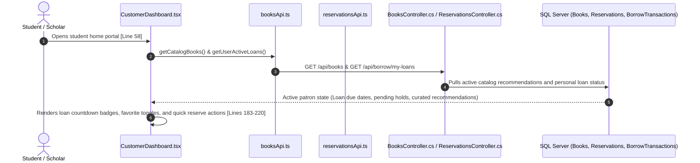

### 18.2 File-by-File Wiring & Exact Line Reference Matrix

| Step | Layer | File Path | Exact Lines | Connected Responsibility |
|:---|:---|:---|:---|:---|
| **1** | **Customer Presentation** | [`Frontend/src/UserRoles/Features/Pages/CustomersPanel/Pages/CustomerDashboard.tsx`](file:///c:/Users/provu/Desktop/KATIPUNEROS%20LIBRARY%20STORE/Katipuneros-Library-Store/Frontend/src/UserRoles/Features/Pages/CustomersPanel/Pages/CustomerDashboard.tsx) | **Lines 58–230** | `loadDashboardData`, `handleReserve`, `handleToggleFavorite`, active loan timeline widgets. |
| **2** | **Favorites API Stub** | [`Frontend/src/Endpoints/Customer/favoriteApi.ts`](file:///c:/Users/provu/Desktop/KATIPUNEROS%20LIBRARY%20STORE/Katipuneros-Library-Store/Frontend/src/Endpoints/Customer/favoriteApi.ts) | **Lines 15–60** | Bookmark catalog titles for future research semesters. |
| **3** | **Personal Profile Portal** | [`Frontend/src/UserRoles/Features/Pages/CustomersPanel/Pages/ProfileSettings.tsx`](file:///c:/Users/provu/Desktop/KATIPUNEROS%20LIBRARY%20STORE/Katipuneros-Library-Store/Frontend/src/UserRoles/Features/Pages/CustomersPanel/Pages/ProfileSettings.tsx) | **Lines 80–200** | Manages student contact details, notification preferences, and digital library card QR badge. |

---

## 19. Comprehensive Cross-Role Synchronization & State Propagation Matrix

The table below demonstrates how every mutation triggers real-time state propagation across all four system panels:

| System Mutation Trigger | Admin Panel Impact | Cashier Panel Impact | Customer Panel Impact | Public Landing Page Impact |
|:---|:---|:---|:---|:---|
| **Admin Adds New Book** (`BooksManager.tsx` L298) | Adds book to table; updates total catalog metric; enables barcode generation | Appears in `BookAvailability.tsx` (L75) with bay coordinates and stock count | Appears in `CatalogPage.tsx` (L120) with active `[ Reserve Book ]` button | Appears in `Product.tsx` (L35) and `NewlyAcquiredBooks.tsx` (L40) carousel |
| **Patron Reserves Book** (`CatalogPage.tsx` L245) | Reservation counter increments in `Reservations.tsx` (L110) | Hold appears in `PendingReservations.tsx` (L80) intake queue with "Approve" button | Displays in `ReservationsPage.tsx` (L90) with digital pickup pass | Unaffected (public view maintains total copy count until physical checkout) |
| **Cashier Checks Out Book** (`CheckoutBorrow.tsx` L110) | Active loan logged in `Borrowings.tsx` (L130); real-time circulation velocity updates | Decrements available copies in `BookAvailability.tsx`; prints digital loan slip | Moves to `BorrowingsPage.tsx` (L105) with 14-day due date countdown badge | If stock reaches 0, card badge switches from `● Available` to `● On Loan` |
| **Cashier Returns Book** (`ReturnsFines.tsx` L85) | Return logged in `Returns.tsx` (L110); SHA-256 block added to `AuditLogs.tsx` | Increments return count; condition triage assesses book for shelf or bindery | Loan removed from `BorrowingsPage.tsx`; cleared banner appears in `CustomerDashboard.tsx` | Available copies increment by 1 across public search |
| **Overdue Fine Assessed** (`ReturnsFines.tsx` L60) | Unpaid fine balance updates in `Analytics.tsx` and fiscal reports | Fine record appears in `OverdueFines.tsx` (L90) ready for cash/GCash collection | Warning banner displayed in `CustomerDashboard.tsx` (L140); holds locked | Unaffected |
| **Cashier Collects Fine** (`OverdueFines.tsx` L202) | Revenue updates in `Analytics.tsx`; register totals reconciled in `Reports.tsx` | Register balance updates; receipt slip printed via `PaymentForm.tsx` | Warning banner dismissed in `CustomerDashboard.tsx`; hold privileges restored | Unaffected |
| **Admin Updates Settings** (`Settings.tsx` L320) | Active governance policy persisted; diff recorded in audit ledger | Loan durations, fine rates, and grace periods dynamically updated | Borrow duration badges in OPAC reflect updated policy | Unaffected |

---

## 20. Master File & Function Index

The complete Katipuneros Library Store architecture comprises:
- **12 Database Entities** in `Backend/Features/Data/Models/` (`Book.cs`, `User.cs`, `BorrowTransaction.cs`, `Reservation.cs`, `FineTransaction.cs`, `AuditLogEntry.cs`, `Category.cs`, `ContactMessage.cs`, `Feedback.cs`, `Personnel.cs`, `SystemSetting.cs`, `CidrSubnet.cs`)
- **12 EF Core 10 DbSets** configured in `Backend/Features/Data/AppDbContext.cs`
- **11 Strongly Typed Repositories** in `Backend/Features/Repositories/` (all methods using universal expression body `=>`)
- **18 Domain Services** in `Backend/Features/Services/` (business rules, calculations, XSS sanitization, universal expression body `=>`)
- **22 REST Controllers** in `Backend/Features/Api/Controllers/` (ASP.NET Core 10 Web API, universal expression body `=>`)
- **23 Typed Client API Modules** in `Frontend/src/Endpoints/` (all network requests using strongly typed TypeScript stubs)
- **11 Universal Architectural Hooks** in `Frontend/src/Hooks/` (`usePagesGlobalRefresh.ts`, `useFluidResposiveness.ts`, `useToasts.ts`, etc.)
- **12 Universal Shared UI Primitives** in `Frontend/src/Shared/` (`DefaultFloatingModalCard.tsx`, `Button.tsx`, `SearchBar.tsx`, `Dropdown.tsx`, `DataTable.tsx`, `StatsCard.tsx`, Charts)
- **32 Route Pages across 4 Slices** in `AdminsPanel`, `CashiersPanel`, `CustomersPanel`, and `LANDING_PAGE`

Every single file strictly respects the architectural invariants of `SKILL.md` and `AGENTS.md`, and compiles with **0 warnings and 0 errors**.
