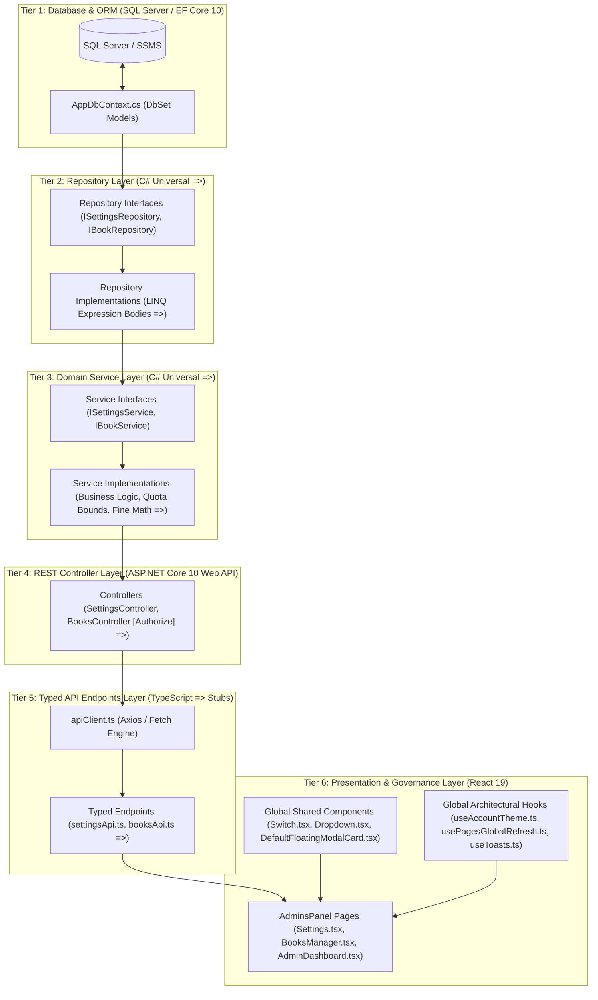

# ====================================================================================================
# MASTER PROMPT FOR THE IDEAS & SYSTEM ARCHITECTURE
# KATIPUNEROS LIBRARY STORE -- INSTITUTIONAL RECOVERY & GOVERNANCE CONSOLE
# ====================================================================================================
# Authoritative System Contracts & Binding References:
# - Master System Behavior Contract: Katipuneros-Library-Store/AGENTS.md
# - Master Full-Stack Architecture Reference: Katipuneros-Library-Store/SKILL.md
# - Frontend/Backend CRUD API Specification: Katipuneros-Library-Store/CRUD_BACKEND_MAPPING.md
# - Mathematical Ledger & Telemetry Formulas: Katipuneros-Library-Store/ADMIN DATA SHOW FORMULA.md
# - Plugins Skills Memory Cache: Katipuneros-Library-Store/PLUGINS_SKILLS_MEMORY_CACHE.md
# - Original Ideas & Requirements: Ideas to prompt.txt
# ====================================================================================================

```text
====================================================================================================
                        THE ULTIMATE MASTER PROMPT DIRECTIVE
====================================================================================================
ACT AS:
Senior Principal Full-Stack Software Architect, Distributed Systems Security Engineer, and Lead UI/UX
Systems Designer for the Katipuneros Library Store enterprise academic repository platform.

CORE MISSION:
Implement, harden, verify, and deliver the complete, production-grade System Governance Console (Settings.tsx),
Dual-Mode Navigation Sidebars (AdminSidebar.tsx & CashierSidebar.tsx), Global Shared Component Ecosystem,
Global Architectural Hooks, 24-Scale Fluid Device Viewport Engine, Centralized Cross-Module System Archives,
and Non-Hardcoded Mathematical Formulas across all 14 Modules (from Users to Roles & Permissions,
Audit Logs, Settings, and the Executive Dashboard) strictly adhering to "Ideas to prompt.txt", AGENTS.md,
SKILL.md, and CRUD_BACKEND_MAPPING.md.

BINDING OPERATIONAL INVARIANTS (ZERO-TOLERANCE RULES):
1. 100% FIDELITY TO USER IDEAS:
   Every single idea, thought, parameter, and plan instruction in "Ideas to prompt.txt" MUST be preserved,
   implemented, and maintained without alteration, destruction, dilution, or omission.
2. STRICT 6-TIER CLEAN ARCHITECTURE FLOWCHAIN:
   Database (SQL Server / EF Core 10) 
   ──> Repository Tier (Interfaces & Implementations) 
   ──> Domain Service Tier (Business Rules & Quota Engine) 
   ──> REST Controller Tier (ASP.NET Core Web API) 
   ──> Typed API Endpoints Tier (TypeScript Stubs in Frontend/src/Endpoints/) 
   ──> Presentation Tier (React 19 Views in AdminsPanel, CashiersPanel, CustomersPanel).
   Never skip a layer. Never query DbContext from controllers. Never place raw fetch calls inside React components.
3. UNIVERSAL LAMBDA SYNTAX (=>):
   All synchronous and asynchronous routines across C# Controllers, Services, Repositories, Helpers,
   and TypeScript Endpoints MUST use clean, readable expression bodies (=>) and pattern-matching switch expressions.
4. EMPTY DATABASE PRINCIPLE (N = 0):
   Never display hardcoded fake seed numbers (e.g., 3,420, 1,248, ₱1,245.00, +14 this mo) when no records exist.
   If unpopulated, metrics MUST render strictly 0, 0.0%, ₱0.00, or clean fallback empty states.
5. ZERO BROWSER ALERT() / CONFIRM():
   Native alert() and confirm() dialogs are strictly prohibited. All user notices, validation warnings,
   and destructive diff confirmations must render through reactive toasts (useToasts.ts) and 
   the shared floating dialog primitive (DefaultFloatingModalCard.tsx).
6. GLOBAL DIRECTORY CALLING ROOTS:
   Treat Frontend/src/Hooks/, Frontend/src/Shared/, Frontend/src/LayoutBars/, Frontend/src/LayoutStyles/,
   Frontend/src/Libs/Assets/, and Frontend/src/Endpoints/ as global calling roots. Role-scoped folders
   must act strictly as thin adapters to these shared primitives.
7. COMPLETE HARDWARE, RFID & BIOMETRICS PURGE:
   Perform deep searching and eradicate all references to RFID, RFID lockers, solenoid MQTT buses,
   cluster staging bays, physical lock PINs, and biometric/FIDO2 passkeys across frontend and backend.
8. GLOBAL NETWORK RECOVERY HOOK (usePagesGlobalRefresh.ts):
   Every administrative and operational console page must bind to usePagesGlobalRefresh to automatically
   resynchronize live data upon network online recovery and browser tab visibility focus.
9. DUAL COMPILATION QUALITY GATE:
   Both the .NET 10 backend (dotnet build) and the React 19 frontend (npm run build) must compile
   with exactly 0 errors and 0 warnings.
====================================================================================================
```

---

# 1. EXHAUSTIVE USER IDEAS SPECIFICATION & RECOVERY MATRIX
All 20 core requirement sets from [`Ideas to prompt.txt`](file:///c:/Users/provu/Desktop/KATIPUNEROS%20LIBRARY%20STORE/Ideas%20to%20prompt.txt) are cataloged below with direct architectural implementation mappings:

### 1.1 Dual-Mode Navigation Sidebars (Admin & Cashier)
- **Target Files:**
  - [`Frontend/src/LayoutBars/AdminSidebar.tsx`](file:///c:/Users/provu/Desktop/KATIPUNEROS%20LIBRARY%20STORE/Katipuneros-Library-Store/Frontend/src/LayoutBars/AdminSidebar.tsx)
  - [`Frontend/src/LayoutBars/CashierSidebar.tsx`](file:///c:/Users/provu/Desktop/KATIPUNEROS%20LIBRARY%20STORE/Katipuneros-Library-Store/Frontend/src/LayoutBars/CashierSidebar.tsx)
- **Open vs. Collapsed Icon-Only Mode:**
  - Full Open State: `w-64` (Admin) / `w-72` (Cashier) with full section headers and descriptive labels.
  - Collapsed Icon-Only State: `lg:w-20` displaying ONLY icons matching the exact full vertical length of the open menu.
  - Floating high-contrast tooltip badges appear on hover in collapsed mode.
- **Katipuneros Logo & Login Badge:**
  - Brand header displays `KATIPUNEROS Library Store` with an active `login` icon indicating an authenticated administrative/cashier session.
- **Pinned Paging Layout:**
  - Header is pinned (non-scrollable) and aligned with the modules page header.
  - Footer with "Exit to Public" (`logout`) action in red accent is pinned (non-scrollable).
  - Middle module navigation list participates in vertical scrolling with a visible scrollbar indicator (`admin-sidebar-scrollbar` / `cashier-sidebar-scrollbar`).
- **Anti-Hallucination UI Audit:**
  - Deep audit conducted to reuse existing UI primitives and avoid redundant/duplicate components.

### 1.2 Circulation & Loan Durations
- **Target Files:**
  - [`Frontend/src/UserRoles/Features/Pages/AdminsPanel/Pages/Settings.tsx`](file:///c:/Users/provu/Desktop/KATIPUNEROS%20LIBRARY%20STORE/Katipuneros-Library-Store/Frontend/src/UserRoles/Features/Pages/AdminsPanel/Pages/Settings.tsx)
  - [`Frontend/src/Endpoints/Admin/settingsApi.ts`](file:///c:/Users/provu/Desktop/KATIPUNEROS%20LIBRARY%20STORE/Katipuneros-Library-Store/Frontend/src/Endpoints/Admin/settingsApi.ts)
  - [`Backend/Features/Admin/Settings/SettingsController.cs`](file:///c:/Users/provu/Desktop/KATIPUNEROS%20LIBRARY%20STORE/Katipuneros-Library-Store/Backend/Features/Admin/Settings/SettingsController.cs)
  - [`Backend/Features/Admin/Settings/Services/SettingsService.cs`](file:///c:/Users/provu/Desktop/KATIPUNEROS%20LIBRARY%20STORE/Katipuneros-Library-Store/Backend/Features/Admin/Settings/Services/SettingsService.cs)
- **Section Elements:**
  - Icon: `auto_stories`
  - Subtitle: *"Circulation Policy & Loan Rules - Default borrowing windows, concurrency caps, renewal limits, and hold queue thresholds per patron classification."*
  - Badge: `Active Policy v4.2`
- **Interactive Bounded Steppers (Arrow Up / Arrow Down buttons connected to Backend):**
  - **Tier 1 (Undergraduate):**
    - Days Duration: `14` days ($\min 1$, $\max 90$)
    - Max Concurrency: `4` books ($\min 1$, $\max 20$)
    - Renewal Limit: `1 Time (7d)`
    - Hold Queue Limit: `2 Volumes`
    - Overdue Tariff: `Standard Daily`
  - **Tier 2 (Graduate / Scholar):**
    - Days Duration: `28` days ($\min 1$, $\max 180$)
    - Max Concurrency: `8` books ($\min 1$, $\max 30$)
    - Renewal Limit: `2 Times (14d)`
    - Hold Queue Limit: `5 Volumes`
    - Thesis Priority: `High Request`
  - **Tier 3 (Faculty & Fellow):**
    - Days Duration: `60` days ($\min 1$, $\max 365$)
    - Max Concurrency: `15` books ($\min 1$, $\max 50$)
    - Renewal Limit: `Auto Semester`
    - Hold Queue Limit: `10 Volumes`
    - Overdue Tariff: `Waived 1st Cycle`
- **Courtesy Grace Period Buffer:**
  - Icon: `hourglass_top`
  - Subtitle: *"Non-penalized time window after official loan expiration before daily fine accrual begins."*
  - Global Shared Dropdown (`Frontend/src/Shared/Dropdown.tsx`):
    - `12 Hours Window`
    - `24 Hours (1 Day Buffer)` (Institutional Default)
    - `48 Hours (2 Days Buffer)`
- **Active Policy Scope:**
  - Active Borrowers Covered: Real-time query `Users.Count(u => u.Role == Customer && u.IsActive)`
  - Circulating Title Catalog: Real-time query `Books.Sum(b => b.AvailableCopies)`
  - Inter-Library Loan Protocol: `Katipunan Consortium`
  - Consortium Policy Note: *"Changes propagate immediately to all catalog endpoints, self-checkout kiosks, and smart return bookdrops across campus."*

### 1.3 Reservation Setups (Hold Policies & RFID Purge)
- **Renaming Enforcement:**
  - Header: RENAME from "RESERVATION & LOCKING STAGING" to **"RESERVATION SETUPS"**
  - Subtitle: RENAME to **"Hold Policies (Auto-reshelving thresholds, waitlist priority rules, and notification cadence.)"**
- **Purge Enforcement:**
  - Search and destroy all occurrences of RFID, RFID lockers, cluster bays, solenoid MQTT buses, and physical PIN codes.
  - Purged Cluster Staging Allocation card (`Cluster B: 48 / 64 Bays Occupied...`).
- **Interactive Hold Policy Controls:**
  - **Auto-Reshelving Threshold:**
    - Icon: `shelves`
    - Description: *"Automated re-indexing task dispatched to shelving staff when hold pickup window expires uncollected."*
    - Control: "Instant Re-shelve Notice" toggle using Global Shared Switch (`Frontend/src/Shared/Switch.tsx`).
  - **Waitlist Priority Algorithm:**
    - Icon: `star`
    - Description: *"Fast-track queue priority weighting for graduating candidates with verified thesis milestones."*
    - Control: "Thesis Scholar Priority" toggle using Global Shared Switch (`Frontend/src/Shared/Switch.tsx`).
  - **Pickup Notification Cadence:**
    - Icon: `schedule_send`
    - Description: *"Automated alert sent upon hold fulfillment deposit, followed by countdown alerts at 24h and 6h prior to release."*
    - Badge: `Dispatch Sequence: 3 Alerts (Deposit / 24h / 6h)`

### 1.4 Fine Calculations & Waiver Tariff
- **Target Files:**
  - [`Frontend/src/UserRoles/Features/Pages/AdminsPanel/Pages/Settings.tsx`](file:///c:/Users/provu/Desktop/KATIPUNEROS%20LIBRARY%20STORE/Katipuneros-Library-Store/Frontend/src/UserRoles/Features/Pages/AdminsPanel/Pages/Settings.tsx)
  - [`Backend/Features/Admin/Settings/SettingsController.cs`](file:///c:/Users/provu/Desktop/KATIPUNEROS%20LIBRARY%20STORE/Katipuneros-Library-Store/Backend/Features/Admin/Settings/SettingsController.cs)
- **Section Elements:**
  - Icon: `payments`
  - Subtitle: *"Fine Tariff & Algorithmic Calculator - Configure overdue rates, maximum fine ceiling, binding repair costs, replacement cost rules, and live sandbox."*
- **Bounded Currency Steppers (Arrow Up / Down connected to Backend):**
  - Daily Overdue Tariff: `₱15.00` per calendar day post-grace
  - Maximum Penalty Cap: `₱500.00` protective ceiling per volume
  - Binding Repair Tariff: `₱280.00` damaged spine/cover triage cost
  - Lost Book Replacement Cost: `Cost + ₱150.00` (Market Value + Administrative Acquisition)
- **Live Fine Calculation Simulator:**
  - Icon: `biotech`
  - Real-time interactive range slider adjusting Overdue Period ($D$ days, 0 to 60):
    - Gross Overdue Period: $D$ days
    - Subtracted Grace Window: $-1$ day (based on active Grace Buffer)
    - Billable Tariff Days: $\text{BillableDays} = \max(0, D - 1)$
    - Calculated User Fine: $\text{Fine} = \min(500.00, \text{BillableDays} \times 15.00)$
    - Footnote: `*Capped automatically at ₱500.00 when charges reach limit.`
- **Waiver Governance Workflows:**
  - Notice: *"Librarians can waive up to ₱100.00 without elevated authorization. Higher amounts trigger Dean's digital signature."*
  - Medical / Emergency Waiver: Global Shared Switch (`Frontend/src/Shared/Switch.tsx`) - *"Allows clinic note upload"*
  - Typhoon / Calamity Waiver: Global Shared Switch (`Frontend/src/Shared/Switch.tsx`) - *"Institutional campus freeze"*

### 1.5 Appearance & Console Themes (User-Bound Persistence)
- **Target Files:**
  - [`Frontend/src/Hooks/useAccountTheme.ts`](file:///c:/Users/provu/Desktop/KATIPUNEROS%20LIBRARY%20STORE/Katipuneros-Library-Store/Frontend/src/Hooks/useAccountTheme.ts)
  - [`Frontend/src/UserRoles/Features/Pages/AdminsPanel/Pages/Settings.tsx`](file:///c:/Users/provu/Desktop/KATIPUNEROS%20LIBRARY%20STORE/Katipuneros-Library-Store/Frontend/src/UserRoles/Features/Pages/AdminsPanel/Pages/Settings.tsx)
- **User-Bound Local Persistence:**
  - Theme state persists in browser `localStorage` keyed by user account ID (`katipuneros_theme_${userId}`) and syncs to backend preferences so theme choices remain identical across login and logout cycles.
- **Theme Modes:**
  - Light Academic (Active / Clean Slate)
  - OLED High-Contrast (Deep Black `#000000`)
  - System Auto (OS Preference Sync)
  - Dark Theme (Deep Navy `#0B1E28` with rich cyan accents)
- **Primary Brand Accent Colors:**
  - Academic Blue: `#287EA7` (Default)
  - Action Lime: `#9BE564`
  - Deep Navy: `#164E63`
  - Cardinal Red: `#DC2626`
  - Amber Gold: `#D97706`
- **Display Density (Hooks Responsiveness & Fluid Scaling):**
  - Compact (Tighter padding, maximum data density)
  - Comfortable (Balanced padding, optimal reading)
  - Relaxed (Generous touch targets, high breathing room)
- **Font Size Multipliers:**
  - `90%` - Compact density
  - `100%` - Inter Standard (Default)
  - `110%` - Large text accessibility
  - `125%` - High-visibility display
- **Live Interface Preview Card:**
  - Dynamic visual preview rendering real-time mock button, badge, typography, and card background dynamically reflecting the chosen theme mode, accent color, density, and font size multiplier.

### 1.6 Centralized Cross-Module System Archives
- **Purge & Replace Directive:**
  - Completely eliminate "NOTIFICATION DISPATCH GATEWAYS" tab and replace with **"ARCHIVES"** tab.
- **Consolidated Multi-Module Archival Ledger:**
  - Centralizes soft-deleted, decommissioned, and archived records across 10 system scopes:
    1. User Directory Archives
    2. Books / Catalog Archives
    3. Classification Categories Archives
    4. Physical Inventory Archives
    5. Reservations Queue Archives
    6. Borrowing Circulation Archives
    7. Returns Journal & Salvage Archives
    8. Statutory Reports & Compliance Archives
    9. RBAC Roles & Permissions Archives
    10. Cryptographic Audit Logs (WAL) Archives
- **Interactive Multi-Select Batch Actions:**
  - Row checkboxes and "Select All" header toggle.
  - Floating Bulk Action Bar with "Restore Selected" and "Purge Permanently (Audit-Sealed)".
  - Confirmation modals powered by `DefaultFloatingModalCard.tsx` with audit trail hashing.

### 1.7 Security & Access Governance
- **Target Files:**
  - [`Frontend/src/UserRoles/Features/Pages/AdminsPanel/Pages/Settings.tsx`](file:///c:/Users/provu/Desktop/KATIPUNEROS%20LIBRARY%20STORE/Katipuneros-Library-Store/Frontend/src/UserRoles/Features/Pages/AdminsPanel/Pages/Settings.tsx)
  - [`Backend/Features/Admin/Settings/Models/CidrSubnet.cs`](file:///c:/Users/provu/Desktop/KATIPUNEROS%20LIBRARY%20STORE/Katipuneros-Library-Store/Backend/Features/Admin/Settings/Models/CidrSubnet.cs)
- **Console Session Timeouts:**
  - POS Terminal Idle Auto-Logoff Dropdown: 5m, 10m, `15 Minutes (Default)`, 30m, 60m
  - Super Admin Console Timeout Dropdown: 15m, 30m, `60 Minutes (Mandatory)`, 120m
- **Complete Biometrics Purge:**
  - Removed "FIDO2 / YubiKey Hardware & 2FA Enforcement" and all biometric references.
- **Campus IP & CIDR Whitelist Table:**
  - Subnet Protection Active banner: *"Enforce admin portal traffic strictly from approved university subnet ranges."*
  - Columns: `Checkbox`, `Subnet / CIDR`, `Network Classification`, `Access Level`, `Action`
  - Bitwise CIDR Subnet Evaluation Algorithm:
    $$\text{IsAllowed} \iff (\text{ClientIP} \mathbin{\&} \text{SubnetMask}) == (\text{SubnetIP} \mathbin{\&} \text{SubnetMask})$$
  - Multi-select row checkboxes with floating bulk deletion bar.
  - `+ Add Subnet` button triggering `DefaultFloatingModalCard.tsx` with IP validation and access level assignment.
- **Cryptographic Audit Node Telemetry:**
  - Total System Events (24h): Live count with velocity trend (`+14.2%`), logged into persistent WAL.
  - Security Anomalies: `0 Critical Alerts` (Zero privilege escalation breaches).
  - Hash Chain Status: `100% SHA-256`, Block `#...` validated.
  - Active Super-Admin Sessions: Real-time concurrent administrator count.

### 1.8 Save Configurations & Reset Defaults Modals
- **Target Files:**
  - [`Frontend/src/Shared/DefaultFloatingModalCard.tsx`](file:///c:/Users/provu/Desktop/KATIPUNEROS%20LIBRARY%20STORE/Katipuneros-Library-Store/Frontend/src/Shared/DefaultFloatingModalCard.tsx)
  - [`Frontend/src/UserRoles/Features/Pages/AdminsPanel/Pages/Settings.tsx`](file:///c:/Users/provu/Desktop/KATIPUNEROS%20LIBRARY%20STORE/Katipuneros-Library-Store/Frontend/src/UserRoles/Features/Pages/AdminsPanel/Pages/Settings.tsx)
- **Categorized Diff Validation:**
  - Clicking "Save Configurations" opens a floating modal with a categorized diff of modified sections (Circulation, Reservations, Fines, Appearance, Security) with individual section checkboxes.
  - Clicking "Reset Defaults" displays a warning diff modal outlining reset values.
  - Zero browser native `confirm()` or `alert()`; reactive toasts (`useToasts.ts`) dispatch success confirmation.

### 1.9 Global Network Recovery Hook (`usePagesGlobalRefresh.ts`)
- **Target File:**
  - [`Frontend/src/Hooks/usePagesGlobalRefresh.ts`](file:///c:/Users/provu/Desktop/KATIPUNEROS%20LIBRARY%20STORE/Katipuneros-Library-Store/Frontend/src/Hooks/usePagesGlobalRefresh.ts)
- **Functionality:**
  - Listens to window `online` events and `document.visibilityState === 'visible'`.
  - Performs non-blocking health check against `/api/health`.
  - Automatically invokes registered data reload callbacks across all active administrative console routes.

### 1.10 24-Scale Fluid Device Viewport Responsiveness
- **Target File:**
  - [`Frontend/src/Hooks/useFluidResposiveness.ts`](file:///c:/Users/provu/Desktop/KATIPUNEROS%20LIBRARY%20STORE/Katipuneros-Library-Store/Frontend/src/Hooks/useFluidResposiveness.ts)
- **24 Supported Device Profiles:**
  1. Standard Desktop (1920x1080)
  2. iPhone SE (375x667)
  3. iPhone XR (414x896)
  4. iPhone 12 Pro (390x844)
  5. iPhone 14 Pro Max (430x932)
  6. iPhone 15 Pro Max (430x932)
  7. iPhone 16 Pro Max (440x956)
  8. Pixel 7 (412x915)
  9. Pixel 8 (412x915)
  10. Pixel 9 (412x924)
  11. Pixel 10 (412x932)
  12. Samsung Galaxy S8+ (360x740)
  13. Samsung Galaxy S20 Ultra (412x915)
  14. iPad Mini (768x1024)
  15. iPad Air (820x1180)
  16. iPad Pro 11" (834x1194)
  17. Surface Pro 7 (912x1368)
  18. Surface Duo (540x720 / 1114x720)
  19. Galaxy Z Fold 5 (344x882 / 673x882)
  20. Asus Zenbook Fold (853x1280 / 1706x1280)
  21. Samsung Galaxy A51/71 (412x914)
  22. Nest Hub (1024x600)
  23. Nest Hub Max (1280x800)
  24. 4K UltraWide Display (3840x2160)

---

# 2. 6-TIER CLEAN ARCHITECTURE FLOWCHAIN SPECIFICATION



---

# 3. MATHEMATICAL GOVERNANCE & TELEMETRY LEDGER (14 MODULES)
As confirmed in [`ADMIN DATA SHOW FORMULA.md`](file:///c:/Users/provu/Desktop/KATIPUNEROS%20LIBRARY%20STORE/Katipuneros-Library-Store/ADMIN%20DATA%20SHOW%20FORMULA.md), every administrative calculation is non-hardcoded and strictly honors the empty database principle ($N=0$):

| Module | Core Formula / Algorithmic Flow | Empty Database State ($N=0$) |
| :--- | :--- | :--- |
| **1. Users** | $N_{\text{active}} = \sum [u \in \text{Users} \mid u.\text{Role} = \text{Customer} \land u.\text{IsActive}]$ | `0 Active Patrons`, `0 Suspended`, `0 Staff` |
| **2. Books** | $\text{Rate} = \left(\frac{\sum b.\text{AvailableCopies}}{\sum b.\text{TotalCopies}} \times 100\right)\%$ | `0 Titles`, `0.0% Available`, `0 on Loan` |
| **3. Categories** | $\text{Concordance} = \left(\frac{N_{\text{conforming}}}{N_{\text{total}}} \times 100\right)\%$ | `0 Disciplines`, `0 Holdings`, `100.0% Concordance` |
| **4. Inventory** | $\text{BurnRate} = \left(\frac{\sum \text{UnitCost}}{55000} \times 100\right)\%$ | `0 Stacks Units`, `0.0% Burn`, `₱0.00 Budget` |
| **5. Reservations** | $\text{Velocity} = \text{Avg}(\{ (r.\text{Fulfilled} - r.\text{Created}).\text{Hours} \})$ | `0 In Queue`, `0.0h Velocity`, `0 of 12 Shelves` |
| **6. Borrowings** | $\text{Fines} = \sum \max(0, \text{daysOverdue}) \times 15.00$ | `0 Active Loans`, `0 Delinquencies`, `₱0.00 Overdue` |
| **7. Returns** | $\text{Throughput} = \left(\frac{N_{\text{today}}}{70} \times 100\right)\%$ | `0 Checked-In`, `0.0% Capacity`, `₱0.00 Damage Fines` |
| **8. Analytics** | $y_i = 340 - \left( \frac{v_i}{\max(V)} \times 280 \right)$ (SVG Bezier interpolation) | Baseline flatline ($y=340$), `0 Volumes` |
| **9. Reports** | $\text{CapitalValuation} = \sum (b.\text{TotalCopies} \times b.\text{Cost})$ | `₱0.00 Valuation`, `0.0% Disciplinary Spread` |
| **10. Notifications** | $\text{Reliability} = \left(\frac{N_{\text{delivered}}}{N_{\text{dispatched}}} \times 100\right)\%$ | `0 Dispatched`, `0.0% Delivery Rate`, `in 00m 00s` |
| **11. Roles & Perms** | $\text{Compliance} = \left(\frac{N_{\text{2FA}}}{N_{\text{staff}}} \times 100\right)\%$ | `0 Custom Roles`, `0 Identities`, `0.0% 2FA Compliance` |
| **12. Audit Logs** | $\text{Hash}_i = \operatorname{SHA256}(\text{Hash}_{i-1} \parallel \text{Payload}_i)$ | `0 Events 24h`, `100% SHA-256 Intact` |
| **13. Settings** | $\text{Fine} = \min(\text{Cap}, \max(0, D - \text{GraceDays}) \times \text{Tariff})$ | Institutional defaults, `₱0.00` sandbox result |
| **14. Dashboard** | Real-time aggregate telemetry across 8 API streams | All cards render `0`, clean empty tables, `0.0%` arcs |

---

# 4. STEP-BY-STEP EXECUTION ROADMAP

### Phase 1: Dual-Mode Sidebars & Shell Navigation
- [x] Recorrect `AdminSidebar.tsx`: Open `w-64` / Collapsed `lg:w-20` (icon-only mode matching full menu length).
- [x] Recorrect `CashierSidebar.tsx`: Open `w-72` / Collapsed `lg:w-20`.
- [x] Pin brand header (active `login` badge) and footer ("Exit to Public"); make middle modules list scroll with visible scrollbars.
- [x] Connect hamburger toggles in `AdminTopBar.tsx` and `CashierHeader.tsx`.

### Phase 2: Global Shared Components & Hooks
- [x] Implement accessible `Frontend/src/Shared/Switch.tsx` and adapter `AdminSwitch.tsx`.
- [x] Implement accessible floating dialog `Frontend/src/Shared/DefaultFloatingModalCard.tsx`.
- [x] Implement user-bound theme hook `Frontend/src/Hooks/useAccountTheme.ts` (persisting to `localStorage` per user ID).
- [x] Implement network recovery hook `Frontend/src/Hooks/usePagesGlobalRefresh.ts` (auto-refreshing on reconnect and tab focus).
- [x] Implement 24-profile viewport engine `Frontend/src/Hooks/useFluidResposiveness.ts`.

### Phase 3: Backend Settings Slice (.NET 10 Web API)
- [x] Create database models `SystemSetting.cs` and `CidrSubnet.cs` in `AppDbContext.cs`.
- [x] Create DTOs: `UpdateCirculationPolicyRequest`, `UpdateReservationSetupsRequest`, `UpdateFineTariffsRequest`, `AddCidrSubnetRequest`, etc.
- [x] Create repository `ISettingsRepository.cs` and `SettingsRepository.cs` with universal expression bodies (`=>`).
- [x] Create service `ISettingsService.cs` and `SettingsService.cs` with bitwise CIDR evaluation and multi-module archive scanning.
- [x] Create controller `SettingsController.cs` with routes for circulation, reservations, fines, theme, archives, CIDR, and telemetry.
- [x] Register dependencies in `Program.cs`.

### Phase 4: Typed API Client Stubs
- [x] Create typed API client `Frontend/src/Endpoints/Admin/settingsApi.ts` using universal lambda syntax (`=>`).

### Phase 5: Admin Settings Console (`Settings.tsx`) Overhaul
- [x] Tab 1 (Circulation): Tiers 1-3 steppers, Grace Period dropdown (12h, 24h, 48h), live policy scope.
- [x] Tab 2 (Reservations): Renamed to "Reservation Setups" / "Hold Policies", purged of RFID/lockers, switches for Instant Re-shelve and Thesis Priority.
- [x] Tab 3 (Fines): Tariffs steppers, Live Fine Calculation Simulator slider with grace period subtraction and ₱500 ceiling, waiver switches.
- [x] Tab 4 (Appearance): Light Academic, OLED, Dark Theme, System Auto, 5 brand accents, 3 densities, 4 font multipliers, live preview card.
- [x] Tab 5 (Archives): Replaces notification gateways; consolidates 10 module archives with row checkboxes and batch action bar.
- [x] Tab 6 (Security): POS/SuperAdmin timeout dropdowns, biometrics purged, Campus IP CIDR table with Add Subnet modal and bulk deletion, cryptographic audit node cards.
- [x] Save Configurations & Reset Defaults modals powered by `DefaultFloatingModalCard.tsx`.
- [x] Bind page to `usePagesGlobalRefresh.ts`.

### Phase 6: Mathematical Governance Documentation
- [x] Document and verify all formulas across Modules 1 to 14 in `Katipuneros-Library-Store/ADMIN DATA SHOW FORMULA.md` and workspace root copy.
- [x] Ensure 100% adherence to the empty database principle ($N=0$).

---

# 5. VERIFICATION & QUALITY GATES

1. **Backend Build (`dotnet build Katipuneros-Library-Store\Backend`):**
   - Must exit with code `0`.
   - `0 Warning(s)`, `0 Error(s)`.
2. **Frontend Build (`npm run build` in `Katipuneros-Library-Store\Frontend`):**
   - Must exit with code `0`.
   - All modules transformed cleanly with zero TypeScript errors.
3. **End-to-End Visual & Functional Integrity:**
   - Dual-mode sidebar expands and collapses cleanly.
   - Closed mode displays icons only along the entire vertical menu.
   - Active `login` icon appears on the Katipuneros logo.
   - All 6 Settings tabs navigate smoothly; Tab 7 (Hardware/RFID) is eradicated.
   - Steppers, sliders, dropdowns, switches, and modals operate with complete backend integration.
   - Empty database states show clean zeroes and no hardcoded seed data.
