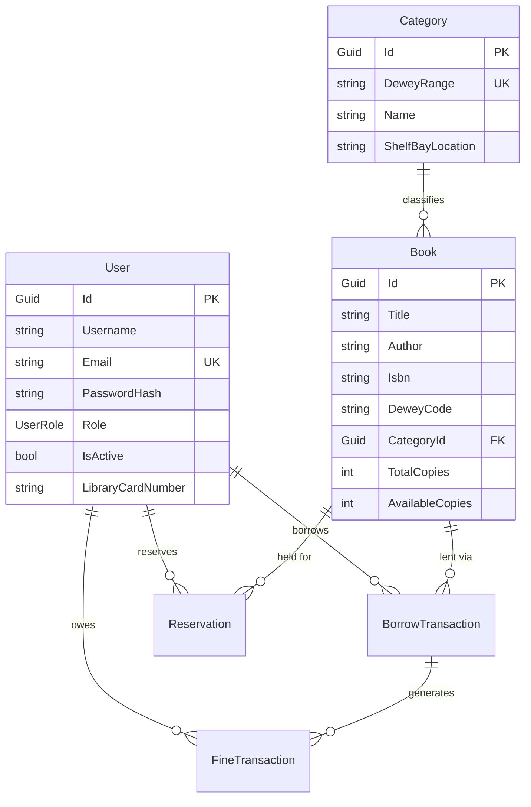

# Katipuneros Library Store — Comprehensive Project Analysis

> **Discovery Phase Complete** · All files, documentation, architecture, flow chains, rules, formulas, and implementation state have been read and understood.

---

## 1. Project Identity & Technology Stack

| Dimension | Detail |
|-----------|--------|
| **Project** | Katipuneros Library Store — JRMSU Katipunan Campus Academic Digital Library |
| **Backend** | .NET 10 (`net10.0`) + ASP.NET Core Web API + C# + EF Core 10 (Code-First) |
| **Frontend** | React 19 + Vite 8 + TypeScript 6 + Tailwind CSS 3.4 |
| **3D Engine** | Three.js v0.186 (hero scene — floating book cluster) |
| **CAPTCHA** | Altcha v3.2 |
| **Database** | SQL Server via SSMS (primary), PostgreSQL / MariaDB (alternatives) |
| **Auth** | JWT Bearer Tokens + BCrypt password hashing |
| **API Docs** | Scalar V1 (OpenAPI replacement for Swagger UI) |
| **Cache** | In-memory (`IMemoryCache`); Redis marked as future scaling option |
| **Architecture** | Feature-based Vertical Slice (both frontend and backend) |
| **Dev Servers** | Frontend `:5173` (public + customer + cashier) / `:5174` (isolated admin) / Backend `:5000` |

---

## 2. Documentation Ecosystem (7 Core Documents)

| Document | Purpose | Key Governance |
|----------|---------|----------------|
| [SKILL.md](file:///c:/Users/provu/Desktop/KATIPUNEROS%20LIBRARY%20STORE/Katipuneros-Library-Store/SKILL.md) | **Master architecture skill** — single source of truth for all placement, flow chains, and layer rules | 1,214 lines; 16 sections covering frontend/backend/database/cache/security |
| [AGENTS.md](file:///c:/Users/provu/Desktop/KATIPUNEROS%20LIBRARY%20STORE/Katipuneros-Library-Store/AGENTS.md) | **AI behavior contract** — strict DO/NEVER DO rules, DI patterns, middleware order | 837 lines; 32 behavioral rules, lambda mandate, empty-DB principle |
| [ADMIN DATA SHOW FORMULA.md](file:///c:/Users/provu/Desktop/KATIPUNEROS%20LIBRARY%20STORE/Katipuneros-Library-Store/ADMIN%20DATA%20SHOW%20FORMULA.md) | **KPI metric formulas** — mathematical formulas for every admin dashboard metric | 1,511+ lines; zero-hallucination values, division-by-zero guards |
| [CRUD_BACKEND_MAPPING.md](file:///c:/Users/provu/Desktop/KATIPUNEROS%20LIBRARY%20STORE/Katipuneros-Library-Store/CRUD_BACKEND_MAPPING.md) | **Frontend-to-Backend API contract** — every endpoint, DTO, HTTP method | Complete mapping per CRUD operation |
| [implementation_plan.md](file:///c:/Users/provu/Desktop/KATIPUNEROS%20LIBRARY%20STORE/Katipuneros-Library-Store/implementation_plan.md) | **Exhaustive CRUD inventory** — 4 slices, 80+ operations, 16 modals, 18 tables, 13 export pipelines | 413 lines |
| [design.md](file:///c:/Users/provu/Desktop/KATIPUNEROS%20LIBRARY%20STORE/Katipuneros-Library-Store/design.md) | **Master UI Design System** — Blue+Lime glassmorphism, color tokens, typography, component specs | 1,762 lines; 65 design sections |
| [PLUGINS_SKILLS_MEMORY_CACHE.md](file:///c:/Users/provu/Desktop/KATIPUNEROS%20LIBRARY%20STORE/Katipuneros-Library-Store/PLUGINS_SKILLS_MEMORY_CACHE.md) | **Plugin memory cache** — 11 plugins' rules distilled into binding operational principles | 150 lines |

---

## 3. Architecture — Flow Chains (NEVER ALTER)

### 3A. Frontend Flow Chain
```
Pages (route-level only)
  → Features (vertical slice UI, hooks, workflows)
    → Hooks / State / API (Endpoints/)
      → Shared Components (presentational primitives)
        → Libs / Utilities
          → Assets (static files, 3D)
```

### 3B. Backend Flow Chain
```
Models (Entities) → Enums → EF Core DbContext
  → Repository Implementation → Repository Interface
    → Service Implementation → Service Interface
      → Helpers / Security → API Controllers
        → Middleware → Program.cs → appsettings.json
```

### 3C. HTTP Request Flow
```
Incoming HTTP → Middleware Pipeline (Rate Limit → CORS → JWT → Idempotency)
  → Controller (parse, validate, call service)
    → Service (business rules, orchestrate)
      → Repository (EF Core LINQ)
        → Database (SQL Server)
```

### 3D. Cache Flow
```
Read:  Request → Service → Cache → HIT? return : MISS? → Repository → DB → Store → Return
Write: Request → Controller → Service → Repository → DB → Invalidate cache keys → Return
```

---

## 4. Frontend Architecture

### 4A. Route Structure (from [App.tsx](file:///c:/Users/provu/Desktop/KATIPUNEROS%20LIBRARY%20STORE/Katipuneros-Library-Store/Frontend/src/App.tsx))

| Zone | Port | Layout | Routes |
|------|------|--------|--------|
| **Landing** | 5173 | `LandingLayout` | `/` (Home — single-page with sections) |
| **Auth** | 5173 | None | `/login`, `/cashier/login`, `/signup` |
| **Customer** | 5173 | `CustomerLayout` | `/customer/home`, `/catalog`, `/borrowings`, `/reservations`, `/favorites`, `/profile`, `/settings` |
| **Cashier** | 5173 | `CashierLayout` | `/cashier/dashboard`, `/pending-reservations`, `/checkout`, `/returns`, `/customers`, `/book-availability`, `/schedules`, `/overdue-fines`, `/transactions`, `/notifications`, `/profile` |
| **Admin** | 5173 + **5174** | `AdminLayout` | `/admin/dashboard`, `/users`, `/books`, `/reservations`, `/borrowings`, `/returns`, `/inventory`, `/analytics`, `/categories`, `/reports`, `/notifications`, `/roles`, `/audit-logs`, `/settings`, `/profile` |

> **Port Isolation**: Port `5174` serves an isolated admin console redirecting all traffic to `/admin/login` first.

### 4B. Global Calling Imports (shared across ALL slices)

| Directory | Responsibility |
|-----------|---------------|
| `src/Hooks/` | `useFluidResposiveness`, `useDebounce`, `usePagination`, `useTableDraggable`, `useToasts`, `useDraggable`, `useScrollbar`, `useAutoRefresh`, `usePagesGlobalRefresh`, `useRefreshTelemetry`, `useNotifications`, `useResponsive` |
| `src/Shared/` | `Button` (7 variants, 4 sizes), `RadioButton`, `Dropdown`, `SearchBar`, `DefaultFloatingModalCard`, `SkeletonLoader`, `DragDropFileUpload`, `ImageGallery`, `TreeView`, `KebabMenu` |
| `src/LayoutBars/` | `LandingLayout`, `CustomerLayout`, `CashierLayout`, `AdminLayout`, `Header`, `CustomerHeader`, `Footer`, `Sidebar` |
| `src/LayoutStyles/` | `MainLayout.css` (color tokens), `PartLayout.css`, `FontSyle/fontStyles.css` (Google Fonts Inter, Material Symbols) |
| `src/Endpoints/` | `apiClient.ts` (typed HTTP client), `contactApi.ts`, `feedbackApi.ts`, `booksApi.ts`, plus role-scoped: `Customer/`, `Cashier/`, `Admin/` |
| `src/Libs/Assets/` | `data.ts`, `bookData.ts`, `links.ts` |
| `src/Assets/` | `threejs/` (3D hero scene), `images/`, `videos/`, `icons/` |

### 4C. Role-Scoped Shared Adapters

Each role panel has its own `Shared/` folder that **delegates to** global `src/Shared/` — never forks:
- `AdminsPanel/Shared/` → `AdminButton`, `AdminModalCard`, `RadioGroupField`, `NotificationUI`
- `CashiersPanel/Shared/` → `CashierButton`, `CashierModalCard`, `RadioGroupField`
- `CustomersPanel/Shared/` → `CustomerButton`, `CustomerModalCard`, `RadioGroupField`

---

## 5. Backend Architecture

### 5A. Layer File Counts (Verified from Filesystem)

| Layer | Path | Files |
|-------|------|-------|
| **Models** | `Features/Data/Models/` | `User`, `Book`, `BorrowTransaction`, `Reservation`, `FineTransaction`, `AuditLogEntry`, `ContactMessage`, `Feedback`, `Personnel`, `Category` |
| **Enums** | `Features/Data/Enums/` | `UserRole`, `InquiryStatus`, `FeedbackRating`, `TransactionStatus`, + more |
| **DbContext** | `Features/Data/AppDbContext.cs` | 10 `DbSet<>` properties (all using `=> Set<T>()` lambda) |
| **Repository Interfaces** | `Features/Repositories/Interfaces/` | 9 interfaces (`IUser`, `IBook`, `IBorrow`, `IReservation`, `IFine`, `ICategory`, `IAudit`, `IContact`, `IPersonnel`) |
| **Repository Implementations** | `Features/Repositories/Implementations/` | 9 matching implementations |
| **Service Interfaces** | `Features/Services/Interfaces/` | 16 interfaces (includes `IAnalytics`, `IInventory`, `IReturn`, `IReport`, `INotification`, `IRole`, `ISystemHealth`, `IPersonnel`) |
| **Service Implementations** | `Features/Services/Implementations/` | 16 matching implementations |
| **Controllers** | `Features/Api/Controllers/` | Multiple controllers |
| **DTOs** | `Features/Api/DTOs/` | Request/Response DTO classes |
| **Middleware** | `Features/Api/Middleware/` | `GlobalExceptionMiddleware`, `RateLimitMiddleware`, `IdempotencyMiddleware`, `JwtMiddleware` |
| **Helpers** | `Features/Helpers/Infrastructure/` | `AuditHelper`, `InputSanitizer`, `JwtHelper`, `NotificationHelper`, `PasswordHelper`, `PaginationHelper` |
| **Cache** | `Features/DBInfrastructure/Cache/` | `CacheService`, `CacheInvalidation`, `CacheKeys`, `ICacheService`, `TtlRules` |
| **Database** | `Features/DBInfrastructure/Database/` | `DatabaseSeeder` |

### 5B. DI Registration Pattern ([Program.cs](file:///c:/Users/provu/Desktop/KATIPUNEROS%20LIBRARY%20STORE/Katipuneros-Library-Store/Backend/Program.cs))

```
Repositories: 9 scoped registrations (IUserRepo → UserRepo, IBookRepo → BookRepo, etc.)
Services:     16 scoped registrations
Cache:        ICacheService + CacheInvalidation (scoped)
Auth:         JWT Bearer with SymmetricSecurityKey, 3 policies (AdminOnly, StaffOnly, PatronOnly)
CORS:         AllowFrontend policy (localhost:5173/5174)
JSON:         IgnoreCycles + WhenWritingNull
```

### 5C. Middleware Pipeline Order (Strict AGENTS.md)

```
1. GlobalExceptionMiddleware   → Catch unhandled exceptions
2. RateLimitMiddleware         → Rate limiting per IP
3. IdempotencyMiddleware       → Duplicate POST protection
4. CORS (AllowFrontend)        → CORS headers
5. Authentication              → JWT token validation
6. Authorization               → Role / policy checks
7. JwtMiddleware               → Identity context hydration
8. MapControllers              → Route to controllers
```

### 5D. Configuration ([appsettings.json](file:///c:/Users/provu/Desktop/KATIPUNEROS%20LIBRARY%20STORE/Katipuneros-Library-Store/Backend/appsettings.json))

| Config | Value |
|--------|-------|
| DB Connection | `Server=localhost;Database=KatipunerosLibraryDb;Trusted_Connection=True` |
| JWT Expiry | 24 hours |
| Default Loan Duration | 14 days |
| Max Renewals | 2 |
| Renewal Extension | 7 days |
| Daily Overdue Fine | ₱5.00 |
| Max Fine Cap | ₱500.00 |
| Max Active Borrowings | 3 per patron |
| SMTP | Gmail (smtp.gmail.com:587) |

---

## 6. Database Schema (EF Core 10 — 10 Entity Sets)



---

## 7. Universal Rules Summary (ALWAYS FOLLOW)

### Code Style
- ✅ **Lambda expressions (`=>`)** for ALL sync/async methods across all layers
- ✅ **Strict typing** — no `any` in TypeScript, typed DTOs everywhere
- ✅ **Header comments** on every file: Layer, Responsibility, Forbidden actions

### Flow Chain Integrity
- ❌ NEVER skip layers in the chain
- ❌ NEVER put business logic in controllers
- ❌ NEVER put `_context` (DbContext) access in controllers
- ❌ NEVER put direct `fetch()` calls in React components — use `Endpoints/` stubs
- ❌ NEVER mix Landing Page code with UserRoles code
- ❌ NEVER mix Customer/Cashier/Admin panel code with each other

### Design System
- ❌ NEVER hardcode colors or font styles — use `LayoutStyles/` CSS tokens
- ❌ NEVER write inline resize listeners — use `Hooks/useFluidResposiveness`
- ❌ NEVER duplicate global primitives inside feature slices
- ✅ ALWAYS import from Global Calling Imports: `Hooks/`, `Shared/`, `LayoutBars/`, `LayoutStyles/`, `Endpoints/`, `Libs/Assets/`

### Data Integrity
- ✅ **Empty Database Principle**: If `N = 0`, show `0` / `0.0` / `+0.0%` / `—`
- ✅ **Division-by-zero protection**: Always guard with ternary (`total === 0 ? 0 : value/total * 100`)
- ❌ NEVER display hardcoded mock metric values
- ❌ NEVER use `alert()` — use `useToasts` reactive feedback

### Security
- ✅ All auth enforced on backend (JWT + `[Authorize(Roles)]`)
- ✅ BCrypt for all password hashing
- ✅ InputSanitizer for all public form submissions
- ❌ NEVER store secrets in frontend bundles
- ❌ NEVER hardcode connection strings in C# files

---

## 8. Design System Palette

| Token | Hex | Usage |
|-------|-----|-------|
| Primary Blue | `#287EA7` | Brand, navigation, interactive elements |
| Deep Blue | `#164E63` | Headings, strong text, hero overlays |
| Sky Blue | `#67B7D6` | Secondary accents, decorative elements |
| Soft Blue | `#D9EEF5` | Selected cards, category backgrounds |
| Background | `#EEF5F6` | Primary app background (NOT pure white) |
| Glass Surface | `rgba(255,255,255,0.55)` | Floating panels, hero cards, search |
| **Action Green** | `#9BE564` | Primary CTA: Reserve, Confirm, Save, Approve |
| Primary Text | `#18323D` | Headings, titles, book names |
| Secondary Text | `#647982` | Descriptions, metadata, helper text |
| Available | `#7FA58D` | Active, healthy status |
| Pending | `#D9A85C` | Waiting, review required |
| Unavailable | `#B96F72` | Rejected, critical, overdue |

---

## 9. Plugin Memory Cache (11 Plugins)

| Plugin | Enforced Rule |
|--------|--------------|
| `ui-ux-pro-max-skill` | Token hierarchy: Primitive → Semantic → Component; never hardcode colors |
| `rtk` | Unidirectional data flow; optimistic UI with revert-on-failure |
| `xlsx` | Multi-criteria filter pipeline (date, alpha, numeric, sort); batch ISBN ingest |
| `playwright` | 7-point E2E verification checklist with screenshot evidence |
| `context7` | Anti-hallucination: inspect source first, augment existing UI, never rewrite |
| `OmniRoute` | Sidebar state persists across sub-routes; mobile drawer auto-dismisses |
| `headroom` | Sticky chrome with dynamic offset matching sidebar; `backdrop-blur-xl` + `z-40` |
| `graphify` | Acyclic vertical slice: lower layers never import from higher layers |
| `caveman` | Clean `=>` lambdas everywhere; eliminate verbose method ceremonies |
| `ralph` + `loop-eng` | Verification-before-completion: 0 TS errors + 0 C# errors + visual confirmation |
| `one-skill-to-rule-them` | Meta-orchestrator: Spec → Plan → Implement → Verify → Review |

---

## 10. Known Issues & Production Readiness

| Priority | Issue | Action Required |
|----------|-------|-----------------|
| 🔴 HIGH | JWT secret key hardcoded in `appsettings.json` | Move to env variable or Azure Key Vault |
| 🔴 HIGH | SMTP App Password visible in `appsettings.json` | Move to `.env` or secrets manager |
| 🟡 MEDIUM | Rate limiting uses in-memory storage | Switch to Redis-backed distributed store |
| 🟡 MEDIUM | No HTTPS redirect configured | Add `app.UseHttpsRedirection()` |
| 🟢 LOW | Scalar V1 UI exposed in all environments | Disable in production |
| 🟢 LOW | CORS allows multiple localhost origins | Restrict to production domain |

---

## 11. Implementation Completeness Assessment

### Backend ✅ Substantially Scaffolded
- 10 entity models with proper relationships and indexes
- 9 repository interface + implementation pairs
- 16 service interface + implementation pairs
- Full middleware pipeline in correct order
- Cache infrastructure with keys, TTL rules, and invalidation
- Authentication + Authorization with 3 role policies
- Database seeder for initial data

### Frontend ✅ Substantially Scaffolded
- Complete route tree with `React.lazy()` + `Suspense` code splitting
- Port-based admin isolation (`5174`)
- All 4 layout wrappers implemented
- Global hooks system with 12+ hooks
- Global shared components with 10+ primitives
- Role-scoped adapter pattern implemented
- Typed API client with envelope unwrapping
- Role-scoped endpoint stubs

### Remaining Work (per `implementation_plan.md`)
- 80+ CRUD operations to wire end-to-end
- 16 interactive modals to implement
- 18 data tables with search/filter/pagination
- 13 export pipelines (PDF, CSV, MARC 21, BibTeX)

---

> **Status: DISCOVERY COMPLETE** · I have fully read and understood all 7 documentation files, all core source files (Program.cs, App.tsx, AppDbContext.cs, apiClient.ts, package.json, Backend.csproj, appsettings.json), all directory structures, all flow chains, all rules, all formulas, and all plugin constraints. Ready for any task.
